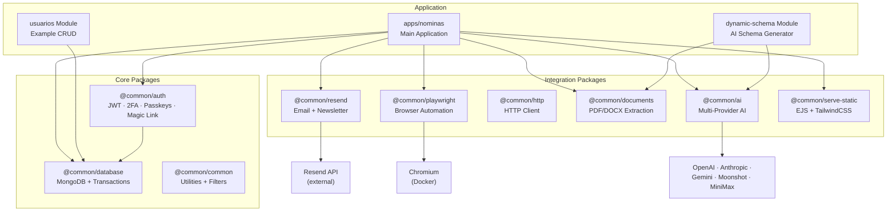
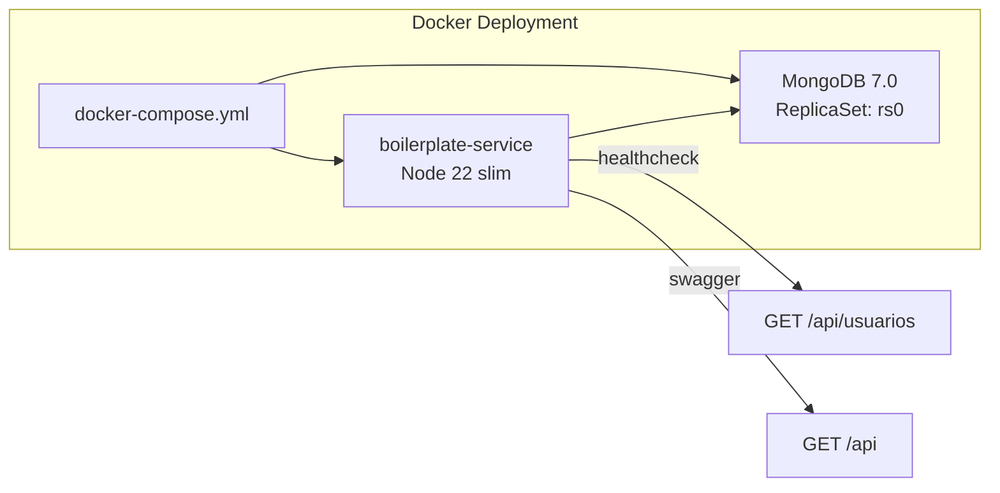
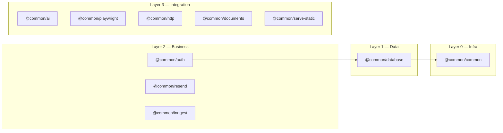

# AGENTS.md — NestJS Boilerplate Service

> Índice maestro para agentes IA y desarrolladores. Contiene toda la información necesaria para trabajar autónomamente en este proyecto.

---

## Índice Rápido

| Sección | Descripción |
|---------|-------------|
| [1. Comandos](#1-comandos) | Build, test, lint, dev |
| [2. Stack y Arquitectura](#2-stack-y-arquitectura) | Tech stack, diagramas |
| [3. OpenSpec — SDD Workflow](#3-openspec--sdd-workflow) | Cómo usar specs y cambios |
| [4. Paquetes — Índice](#4-paquetes--índice) | Todos los packages y su estado |
| [5. Convenciones de Código](#5-convenciones-de-código) | Imports, naming, DI, módulos |
| [6. Configuración](#6-configuración) | .env, tsconfig paths |
| [7. Despliegue](#7-despliegue) | Docker, producción, checklist |
| [8. Reglas para Trabajo Autónomo](#8-reglas-para-trabajo-autónomo) | Cómo debe trabajar una IA aquí |
| [9. Documentación Autónoma](#9-documentación-autónoma) | Propuesta de auto-documentación |
| [10. Troubleshooting](#10-troubleshooting) | Problemas comunes |
| [11. Key Files](#11-key-files) | Archivos importantes |
| [12. Project Status Dashboard](#12-project-status-dashboard) | Cambios activos y estado del proyecto |
| [13. Documentation Index](#13-documentation-index) | Índice de documentación referencial |

---

## 1. Comandos

| Task | Comando |
|------|---------|
| Dev Server | `npm run start:dev` |
| Build | `npm run build` |
| Lint | `npm run lint` |
| Test Unit | `npm run test` |
| Test Single | `npm run test -- path/to/file.spec.ts` |
| Test E2E | `npm run test:e2e` |
| Test Coverage | `npm run test:cov` |
| Format | `npm run format` |
| Prod Start | `npm run start:prod` |

---


## 2. Stack y Arquitectura





### Stack Tecnológico

| Tecnología | Versión | Propósito |
|------------|---------|-----------|
| NestJS | 11.x | Framework |
| TypeScript | 5.7.x | Lenguaje |
| MongoDB | 7.0 | Base de datos (ReplicaSet) |
| Mongoose | 9.x | ODM |

| Playwright | 1.59.x | Browser automation |
| Swagger | 11.3.x | API docs |
| Docker | — | Node 22.18.0-slim |
| Argon2 | 0.31.x | Password hashing |

---

## 3. OpenSpec — SDD Workflow

OpenSpec es el sistema de especificaciones por cambios (Spec-Driven Development). Todo cambio significativo en el proyecto debe pasar por este flujo.

### Estructura

```
openspec/
├── config.yaml              ← Configuración del proyecto
├── specs/                   ← Source of truth (specs principales)
│   ├── auth/spec.md
│   ├── ai/spec.md
│   ├── database/spec.md
│   ├── email/spec.md
│   ├── documents/spec.md
│   ├── http/spec.md
│   ├── inngest/spec.md
│   ├── playwright/spec.md
│   └── serve-static/spec.md
├── changes/                 ← Cambios activos
│   ├── {change-name}/       ← Carpeta del cambio activo
│   │   ├── state.yaml       ← Estado del DAG
│   │   ├── proposal.md      ← Propuesta
│   │   ├── specs/           ← Delta specs
│   │   ├── design.md        ← Diseño técnico
│   │   ├── tasks.md         ← Checklist de tareas
│   │   └── verify-report.md ← Reporte de verificación
│   └── archive/             ← Cambios completados
```

### Flujo SDD para cada cambio

```
/sdd-new <change-name>     → Crea proposal + specs + design + tasks
/sdd-continue <change-name> → Ejecuta la siguiente fase disponible
/sdd-verify <change-name>   → Verifica contra specs
/sdd-archive <change-name>  → Archiva el cambio (mergea deltas a main specs)
```

### Fases del Ciclo

| Fase | Output | Depende de | Descripción |
|------|--------|------------|-------------|
| proposal | `proposal.md` | — | Qué, por qué, alcance, riesgos |
| specs | `specs/{domain}/spec.md` | proposal | Requisitos con Given/When/Then |
| design | `design.md` | proposal | Decisiones técnicas, diagramas |
| tasks | `tasks.md` | specs + design | Checklist de implementación |
| apply | Cambios en código | tasks | Implementación |
| verify | `verify-report.md` | tasks + specs | Validación |
| archive | Mover a archive/ | verify | Merge specs + archivo |

### Reglas OpenSpec

1. **Nunca** modificar `openspec/specs/` directamente. Los cambios se hacen via delta specs en `openspec/changes/{name}/` y se mergean al archivar.
2. **Siempre** leer las specs del dominio afectado antes de implementar.
3. **Cada cambio debe tener al menos** un proposal y un spec. Design y tasks son recomendados.
4. **Al archivar**, el delta spec se mergea al main spec del dominio.
5. **Commitel mensaje**: `feat({domain}): {desc}` o `fix({domain}): {desc}` para cambios con spec.
6. **state.yaml** se actualiza automáticamente en cada fase. No modificarlo manualmente.

### Buscar Specs por Dominio

```bash
# Encontrar spec de un dominio
openspec/specs/<domain>/spec.md

# Ver cambios activos
ls openspec/changes/

# Ver cambios archivados
ls openspec/changes/archive/
```

Si un agente IA necesita entender cómo funciona un módulo, DEBE leer primero:
1. `openspec/specs/{domain}/spec.md` — contrato del módulo
2. `packages/{name}/README.md` — documentación de uso
3. El código fuente — implementación

---

## 4. Paquetes — Índice

### Matriz de Paquetes

| Package | README | JSDoc | Swagger | Tests | Estado |
|---------|--------|-------|---------|-------|--------|
| [@common/ai](packages/ai/README.md) | ✅ | ❌ | — | ❌ | partial |
| [@common/auth](packages/auth/README.md) | ✅ | ⚠️ | ❌ | ❌ | partial |
| [@common/common](packages/common/README.md) | ⚠️ | ❌ | — | ❌ | partial |
| [@common/database](packages/database/README.md) | ✅ | ⚠️ | — | ❌ | partial |
| [@common/documents](packages/documents/README.md) | ✅ | ⚠️ | — | ❌ | partial |
| [@common/http](packages/http/README.md) | ✅ | ⚠️ | — | ❌ | partial |
| [@common/inngest](packages/inngest/README.md) | ✅ | ⚠️ | ✅ | ✅ | **complete** |
| [@common/playwright](packages/playwright/README.md) | ✅ | ⚠️ | — | ❌ | partial |
| [@common/resend](packages/resend/README.md) | ✅* | ❌ | — | ❌ | partial |
| [@common/serve-static](packages/serve-static/README.md) | ✅* | ❌ | — | ❌ | partial |

> ✅ = completo · ⚠️ = parcial · ❌ = ausente · — = no aplica · \* = creado recientemente

### Dependencias entre Paquetes



### Notas por Paquete

#### `@common/ai` — AI Providers Wrapper
- **Ubicación:** `packages/ai/`
- **Dependencias:** `openai`, `@anthropic-ai/sdk`, `@google/generative-ai`
- **Providers:** OpenAI, Anthropic, Gemini, Moonshot, MiniMax + custom
- **Incluye:** `AiService.chat()`, `generateText()`, `generateSchema()`, `embeddings()`, streaming
- **Falta:** JSDoc en métodos públicos, tests unitarios

#### `@common/auth` — Authentication
- **Ubicación:** `packages/auth/`
- **Métodos:** JWT, Magic Link, OAuth (placeholder), 2FA/TOTP, Passkeys/WebAuthn
- **Password hashing:** Argon2 (NO bcrypt — `argon2` en uso, `bcrypt` en package.json es legacy)
- ⚠️ **Auth es stub/demo** — hardcodea `demo@example.com` / `demo123`. No usar en producción sin reemplazar.
- **Falta:** Swagger decorators en controlador, JSDoc completo, tests

#### `@common/common` — Utilities
- **Ubicación:** `packages/common/`
- **Contiene:** `BaseAdapter<T>` interface, `DatabaseExceptionFilter`, `HttpError`
- ⚠️ `http-error` está duplicado con `packages/http/`
- **Falta:** README más completo, JSDoc, unificar con http

#### `@common/database` — MongoDB
- **Ubicación:** `packages/database/`
- **Requiere:** MongoDB ReplicaSet (`rs0`) para transacciones
- **Incluye:** `TransactionService.withTransaction()`, `@Transactional` decorator, retry logic
- **Falta:** JSDoc en transaction, ejemplos de decorators, tests

#### `@common/documents` — Document Extraction
- **Ubicación:** `packages/documents/`
- **Formatos:** PDF (`pdf-parse`), DOCX (`mammoth`), parser interface extensible
- **Falta:** JSDoc en servicios, tests con archivos de prueba

#### `@common/http` — HTTP Client
- **Ubicación:** `packages/http/`
- **Incluye:** HTTP client (axios), download service con sharp para optimización de imágenes
- **Falta:** JSDoc completo, tests, unificar http-error con common

#### `@common/inngest` — Task Queue ⭐ (mejor documentado)
- **Ubicación:** `packages/inngest/`
- **Endpoints:** `/api/inngest`, `/api/inngest-events/hola-inngest`
- **Tiene:** Tests unitarios + integración, Swagger decorators, README bilingüe
- **Falta:** JSDoc completo en métodos

#### `@common/playwright` — Browser Automation
- **Ubicación:** `packages/playwright/`
- **Config:** Playwright con Chromium, headless configurable, timeouts, retries
- **Falta:** Tests (complejo por requerir browser), JSDoc en servicio

#### `@common/resend` — Email (recientemente documentado)
- **Ubicación:** `packages/resend/`
- **Incluye:** `ResendService` (email simple + templates), `NewsletterModule` (suscriptores in-memory)
- ⚠️ Newsletter usa `Map` en memoria — NO persiste entre reinicios
- **Falta:** JSDoc, tests, persistencia para newsletter

#### `@common/serve-static` — EJS Templates (recientemente documentado)
- **Ubicación:** `packages/serve-static/`
- **Incluye:** `ServeStaticService.render()`, layouts, partials, TailwindCSS CDN, caché 60s
- **Falta:** JSDoc, tests, ejemplos de templates

---

## 5. Convenciones de Código

### Imports Order

```typescript
// 1. NestJS core
import { Module, Injectable } from '@nestjs/common';

// 2. External packages
import { Inngest } from 'inngest';

// 3. Shared packages
import { DatabaseModule } from '@common/database';

// 4. DTOs/Interfaces (local)
import { CreateUsuarioDto } from './dto';
```

### Naming

| Elemento | Convention | Ejemplo |
|----------|-----------|---------|
| Files | `kebab-case.ts` | `usuarios.controller.ts` |
| Classes | `PascalCase` | `UsuariosService` |
| Interfaces | `PascalCase` | `UsuarioInterface` |
| DTOs | `PascalCase` + `Dto` | `CreateUsuarioDto` |
| Constants | `UPPER_SNAKE_CASE` | `MAX_RETRIES` |
| Variables | `camelCase` | `userName` |
| Tests | `name.spec.ts` | `usuarios.service.spec.ts` |

### Dependency Injection

```typescript
@Injectable()
export class UsuariosService {
  constructor(
    private readonly repository: UsuariosRepository,
    private readonly inngest: InngestService,
  ) {}
}
```

### Module Organization

```typescript
@Module({
  imports: [MongooseModule.forFeature([{ name: MiEntidad.name, schema: MiEntidadSchema }])],
  controllers: [MiEntidadController],
  providers: [MiEntidadRepository, MiEntidadService],
  exports: [MiEntidadService],
})
export class MiEntidadModule {}
```

### Crear Nuevo Módulo en App

```
apps/nominas/src/modules/mi-modulo/
├── dto/                      # Create*Dto, Update*Dto, etc.
├── interfaces/               # Interfaces del módulo
├── schemas/                  # Mongoose schemas
├── mi-modulo.controller.ts
├── mi-modulo.module.ts
├── mi-modulo.repository.ts
└── mi-modulo.service.ts
```

---

## 6. Configuración

### Environment Variables

Agrupadas por paquete:

```env
# ═══════════════════════════════════════════════════════════════
# Environment Variables Reference
# Legend:  ⚠️ REQUIRED  |  ✓ optional (default shown)
# ═══════════════════════════════════════════════════════════════

# ── App ──
✓ PORT=3000

# ── MongoDB ──
⚠️ MONGODB_URI=mongodb://localhost:27017/boilerplate_db

# ── Auth: JWT ──
⚠️ JWT_SECRET=your-super-secret-key-min-32-chars       # min 32 chars
✓ JWT_ACCESS_TOKEN_TTL=900
✓ JWT_REFRESH_TOKEN_TTL=604800
✓ JWT_ISSUER=api-nominas
✓ JWT_AUDIENCE=api-nominas

# ── Auth: Magic Link ──
✓ MAGIC_LINK_ENABLED=true
✓ MAGIC_LINK_TOKEN_TTL=300

# ── Auth: OAuth (optional) ──
✓ OAUTH_GOOGLE_CLIENT_ID=
✓ OAUTH_GOOGLE_CLIENT_SECRET=
✓ OAUTH_GITHUB_CLIENT_ID=
✓ OAUTH_GITHUB_CLIENT_SECRET=

# ── Auth: Argon2 ──
✓ ARGON2_TYPE=2
✓ ARGON2_MEMORY_COST=65536
✓ ARGON2_TIME_COST=3
✓ ARGON2_PARALLELISM=4

# ── Auth: 2FA ──
✓ TWO_FACTOR_ISSUER=MyApp
✓ TWO_FACTOR_ALGORITHM=SHA1
✓ TWO_FACTOR_DIGITS=6
✓ TWO_FACTOR_PERIOD=30
✓ TWO_FACTOR_BACKUP_CODES_COUNT=10
✓ TWO_FACTOR_BACKUP_CODES_LENGTH=10

# ── Auth: Passkeys ──
✓ PASSKEYS_RP_ID=localhost
✓ PASSKEYS_RP_NAME=MyApp
✓ PASSKEYS_RP_ORIGIN=http://localhost:3000

# ── Playwright ──
✓ PLAYWRIGHT_HEADLESS=true
✓ PLAYWRIGHT_TIMEOUT=30000
✓ PLAYWRIGHT_RETRIES=3
✓ PLAYWRIGHT_BROWSERS_PATH=

# ── Inngest ──
⚠️ INNGEST_EVENT_KEY=your_event_key                      # required if using Inngest
⚠️ INNGEST_SIGNING_KEY=your_signing_key                  # required if using Inngest
✓ INNGEST_BASE_URL=https://inngest.treborjs-dev.online/

# ── Resend ──
⚠️ RESEND_API_KEY=                                        # required if using email
✓ RESEND_FROM_EMAIL=onboarding@resend.dev
✓ RESEND_FROM_NAME=My App
✓ RESEND_REPLY_TO=

# ── AI Providers (optional — provider chosen at runtime) ──
✓ OPENAI_API_KEY=
✓ ANTHROPIC_API_KEY=
✓ GEMINI_API_KEY=
✓ MOONSHOT_API_KEY=
✓ MINIMAX_API_KEY=

# ── Dynamic Schema ──
✓ DYNAMIC_SCHEMA_LEGACY=false
```

### tsconfig Paths (paquetes registrados)

```json
{
  "@common/common": ["packages/common/src/index.ts"],
  "@common/database": ["packages/database/src/index.ts"],
  "@common/inngest": ["packages/inngest/src/index.ts"],
  "@common/playwright": ["packages/playwright/src/index.ts"],
  "@common/http": ["packages/http/src/index.ts"],
  "@common/ai": ["packages/ai/src/index.ts"],
  "@common/documents": ["packages/documents/src/index.ts"]
}
```

> **Nota:** `@common/auth`, `@common/resend` y `@common/serve-static` NO están en `tsconfig.json` paths. Se resuelven mediante `nest-cli.json` o instalación directa.

---

## 7. Despliegue

### Docker

```bash
# Build + Run
docker build -t boilerplate-service .
docker-compose up -d

# Dev con hot-reload
docker-compose -f docker-compose.yml -f docker-compose.dev.yml up -d

# Test automático
./docker-test.sh
```

**Ver:** `README.Docker.md` para documentación completa.

### Endpoints en Producción

| Endpoint | URL |
|----------|-----|
| API Base | `http://localhost:3000/api` |
| Swagger | `http://localhost:3000/api` |
| Health Check | `http://localhost:3000/api/usuarios` |

### Checklist de Producción

- [ ] `JWT_SECRET` configurado con valor seguro (min 32 chars)
- [ ] MongoDB connection string con credenciales
- [ ] `RESEND_API_KEY` configurada (si se usa email)
- [ ] API keys de AI providers configuradas (si se usa `@common/ai`)
- [ ] `npm run build` exitoso
- [ ] `npm run lint` sin errores
- [ ] `npm run test` sin fallos
- [ ] Swagger accesible en `/api`
- [ ] Health check responde 200
- [ ] Docker image build exitoso
- [ ] Playwright browsers instalados en la imagen
- [ ] Reemplazar auth stub (`demo@example.com`) si está en producción

### Notas de Producción

- **Playwright:** Chromium instalado en `/opt/playwright/browsers` dentro del contenedor Docker
- **MongoDB:** Requiere ReplicaSet (`rs0`) para transacciones. El docker-compose lo configura automáticamente
- **Auth:** El módulo `@common/auth` actualmente tiene un stub de demo. NO usar en producción sin implementar un UserService real
- **Usuario:** La imagen Docker corre como `nodejs` (non-root, UID 1001)

---

## 8. Reglas para Trabajo Autónomo

### Principios

1. **LEER antes de escribir** — siempre leer el README del paquete y AGENTS.md antes de modificar código
2. **DOCUMENTAR mientras se escribe** — JSDoc en todo método público nuevo
3. **SEGUIR las convenciones** — naming, imports, estructura de módulos (sección 4)
4. **VERIFICAR después de escribir** — `npm run build` y `npm run lint` antes de dar por terminado

### Reglas de Código

- **No usar `bcrypt`** — el proyecto usa `argon2` para password hashing. `bcrypt` en package.json es residuo
- **No hardcodear credenciales** — toda configuración vía environment variables
- **Auth es demo** — `@common/auth` tiene un stub. Nuevos módulos de auth deben implementar un servicio real
- **Paquetes sin `tsconfig.json` path** — `auth`, `resend`, `serve-static` no están en tsconfig paths. Si se necesita importarlos, agregar el path

### Reglas para el Modelo de IA

1. **Contexto mínimo**: Antes de tocar cualquier archivo, leer:
   - `AGENTS.md` (índice y reglas)
   - `DOCUMENTATION-CONVENTION.md` (convención de documentación)
   - `openspec/specs/<domain>/spec.md` (spec del dominio afectado)
   - `packages/<name>/README.md` del paquete afectado

2. **OpenSpec primero**: Si el cambio no tiene un cambio activo en `openspec/changes/`, crear UNO via `/sdd-new` antes de implementar.

3. **No modificar archivos que no entiendes**: Si un archivo no tiene documentación y no puedes inferir su propósito, PREGUNTAR

4. **Commits estructurados**:
   ```
   feat(@common/<name>): descripción del cambio
   fix(@common/<name>): descripción del fix
   docs(@common/<name>): descripción de documentación
   chore(@common/<name>): tareas de mantenimiento
   ```

5. **Checklist antes de finalizar**:
   - [ ] `npm run build` pasa
   - [ ] `npm run lint` pasa
   - [ ] JSDoc agregado en nuevos exports públicos
   - [ ] README del paquete actualizado si cambia API
   - [ ] Variables de entorno nuevas documentadas
   - [ ] Spec de dominio actualizada si cambia comportamiento
   - [ ] `openspec/changes/{name}/tasks.md` marcado con los tasks completados
   - [ ] `CHANGELOG.md` actualizado con entrada del cambio

### Mapa de Decisión para IA

```
¿Vas a crear algo nuevo?
├── ¿Es un paquete reutilizable? → Crear en packages/<name>/
│   ├── README.md (obligatorio)
│   ├── JSDoc en todos los exports
│   ├── Registrar en nest-cli.json
│   ├── Agregar path en tsconfig.json
│   └── package.json con peerDependencies
├── ¿Es un módulo de negocio? → Crear en apps/nominas/src/modules/<name>/
│   ├── Seguir estructura: dto/ interfaces/ schemas/ + controller/service/repository
│   └── Swagger decorators en controlador
└── ¿Es un cambio en paquete existente?
    └── Leer README.md del paquete primero
```

---

## 9. Documentación Autónoma

### Gatillos Automáticos

Cuando una IA complete cualquiera de estas acciones, DEBE documentar:

| Acción | Documentar |
|--------|------------|
| Nuevo paquete | `packages/<name>/README.md` + JSDoc + AGENTS.md index |
| Nuevo método público en paquete existente | JSDoc en el método |
| Nueva variable de entorno | README.md del paquete + AGENTS.md sección 5 |
| Nuevo endpoint | Swagger decorators (`@ApiTags`, `@ApiOperation`...) + README.md |
| Nueva dependencia externa | `package.json` + README.md dependencies table |
| Breaking change | `CHANGELOG.md` + marcar en README |
| Bug fix | JSDoc actualizado si la firma cambia |

### Template de Commit para Documentación

```
docs(@common/<name>): qué se documentó

- README.md: sección X actualizada
- JSDoc agregado en Service.method()
```

### Archivo CHANGELOG (pendiente de crear)

Se recomienda crear `CHANGELOG.md` para rastrear cambios versionados. Formato:

```markdown
# Changelog

## [0.1.0] - 2026-06-12
### Added
- @common/resend: README.md, NewsletterModule
- @common/serve-static: README.md
- AGENTS.md: documentación autónoma, reglas, diagramas

### Changed
- README.md: ahora describe el proyecto real, no el starter de NestJS
```

---

## 10. Troubleshooting

| Problema | Solución |
|----------|----------|
| Puerto 3000 en uso | `netstat -ano \| findstr :3000` · `taskkill /PID <PID> /F` |
| MongoDB no conecta | `mongosh --eval "db.adminCommand('ping')"` |
| Playwright no encuentra browser | `npx playwright install` |
| Swagger no muestra endpoints | Verificar `@ApiTags` en el controlador |
| Build falla por paths | Verificar que el paquete está en `tsconfig.json` paths y `nest-cli.json` |

---

## 11. Key Files

| Archivo | Propósito |
|---------|-----------|
| `AGENTS.md` | Este archivo — índice maestro |
| `DOCUMENTATION-CONVENTION.md` | Convención de documentación IA-friendly |
| `README.Docker.md` | Documentación completa de Docker |
| `INNGEST_SETUP.md` | Setup específico de Inngest self-hosted |
| `nest-cli.json` | Configuración del monorepo |
| `packages/*/README.md` | Documentación individual por paquete |
| `apps/nominas/PATTERNS.md` | Patrones de diseño para módulos de negocio |
| `apps/nominas/CONTRIBUTING.md` | Guía para agregar nuevos módulos |
| `apps/nominas/src/modules/*/README.md` | Docs de módulos de la app |
| `apps/nominas/src/modules/auth/src/two-factor/README.md` | Detalle de implementación 2FA |
| `docs/COVERAGE.md` | Reporte auto-generado de cobertura JSDoc |
| `docs/JSDOC-MIGRATION-PLAN.md` | Plan para Fase 3 (JSDoc asistida) |
| `CHANGELOG.md` | Historial de cambios |
| `openspec/config.yaml` | Configuración SDD del proyecto |
| `openspec/specs/*/spec.md` | Especificaciones por dominio |
| `openspec/changes/` | Cambios activos y archivados |
| `.github/workflows/docs-ci.yml` | CI para validación documental |

> **Nota:** `BOILERPLATE.md` (versión antigua, 481 líneas) fue consolidado en este archivo y los docs de `apps/nominas/` durante el change `documentation-llm-readiness-audit`.

---

## 12. Project Status Dashboard

### Cambios Activos

| Change | Status | Fase | Package Afectado | Spec |
|--------|--------|------|------------------|------|
| `init-openspec-structure` | ✅ Complete | archive | — | `openspec/specs/*` |
| `fix-auth-swagger` | ✅ Complete | apply | `auth` | `openspec/specs/auth/spec.md` |
| `fix-package-cleanup` | ✅ Complete | apply | root (package.json, tsconfig) | — |
| `fix-unify-http-error` | ✅ Complete | apply | `common`, `http` | — |
| `fix-cross-reference-docs` | ✅ Complete | apply | all packages | — |
| `dynamic-schema-pipeline-hardening` | ✅ Complete | archive | `@common/ai`, `@common/documents`, `@common/database`, `dynamic-schema` | `openspec/specs/dynamic-schema/spec.md` (new), delta specs for `ai`/`documents`/`database` (merged) |

### Auditoría Reciente

Change `dynamic-schema-pipeline-hardening` (completado) realizó una auditoría completa del pipeline de generación de schemas Mongoose. Hallazgos:

- **5 críticos** resueltos: image vision real, registro real del modelo Mongoose, registro dinámico, repositorio real, persistencia entre reinicios.
- **8 medios** resueltos: validación de collectionName, tipos array/object con items/properties, retry con `response_format` + temperature 0, validación post-generación, spec OpenSpec para el módulo, observabilidad, rehidratación al arranque, formatos enum validados.
- **3 bajos** resueltos: idempotencia por `fieldsHash`, validación previa de `format`, sin duplicación silenciosa.

Ver `openspec/changes/dynamic-schema-pipeline-hardening/proposal.md` para los 16 hallazgos detallados y el rollback plan con flag `DYNAMIC_SCHEMA_LEGACY=true`.

> ✅ Complete · 🔄 In Progress · 🔲 Pending · ❌ Blocked

### Documentación por Paquete

> Tabla actualizada por `documentation-llm-readiness-audit` (Fase 1+2 completadas).

| Package | README | Spec OpenSpec | JSDoc | Status |
|---------|--------|---------------|-------|--------|
| `@common/ai` | ✅ | ✅ | ⚠️ | partial |
| `@common/auth` | ✅ | ✅ | ⚠️ | partial |
| `@common/common` | ✅ | ✅ (nuevo) | ⚠️ | partial |
| `@common/database` | ✅ | ✅ (expandido) | ⚠️ | partial |
| `@common/documents` | ✅ | ✅ (expandido) | ⚠️ | partial |
| `@common/http` | ✅ | ✅ (expandido) | ⚠️ | partial |
| `@common/inngest` | ✅ | ✅ (expandido) | ⚠️ | **complete** |
| `@common/playwright` | ✅ | ✅ (expandido) | ⚠️ | partial |
| `@common/resend` | ✅ | ✅ | ⚠️ | partial |
| `@common/serve-static` | ✅ | ✅ (expandido) | ⚠️ | partial |
| `apps/nominas` | ✅ (nuevo) | — | ⚠️ | partial |
| `dynamic-schema` (apps) | ✅ | ✅ | ⚠️ | **complete** |

**Status tracking:** Los status tags `<!-- @common/<name> — status: ... -->` al inicio de cada README se actualizan manualmente o via revisión de código.

### Issues Conocidos

| ID | Descripción | Severidad | Package |
|----|-------------|-----------|---------|
| #1 | Auth es stub (demo@example.com) | **ALTA** | `auth` |
| #2 | Swagger tags ausentes en auth controller | ✅ Fixed | `auth` |
| #3 | `@types/bcrypt` no se usa | ✅ Fixed | root |
| #4 | `auth`, `resend`, `serve-static` sin path en tsconfig | ✅ Fixed | root |
| #5 | `http-error` duplicado en common y http | ✅ Fixed | `common`, `http` |
| #6 | Newsletter usa Map en memoria (no persiste) | **BAJA** | `resend` |

---

## 13. Documentation Index

### Cross-Reference Matrix

Cada spec de dominio referencia su documentación asociada:

| Dominio | Spec | README | Código Fuente |
|---------|------|--------|---------------|
| Auth | `openspec/specs/auth/spec.md` | `packages/auth/README.md` | `packages/auth/src/` |
| AI | `openspec/specs/ai/spec.md` | `packages/ai/README.md` | `packages/ai/src/` |
| Database | `openspec/specs/database/spec.md` | `packages/database/README.md` | `packages/database/src/` |
| Email | `openspec/specs/email/spec.md` | `packages/resend/README.md` | `packages/resend/src/` |
| Documents | `openspec/specs/documents/spec.md` | `packages/documents/README.md` | `packages/documents/src/` |
| HTTP | `openspec/specs/http/spec.md` | `packages/http/README.md` | `packages/http/src/` |
| Inngest | `openspec/specs/inngest/spec.md` | `packages/inngest/README.md` | `packages/inngest/src/` |
| Playwright | `openspec/specs/playwright/spec.md` | `packages/playwright/README.md` | `packages/playwright/src/` |
| Serve Static | `openspec/specs/serve-static/spec.md` | `packages/serve-static/README.md` | `packages/serve-static/src/` |
| Dynamic Schema | `openspec/specs/dynamic-schema/spec.md` | `apps/nominas/src/modules/dynamic-schema/README.md` | `apps/nominas/src/modules/dynamic-schema/` |
| Auth (apps) | — | `apps/nominas/src/modules/auth/README.md` | `apps/nominas/src/modules/auth/` |

### Cómo Buscar Documentación

**Para un agente IA:**

1. **Entender un módulo** → `openspec/specs/{domain}/spec.md` (contrato) + `packages/{domain}/README.md` (uso)
2. **Encontrar código** → `packages/{name}/src/` (implementación), `apps/nominas/src/modules/{name}/` (módulos app)
3. **Ver cambios activos** → `openspec/changes/` (cambios en progreso)
4. **Ver historial** → `openspec/changes/archive/` (cambios completados)
5. **Buscar env vars** → `AGENTS.md` sección 6 (todas las variables agrupadas)
6. **Verificar documentación faltante** → `AGENTS.md` sección 12 (status dashboard)

**Tags de estado en READMEs:**

Cada README de paquete lleva un tag HTML de estado:

```html
<!-- @common/<name> — status: complete | partial | critical -->
```

Para encontrar paquetes con documentación crítica:

```bash
rg "status: critical" packages/*/README.md
```

### Documentación Externa de Referencia

| Librería | Documentación |
|----------|---------------|
| NestJS 11 | https://docs.nestjs.com/ |
| Mongoose 9 | https://mongoosejs.com/docs/ |
| Inngest 4 | https://www.inngest.com/docs |
| Playwright | https://playwright.dev/docs/ |
| Resend | https://resend.com/docs |
| Swagger NestJS | https://docs.nestjs.com/openapi/introduction |
| argon2 | https://github.com/ranisalt/node-argon2 |
| @simplewebauthn | https://simplewebauthn.dev/docs/ |

---

## Apéndice: Diagrama de Flujo de Decisión para IA

```mermaid
flowchart TD
    A[Tarea asignada] --> B{¿Qué tipo de cambio?}
    B -->|Nuevo| C0[Leer openspec/specs del dominio]
    B -->|Modificar| D[Leer README del paquete + openspec/specs]

    C0 --> C{¿Paquete o Módulo?}

    C -->|Paquete| F[Crear en packages/]
    C -->|Módulo| G[Crear en apps/nominas/src/modules/]

    F --> H[README.md + JSDoc + tsconfig + nest-cli]
    G --> I[Módulo NestJS estándar + Swagger]

    D --> J[Hacer cambio]
    H --> J
    I --> J

    J --> K0{¿Cambio significativo?}
    K0 -->|Sí| L0[/sdd-new change-name → proposal → specs → design → tasks]
    K0 -->|No| K

    L0 --> K
    K[Correr: npm run build]
    K --> L{¿Build OK?}
    L -->|Sí| M[Correr: npm run lint]
    L -->|No| J
    M --> N{¿Lint OK?}
    N -->|Sí| O[Checklist pre-commit]
    N -->|No| J
    O --> P[Commit + Push]
```
