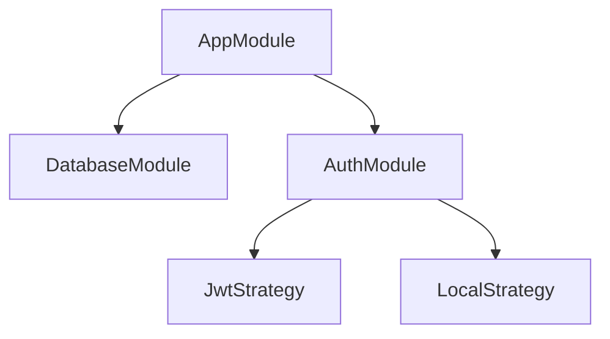
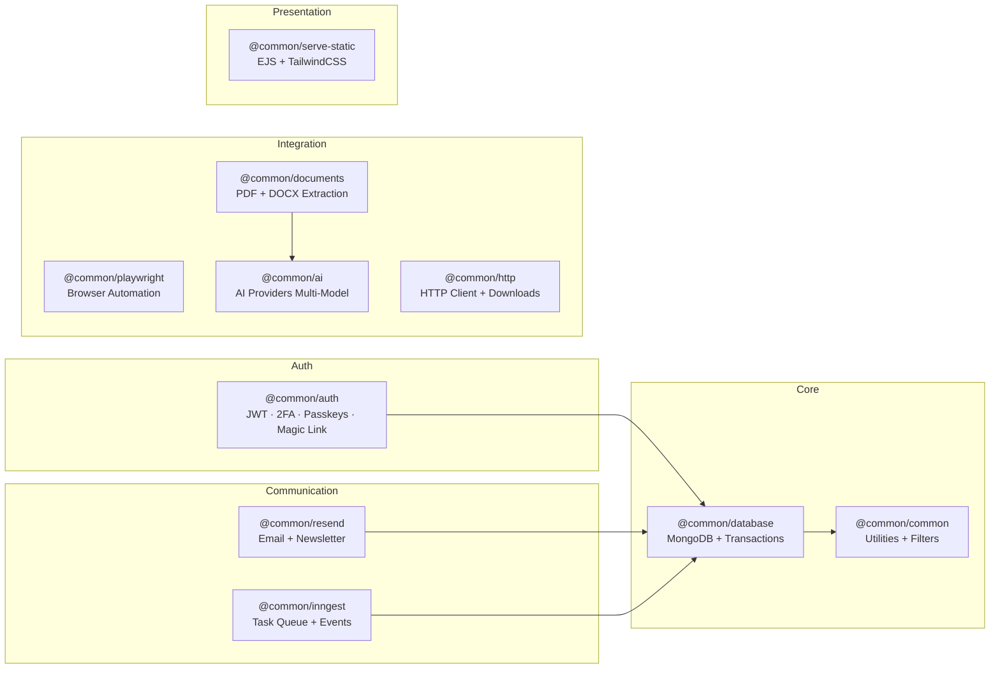

# Documentación IA-Friendly — Convention

Esta convención define cómo estructurar la documentación del proyecto para que sea consumible tanto por humanos como por modelos de IA. El objetivo es que cualquier agente pueda entender el proyecto, sus dependencias, y cómo contribuir sin ambigüedad.

## 1. Nomenclatura por Paquete

Cada `packages/<name>/` DEBE tener:

```
packages/<name>/
├── README.md               # [REQUERIDO] Entry point — propósito, quick start, API
├── src/
│   └── ...                 # [REQUERIDO] JSDoc en TODOS los exports públicos
├── package.json            # [REQUERIDO] name, version, description, dependencies
└── tsconfig.json           # [REQUERIDO] Configuración TypeScript
```

### README.md — Contenido Mínimo

| Sección | Obligatorio | Descripción |
|---------|-------------|-------------|
| `# @common/<name>` | Sí | Título con el nombre del paquete |
| `## Quick Start` | Sí | Código mínimo de importación y uso |
| `## Environment Variables` | Sí | Tabla: variable, default, required, descripción |
| `## API` | Sí | Tabla de métodos públicos con firma y descripción |
| `## Dependencies` | Sí | Dependencias con versiones |
| `## Deployment` | Recomendado | Consideraciones para producción |

## 2. JSDoc en Código

TODO método, interface, clase, decorador, y guard EXPORTADO debe tener JSDoc mínimo:

```typescript
/**
 * Envía un email usando Resend API.
 * @param options - Opciones del email (to, subject, html, etc.)
 * @returns Resultado con id, destinatarios, y timestamp
 * @throws Error si la API key no está configurada o la API rechaza el request
 */
async sendEmail(options: EmailOptions): Promise<SendEmailResult>
```

No se requiere JSDoc en:
- Métodos privados (el nombre debe ser autodescriptivo)
- Parámetros obvios de constructores de NestJS

## 3. Cross-References

Para referenciar otros paquetes del proyecto:

```markdown
Depende de: [@common/database](../database/README.md)
Usado por: [@common/resend](../resend/README.md)
See also: [AuthModule — Two Factor](../auth/README.md#two-factor)
```

En JSDoc:

```typescript
// @see {@link AuthService} para validación de usuarios
```

## 4. AGENTS.md — Master Index

El archivo `AGENTS.md` en la raíz funciona como índice maestro. Debe contener:

- **Tabla de contenido** con links a cada paquete y archivo clave
- **Quick reference** de comandos
- **Reglas de código** (imports, naming, DI)
- **Diagrama de arquitectura** (Mermaid)
- **Sección por paquete** con: propósito, ubicación, dependencias, estado de documentación

## 5. Estados de Documentación

Cada README debe marcar su estado al inicio como comentario HTML:

```markdown
<!-- @common/resend — status: complete | partial | critical -->
```

| Status | Significado |
|--------|-------------|
| `complete` | README completo + JSDoc + tests |
| `partial` | README existe pero falta JSDoc o tests |
| `critical` | Sin README o con información incorrecta |

## 6. Diagramas

Usar Mermaid para diagramas inline en READMEs y AGENTS.md:

````markdown

````

## 7. Reglas para Documentación Autónoma

### Gatillos para documentar

Cuando un agente/IA realiza cualquiera de estas acciones, DEBE documentar el cambio:

| Acción | Documentar |
|--------|------------|
| Nuevo paquete | README.md + package.json + tsconfig + JSDoc |
| Nuevo método público | JSDoc en el método |
| Nueva variable de entorno | Agregar al README y a AGENTS.md |
| Nuevo endpoint | Swagger decorators + tabla en README |
| Nueva dependencia | Agregar a dependencies en README |
| Breaking change | Marcar en CHANGELOG |

### Template para commits de documentación

```
docs(@common/<name>): <cambio breve>

- README.md: actualizado <sección>
- JSDoc: agregado a <clase>.<método>
```

### Checklist pre-commit para IA

- [ ] JSDoc en todos los nuevos exports públicos
- [ ] README.md del paquete actualizado
- [ ] `packages/<name>/package.json` description actualizada
- [ ] Variables de entorno nuevas documentadas en README
- [ ] AGENTS.md actualizado si hay cambios estructurales

## 8. Índice Cross-Package


