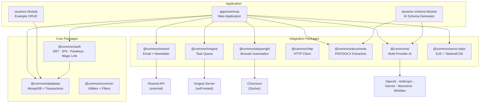
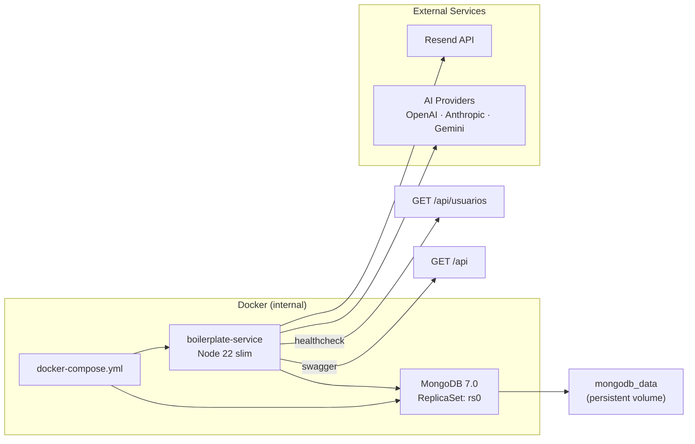
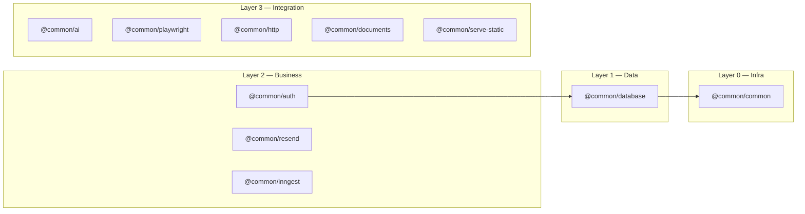

# Architecture & Stack

> Stack, architecture view, deployment view, and package dependency layers for the NestJS boilerplate service.

---

## Application Architecture

---

## Docker Deployment

---

## Stack Tecnológico

| Tecnología | Versión | Propósito |
|------------|---------|-----------|
| NestJS | 11.x | Framework |
| TypeScript | 5.7.x | Lenguaje |
| MongoDB | 7.0 | Base de datos (ReplicaSet) |
| Mongoose | 9.x | ODM |
| Inngest | 4.x | Task queue |
| Playwright | 1.59.x | Browser automation |
| Swagger | 11.3.x | API docs |
| Docker | — | Node 22.18.0-slim |
| Argon2 | 0.31.x | Password hashing |

---

## Package Dependency Layers

