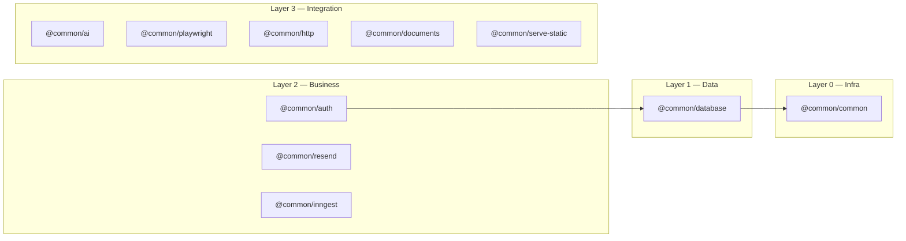

# Packages & Documentation Index

> Package matrix, dependency graph, per-package notes, project status, and documentation cross-references.

---

## Package Matrix

| Package | README | JSDoc | Swagger | Tests | Estado |
|---------|--------|-------|---------|-------|--------|
| [@common/ai](../packages/ai/README.md) | ✅ | ❌ | — | ❌ | partial |
| [@common/auth](../packages/auth/README.md) | ✅ | ⚠️ | ❌ | ❌ | partial |
| [@common/common](../packages/common/README.md) | ⚠️ | ❌ | — | ❌ | partial |
| [@common/database](../packages/database/README.md) | ✅ | ⚠️ | — | ❌ | partial |
| [@common/documents](../packages/documents/README.md) | ✅ | ⚠️ | — | ❌ | partial |
| [@common/http](../packages/http/README.md) | ✅ | ⚠️ | — | ❌ | partial |
| [@common/inngest](../packages/inngest/README.md) | ✅ | ⚠️ | ✅ | ✅ | **complete** |
| [@common/playwright](../packages/playwright/README.md) | ✅ | ⚠️ | — | ❌ | partial |
| [@common/resend](../packages/resend/README.md) | ✅* | ❌ | — | ❌ | partial |
| [@common/serve-static](../packages/serve-static/README.md) | ✅* | ❌ | — | ❌ | partial |

> ✅ = completo · ⚠️ = parcial · ❌ = ausente · — = no aplica · \* = creado recientemente

---

## Package Dependency Layers



---

## Notes per Package

#### `@common/ai` — AI Providers Wrapper
- **Ubicación:** `packages/ai/`
- **Dependencias:** `openai`, `@anthropic-ai/sdk`, `@google/generative-ai`
- **Providers:** OpenAI, Anthropic, Gemini, Moonshot, MiniMax + custom
- **Incluye:** `AiService.chat()`, `generateText()`, `generateSchema()`, `embeddings()`, streaming
- **Falta:** JSDoc en métodos públicos, tests unitarios

#### `@common/auth` — Authentication
- **Ubicación:** `packages/auth/`
- **Métodos:** JWT, Magic Link, OAuth (placeholder), 2FA/TOTP, Passkeys/WebAuthn
- **Password hashing:** Argon2 (NO bcrypt — `argon2` en uso, `bcrypt` en package.json es legacy)
- ⚠️ **Auth es stub/demo** — hardcodea `demo@example.com` / `demo123`. No usar en producción sin reemplazar.
- **Falta:** Swagger decorators en controlador, JSDoc completo, tests

#### `@common/common` — Utilities
- **Ubicación:** `packages/common/`
- **Contiene:** `BaseAdapter<T>` interface, `DatabaseExceptionFilter`, `HttpError`
- ⚠️ `http-error` está duplicado con `packages/http/`
- **Falta:** README más completo, JSDoc, unificar con http

#### `@common/database` — MongoDB
- **Ubicación:** `packages/database/`
- **Requiere:** MongoDB ReplicaSet (`rs0`) para transacciones
- **Incluye:** `TransactionService.withTransaction()`, `@Transactional` decorator, retry logic
- **Falta:** JSDoc en transaction, ejemplos de decorators, tests

#### `@common/documents` — Document Extraction
- **Ubicación:** `packages/documents/`
- **Formatos:** PDF (`pdf-parse`), DOCX (`mammoth`), parser interface extensible
- **Falta:** JSDoc en servicios, tests con archivos de prueba

#### `@common/http` — HTTP Client
- **Ubicación:** `packages/http/`
- **Incluye:** HTTP client (axios), download service con sharp para optimización de imágenes
- **Falta:** JSDoc completo, tests, unificar http-error con common

#### `@common/inngest` — Task Queue ⭐ (mejor documentado)
- **Ubicación:** `packages/inngest/`
- **Endpoints:** `/api/inngest`, `/api/inngest-events/hola-inngest`
- **Tiene:** Tests unitarios + integración, Swagger decorators, README bilingüe
- **Falta:** JSDoc completo en métodos

#### `@common/playwright` — Browser Automation
- **Ubicación:** `packages/playwright/`
- **Config:** Playwright con Chromium, headless configurable, timeouts, retries
- **Falta:** Tests (complejo por requerir browser), JSDoc en servicio

#### `@common/resend` — Email (recientemente documentado)
- **Ubicación:** `packages/resend/`
- **Incluye:** `ResendService` (email simple + templates), `NewsletterModule` (suscriptores in-memory)
- ⚠️ Newsletter usa `Map` en memoria — NO persiste entre reinicios
- **Falta:** JSDoc, tests, persistencia para newsletter

#### `@common/serve-static` — EJS Templates (recientemente documentado)
- **Ubicación:** `packages/serve-static/`
- **Incluye:** `ServeStaticService.render()`, layouts, partials, TailwindCSS CDN, caché 60s
- **Falta:** JSDoc, tests, ejemplos de templates

---

## Project Status Dashboard

### Cambios Activos

| Change | Status | Fase | Package Afectado | Spec |
|--------|--------|------|------------------|------|
| `init-openspec-structure` | ✅ Complete | archive | — | `openspec/specs/*` |
| `fix-auth-swagger` | ✅ Complete | apply | `auth` | `openspec/specs/auth/spec.md` |
| `fix-package-cleanup` | ✅ Complete | apply | root (package.json, tsconfig) | — |
| `fix-unify-http-error` | ✅ Complete | apply | `common`, `http` | — |
| `fix-cross-reference-docs` | ✅ Complete | apply | all packages | — |

> ✅ Complete · 🔄 In Progress · 🔲 Pending · ❌ Blocked

### Documentación por Paquete

| Package | README | Spec OpenSpec | JSDoc | Status |
|---------|--------|---------------|-------|--------|
| `@common/ai` | ✅ | ✅ | ❌ | partial |
| `@common/auth` | ✅ | ✅ | ⚠️ | partial |
| `@common/common` | ⚠️ | — | ❌ | partial |
| `@common/database` | ✅ | ✅ | ⚠️ | partial |
| `@common/documents` | ✅ | ✅ | ⚠️ | partial |
| `@common/http` | ✅ | ✅ | ⚠️ | partial |
| `@common/inngest` | ✅ | ✅ | ⚠️ | **complete** |
| `@common/playwright` | ✅ | ✅ | ⚠️ | partial |
| `@common/resend` | ✅* | ✅ | ❌ | partial |
| `@common/serve-static` | ✅* | ✅ | ❌ | partial |

### Issues Conocidos

| ID | Descripción | Severidad | Package |
|----|-------------|-----------|---------|
| #1 | Auth es stub (demo@example.com) | **ALTA** | `auth` |
| #2 | Swagger tags ausentes en auth controller | ✅ Fixed | `auth` |
| #3 | `@types/bcrypt` no se usa | ✅ Fixed | root |
| #4 | `auth`, `resend`, `serve-static` sin path en tsconfig | ✅ Fixed | root |
| #5 | `http-error` duplicado en common y http | ✅ Fixed | `common`, `http` |
| #6 | Newsletter usa Map en memoria (no persiste) | **BAJA** | `resend` |

---

## Documentation Index

### Cross-Reference Matrix

Cada spec de dominio referencia su documentación asociada:

| Dominio | Spec | README | Código Fuente |
|---------|------|--------|---------------|
| Auth | `openspec/specs/auth/spec.md` | `packages/auth/README.md` | `packages/auth/src/` |
| AI | `openspec/specs/ai/spec.md` | `packages/ai/README.md` | `packages/ai/src/` |
| Database | `openspec/specs/database/spec.md` | `packages/database/README.md` | `packages/database/src/` |
| Email | `openspec/specs/email/spec.md` | `packages/resend/README.md` | `packages/resend/src/` |
| Documents | `openspec/specs/documents/spec.md` | `packages/documents/README.md` | `packages/documents/src/` |
| HTTP | `openspec/specs/http/spec.md` | `packages/http/README.md` | `packages/http/src/` |
| Inngest | `openspec/specs/inngest/spec.md` | `packages/inngest/README.md` | `packages/inngest/src/` |
| Playwright | `openspec/specs/playwright/spec.md` | `packages/playwright/README.md` | `packages/playwright/src/` |
| Serve Static | `openspec/specs/serve-static/spec.md` | `packages/serve-static/README.md` | `packages/serve-static/src/` |

### Cómo Buscar Documentación

**Para un agente IA:**

1. **Entender un módulo** → `openspec/specs/{domain}/spec.md` (contrato) + `packages/{domain}/README.md` (uso)
2. **Encontrar código** → `packages/{name}/src/` (implementación), `apps/nominas/src/modules/{name}/` (módulos app)
3. **Ver cambios activos** → `openspec/changes/` (cambios en progreso)
4. **Ver historial** → `openspec/changes/archive/` (cambios completados)
5. **Buscar env vars** → [`docs/CONVENTIONS.md`](./CONVENTIONS.md) (variables agrupadas)
6. **Verificar documentación faltante** → [`docs/PACKAGES.md`](./PACKAGES.md) (status dashboard)

**Tags de estado en READMEs:**

Cada README de paquete lleva un tag HTML de estado:

```html
<!-- @common/<name> — status: complete | partial | critical -->
```

Para encontrar paquetes con documentación crítica:

```bash
rg "status: critical" packages/*/README.md
```

### Documentación Externa de Referencia

| Librería | Documentación |
|----------|---------------|
| NestJS 11 | https://docs.nestjs.com/ |
| Mongoose 9 | https://mongoosejs.com/docs/ |
| Inngest 4 | https://www.inngest.com/docs |
| Playwright | https://playwright.dev/docs/ |
| Resend | https://resend.com/docs |
| Swagger NestJS | https://docs.nestjs.com/openapi/introduction |
| argon2 | https://github.com/ranisalt/node-argon2 |
| @simplewebauthn | https://simplewebauthn.dev/docs/ |
