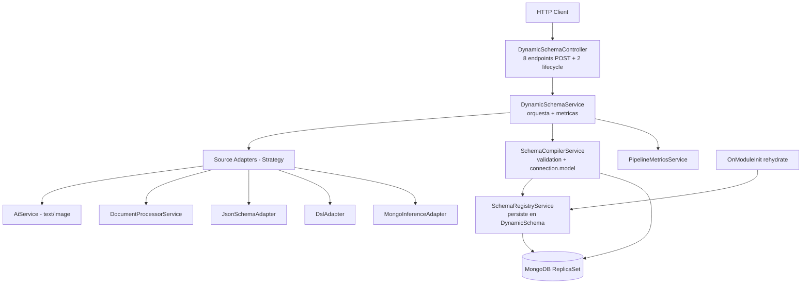

# Design: Dynamic Schema Pipeline Hardening

## Pipeline (post-refactor)



## Strategy Pattern: Source Adapters

```typescript
interface SourceAdapter<TInput, TOutput = GeneratedSchema> {
  readonly source: SchemaSource;
  validate(input: TInput): ValidationResult;
  convert(input: TInput, context: AdapterContext): Promise<TOutput>;
}
```

Implementations:
- TextSourceAdapter -> AiService.generateSchemaFromText
- ImageSourceAdapter -> AiService.generateSchemaFromImage (real vision)
- DocumentSourceAdapter -> DocumentProcessor.extract + TextSourceAdapter
- JsonSchemaSourceAdapter -> maps draft-07 -> GeneratedSchema (no AI)
- DslSourceAdapter -> mini-parser -> GeneratedSchema (no AI)
- MongoInferenceSourceAdapter -> sample docs -> GeneratedSchema (no AI)

All non-AI adapters are deterministic and cheap. AI adapters incur latency + tokens.


## Data Model

### GeneratedSchema (extended, backwards compatible)

```typescript
interface GeneratedSchema {
  fields: SchemaFieldDefinition[];
  collectionName: string;
  metadata?: Record<string, unknown>;
  source?: SchemaSource;          // NEW
  timestamps?: boolean;           // NEW (default true)
  options?: {                     // NEW
    strict?: boolean;
    versionKey?: boolean;
    minimize?: boolean;
  };
}

interface SchemaFieldDefinition {
  name: string;
  type: 'string' | 'number' | 'boolean' | 'date' | 'array' | 'object' | 'mixed' | 'objectId';
  required?: boolean;
  unique?: boolean;               // NEW
  index?: boolean;                // NEW
  ref?: string;                   // NEW (cross-collection ref)
  default?: unknown;
  enum?: unknown[];               // NEW
  validate?: Record<string, unknown>;
  items?: SchemaFieldDefinition;  // NEW (type=array)
  properties?: Record<string, SchemaFieldDefinition>;  // NEW (type=object)
}
```

### DynamicSchema (metadata, persisted)

```typescript
{
  collectionName: string;        // unique
  schemaDefinition: string;      // JSON.stringify(GeneratedSchema)
  fieldsHash: string;            // sha256(normalized fields) for idempotency
  source: SchemaSource;
  provider?: string;
  model?: string;
  registeredAt: Date;
  registeredBy?: string;
  options?: Record<string, unknown>;
}
```

## Endpoints (final list)

| Method | Path | Description |
|--------|------|-------------|
| POST | /api/dynamic-schema/extract | extract only |
| POST | /api/dynamic-schema/generate-from-text | text -> schema (AI) |
| POST | /api/dynamic-schema/generate-from-image | image -> schema (AI vision) |
| POST | /api/dynamic-schema/compile | manual JSON -> compile + register |
| POST | /api/dynamic-schema/compile/dry-run | validate only |
| POST | /api/dynamic-schema/compile-from-json-schema | JSON Schema draft-07 |
| POST | /api/dynamic-schema/compile-from-dsl | DSL declarative |
| POST | /api/dynamic-schema/infer-from-collection/:name | Mongo inference |
| POST | /api/dynamic-schema/pipeline | doc -> extract + generate + compile |
| GET  | /api/dynamic-schema/schemas | list registered |
| DELETE | /api/dynamic-schema/schemas/:collectionName | unregister |
| GET  | /api/dynamic-schema/metrics | metrics snapshot |

## Technical Decisions

| Decision | Alternative | Chosen | Rationale |
|----------|-------------|--------|-----------|
| Image vision | OpenAI-only / multi-provider / OCR | Multi-provider with capability check | Matches existing module promise |
| Compile vs register | Same step / 2 endpoints / +dry-run | Same step + dry-run opt | Best UX, dry-run for safety |
| Persistence | In-memory Map / Redis / Mongo | Mongo (DynamicSchema) | Rehydrate without extra infra |
| AI retry | Same prompt / response_format / temp 0 | response_format + temp=0 on retry | Deterministic, robust |
| array/object types | Just Object / items + properties | items[] + properties{} | Complex schemas expressible |
| DSL syntax | Custom / JSON / YAML | Mini-DSL "Entity { ... }" | Human-readable, LLM-friendly |
| Mongo inference | Sample N / aggregation pipeline | Sample 50 + majority coercion | Sufficient for typical forms |
| Validation | class-validator only / Zod / JSON Schema | class-validator + runtime check | Reuses existing dep |
| Observability | Logs only / Prometheus / OTel | In-memory counters + logs | No infra, sufficient |

## Rollback

Env flag DYNAMIC_SCHEMA_LEGACY=true switches SchemaCompilerService to previous
behavior (Map only, no connection.model(), no persistence). Useful for hot
rollback while keeping the rest of the code deployed.

## Affected Documentation

- apps/nominas/src/modules/dynamic-schema/README.md (rewrite with table of sources)
- packages/ai/README.md (Vision multi-provider section)
- AGENTS.md section 12 (Project Status Dashboard)
