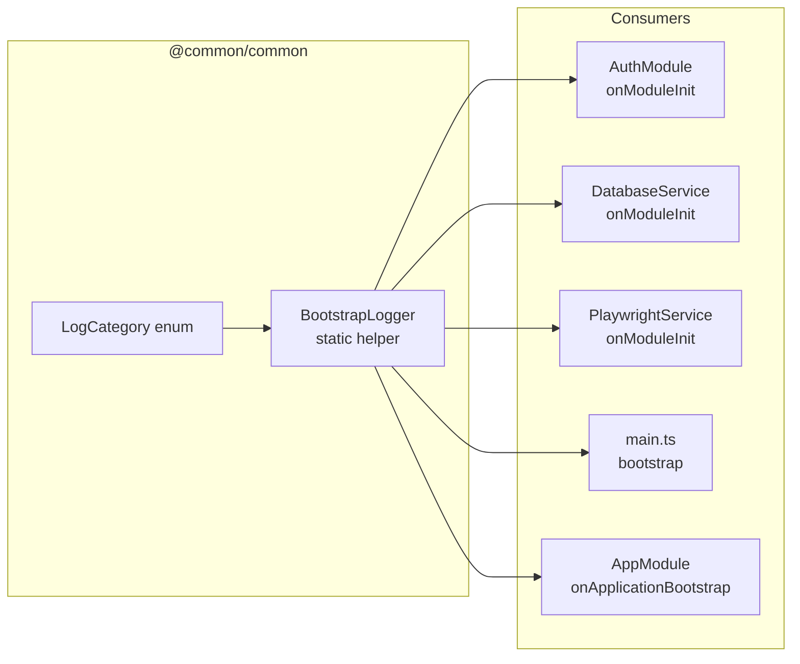
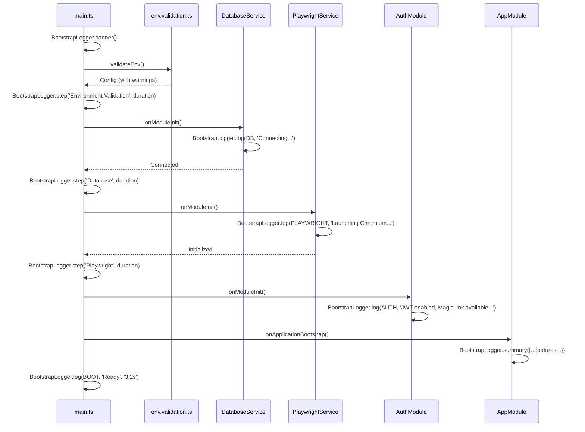

# Design: Improve Startup Logs

## Architecture



## Key Decisions

### Decision 1: Static Helper vs Injectable Service

**Chosen:** Static helper (`BootstrapLogger` with static methods)

**Rationale:**
- Startup logs happen during module initialization, before DI container is fully wired
- Static helper can be called from `main.ts` (outside NestJS DI) and from lifecycle hooks
- Zero dependencies, zero configuration, zero module registration
- Follows the "lazy senior dev" principle: fewest files, no boilerplate

**Rejected alternatives:**
- Injectable service — requires module registration, can't use in `main.ts`
- Global Logger override — too invasive for this scope

### Decision 2: LogCategory in @common/common vs dedicated @common/logger

**Chosen:** `@common/common`

**Rationale:**
- Keeps package count flat — no new package for ~30 lines of enum + ~50 lines of utility
- `@common/common` already exists and is imported by all consumers
- Extraction to dedicated package is always possible later (open/closed principle)

### Decision 3: Rich Format vs Plain Format

**Chosen:** Rich format by default, `LOG_STYLE=plain` fallback

**Rationale:**
- Rich format (box-drawing, emoji, alignment) provides immediate visual grouping for humans in dev
- Production log aggregators parse structured JSON, not console text — so visual format matters for dev
- `LOG_STYLE=plain` fallback ensures compatibility with tools that choke on Unicode
- Implementation: check `process.env.LOG_STYLE` once at module load

### Decision 4: Timing on startup phases

**Chosen:** Manual timing via `Date.now()` in `BootstrapLogger.step()`

**Rationale:**
- No need for a `Stopwatch` class for 3-5 phases
- `Date.now()` is monotonic enough for startup timing (ms precision is fine)
- Each `step()` call records time since the previous step


## Format Specification

### Rich Format (default)

```
╔══════════════════════════════════════════════════════╗
║       Boilerplate Service v1.0                       ║
╠══════════════════════════════════════════════════════╣
║  ◉ Step 1: Environment Validation      (12ms)       ║
║  ◉ Step 2: Database Connection         (342ms)      ║
║  ◉ Step 3: Module Initialization       (89ms)       ║
╠══════════════════════════════════════════════════════╣
║  ● HTTP     http://localhost:3000                    ║
║  ● Swagger  http://localhost:3000/api                ║
╠══════════════════════════════════════════════════════╣
║  ✓ MongoDB       connected (boilerplate_db@rs0)      ║
║  ✓ Playwright    Chromium initialized                ║
║  ✓ Auth          JWT · MagicLink · 2FA · Passkeys    ║
║  ⚡ Inngest      event_key not set (disabled)         ║
║  ⚡ Resend       API key not set (disabled)           ║
║  ✓ AI Providers  openai · anthropic                   ║
╚══════════════════════════════════════════════════════╝
```

### Plain Format (LOG_STYLE=plain)

```
[BOOT] Boilerplate Service v1.0
[BOOT] ◉ Step 1: Environment Validation (12ms)
[BOOT] ◉ Step 2: Database Connection (342ms)
[BOOT] ◉ Step 3: Module Initialization (89ms)
[BOOT] ● HTTP: http://localhost:3000
[BOOT] ● Swagger: http://localhost:3000/api
[BOOT] ✓ MongoDB: connected (boilerplate_db@rs0)
[BOOT] ✓ Playwright: Chromium initialized
[BOOT] ✓ Auth: JWT · MagicLink · 2FA · Passkeys
[BOOT] ⚡ Inngest: event_key not set (disabled)
[BOOT] ⚡ Resend: API key not set (disabled)
[BOOT] ✓ AI Providers: openai · anthropic
```

## Files

### New Files

| File | Purpose |
|------|---------|
| `packages/common/src/logger/log-category.enum.ts` | `LogCategory` enum |
| `packages/common/src/logger/bootstrap-logger.ts` | `BootstrapLogger` static helper |
| `packages/common/src/logger/index.ts` | Barrel export for logger directory |

### Modified Files

| File | Change |
|------|--------|
| `packages/common/src/index.ts` | Add `export * from './logger'` |
| `apps/nominas/src/main.ts` | Rich bootstrap with `BootstrapLogger` steps + banner |
| `packages/auth/src/auth.module.ts` | Use `BootstrapLogger.log(LogCategory.AUTH, ...)` |
| `packages/database/src/database.service.ts` | Use `BootstrapLogger.log(LogCategory.DB, ...)` |
| `packages/playwright/src/playwright.service.ts` | Use `BootstrapLogger.log(LogCategory.PLAYWRIGHT, ...)` |
| `apps/nominas/src/app.module.ts` | Add `onApplicationBootstrap()` for feature summary |
| `CHANGELOG.md` | Entry for v0.6.0 |
| `AGENTS.md` | Update status dashboard §12 |
| `packages/common/README.md` | Document new exports |

## Dependencies

| Dependency | Change |
|------------|--------|
| `@nestjs/common` | Already present — `Logger` class used internally |
| New npm packages | **None** — zero new dependencies |

## Sequence: Startup Log Flow


