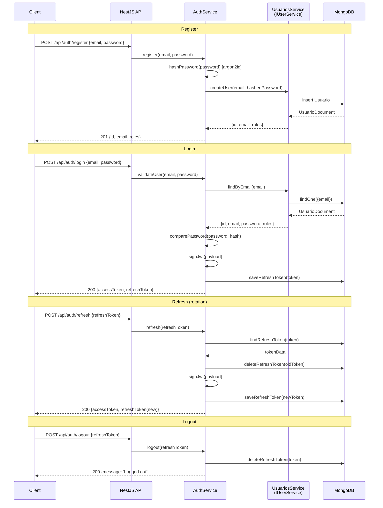
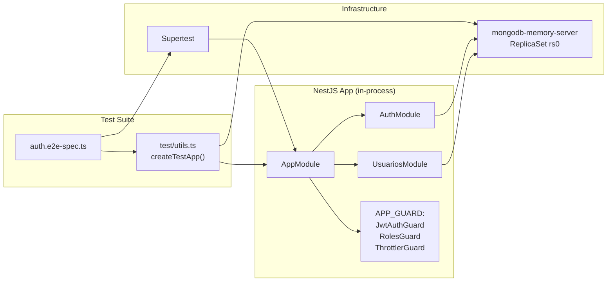

# Design: Auth E2E Hardening

## Auth Flow (post-hardening)



## Demo Stub Gate

### Before (current)

```typescript
// auth.service.ts — validateUser()
if (this.userService) {
  // real path
} else {
  // Fallback — demo stub (ALWAYS active)
  if (email === 'demo@example.com' && password === 'demo123') {
    return { id: 'demo-user-id', ... };
  }
}
```

### After (gated)

```typescript
// auth.service.ts — validateUser()
if (this.userService) {
  // real path (unchanged)
} else if (this.isDemoModeEnabled()) {
  // Demo stub — only when AUTH_DEMO_MODE=true
  if (email === 'demo@example.com' && password === 'demo123') {
    return { id: 'demo-user-id', ... };
  }
} else {
  this.logger.error('No IUserService wired and AUTH_DEMO_MODE is disabled');
}
return null;
```

### `isDemoModeEnabled()` implementation

```typescript
private isDemoModeEnabled(): boolean {
  return this.configService.get<string>('AUTH_DEMO_MODE') === 'true';
}
```

### Bootstrap warning

```typescript
// app.module.ts — onApplicationBootstrap()
if (this.configService.get('AUTH_DEMO_MODE') === 'true') {
  BootstrapLogger.warn('Auth demo mode is ACTIVE — do not use in production');
}
```

## E2E Test Architecture



### E2E test file structure

```
apps/nominas/test/
├── utils.ts                    ← createTestApp() + teardownTestApp()
├── utils.llm-context.md        ← LLM context for test infra
├── health.e2e-spec.ts          ← GET /api/health
├── auth.e2e-spec.ts            ← register → login → protected → refresh → logout
├── auth.e2e-spec.llm-context.md
├── auth-2fa.e2e-spec.ts        ← 2FA setup → verify → login-with-code
├── auth-magic-link.e2e-spec.ts ← magic link request → verify
├── usuarios.e2e-spec.ts        ← CRUD with auth
└── jest-e2e.json               ← existing config (unchanged)
```

### Test data helpers

```typescript
// test/utils.ts
export function testUser(overrides = {}) {
  return {
    email: `test-${Date.now()}@example.com`,
    password: 'TestPass123!',
    name: 'Test User',
    ...overrides,
  };
}

export async function registerAndLogin(app: INestApplication) {
  const user = testUser();
  await request(app.getHttpServer())
    .post('/api/auth/register')
    .send(user)
    .expect(201);
  const { body } = await request(app.getHttpServer())
    .post('/api/auth/login')
    .send({ email: user.email, password: user.password })
    .expect(200);
  return { user, ...body };
}
```

## Env Var Changes

| Variable | Default | Description |
|----------|---------|-------------|
| `AUTH_DEMO_MODE` | `false` | Enable demo stub (`demo@example.com / demo123`) |

Added to `env.validation.ts` as optional boolean with default `false`.
Added to `.env.example` as `AUTH_DEMO_MODE=true` (dev convenience).

## Documentation Updates

| Document | Change |
|----------|--------|
| `packages/auth/README.md` | Add "E2E Testing" + "AUTH_DEMO_MODE" sections |
| `AGENTS.md` §6 | Add `AUTH_DEMO_MODE` to env vars |
| `AGENTS.md` §12 | Issue #1: "Auth es stub" → "Gateado con AUTH_DEMO_MODE" |
| `apps/nominas/test/` | `.llm-context.md` files for E2E infra |
