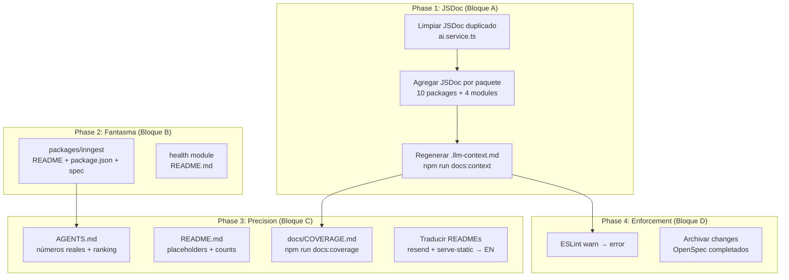

# Design: Complete AI-Friendly Documentation Content

## Overview

Este change ejecuta el **contenido** que la infraestructura del change
`documentation-llm-readiness-audit` prometió pero nunca entregó.
No modifica scripts ni lógica — solo agrega documentación al código
existente y corrige datos desactualizados.

## Execution Pipeline



## JSDoc Strategy (Phase 1)

### Template (from JSDOC-MIGRATION-PLAN.md)

```typescript
/**
 * Brief one-line description of what the method does.
 *
 * Optional longer explanation of behavior, edge cases, or design
 * decisions that aren't obvious from the signature alone.
 *
 * @param paramName - Description of the parameter
 * @returns Description of what is returned
 * @throws {ErrorType} When condition that triggers the error
 *
 * @example
 * const result = service.doSomething('input');
 */
```

### Rules

1. **English** for all JSDoc (per JSDOC-MIGRATION-PLAN recommendation)
2. **Preserve** existing quality JSDoc (e.g., `database.service.ts`)
3. **Remove** stub noise: `/** methodName (see class JSDoc for context). */`
4. **One block per method** — never duplicate
5. **Skip** constructors, private methods, DTOs, schemas, guards (ESLint excludes)

### Package Priority Order

| # | Package | Files | Est. Methods | Priority |
|---|---------|-------|-------------|----------|
| 1 | `@common/ai` | 8 | ~45 | 🔴 HIGH (duplicados + core) |
| 2 | `@common/auth` | 12 | ~60 | 🔴 HIGH (complejo) |
| 3 | `@common/database` | 5 | ~20 | 🟡 MED (ya tiene parcial) |
| 4 | `@common/http` | 6 | ~30 | 🟡 MED |
| 5 | `@common/playwright` | 4 | ~25 | 🟡 MED |
| 6 | `@common/documents` | 5 | ~20 | 🟡 MED |
| 7 | `@common/common` | 4 | ~15 | 🟢 LOW |
| 8 | `@common/resend` | 4 | ~15 | 🟢 LOW |
| 9 | `@common/serve-static` | 3 | ~10 | 🟢 LOW |
| 10 | `@common/inngest` | 3 | ~10 | 🟢 LOW |
| 11 | `apps/usuarios` | 4 | ~20 | 🟢 LOW |
| 12 | `apps/dynamic-schema` | 7 | ~35 | 🟢 LOW |
| 13 | `apps/scraper` | 6 | ~30 | 🟢 LOW |
| 14 | `apps/health` | 1 | ~2 | 🟢 LOW |

### Cleanup Pattern (ai.service.ts)

```typescript
// BEFORE (duplicado):
  /**
   * Register a new AI provider or override an existing one.
   * @param config - Provider configuration
   */
  /** registerProvider (see class JSDoc for context). */
  registerProvider(config: AIConfig): void { ... }

// AFTER (limpio):
  /**
   * Register a new AI provider or override an existing one.
   * @param config - Provider configuration with name, model, and optional API settings
   */
  registerProvider(config: AIConfig): void { ... }
```

## Inngest Package Documentation (Phase 2)

### README.md Structure

```
<!-- @common/inngest — status: complete -->
# @common/inngest
## Overview
## Quick Start
## API Reference
## Configuration (env vars)
## How It Works (architecture)
## Troubleshooting
## Dependencies
```

### Spec Structure (openspec/specs/inngest/spec.md)

- REQ-INNGEST-001: Module registration
- REQ-INNGEST-002: Function definition
- REQ-INNGEST-003: Event triggering
- REQ-INNGEST-004: Retry mechanism
- REQ-INNGEST-005: Error handling

## AGENTS.md Update Strategy (Phase 3)

### Sections to Update

| Section | Change |
|---------|--------|
| §4 Paquetes — Índice | Add `@common/inngest` row |
| §12 Status Dashboard | Add `complete-ai-docs-content` change |
| §13 Documentation Index | Add inngest row |
| §14 Cognitive Ranking | Add inngest, update JSDoc scores, fix test counts |

### README.md Fixes

| Location | Current | Target |
|----------|---------|--------|
| Tests badge | `Tests: XXX passed` | `Tests: 43 spec files` |
| LLM Heatmap | `27 spec files` | `43 spec files` |

## ESLint Promotion (Phase 4)

```javascript
// BEFORE:
"ai-readiness/require-public-jsdoc": "warn",

// AFTER:
"ai-readiness/require-public-jsdoc": "error",
```

**Pre-condition:** `npm run lint` MUST pass with 0 warnings from this rule
before promoting. If any remain, fix them first.

## OpenSpec Archive Criteria

A change is archivable when:
1. All tasks in `tasks.md` are marked `[x]`
2. `verify-report.md` exists (or change was trivial)
3. No pending dependencies from other active changes

### Changes to Archive

| Change | Reason |
|--------|--------|
| `documentation-llm-readiness-audit` | Phase 1+2 complete, Phase 3 deferred here |
| `audit-agents-md-references` | Complete |
| `docker-documentation-update` | Complete |
| `dynamic-schema-complete-pipeline` | Complete (superseded by hardening) |
| `env-validation-defaults` | Complete |

## Verification Plan

```bash
# 1. JSDoc coverage
npm run audit:docs
# Expected: coverage ≥80%, exit code 0

# 2. Lint with error-level rule
npm run lint
# Expected: 0 errors from ai-readiness/require-public-jsdoc

# 3. Build
npm run build
# Expected: success

# 4. Context files — zero placeholders
Get-ChildItem -Recurse -Include '*.llm-context.md' | Select-String 'Sin descripcion JSDoc'
# Expected: no matches

# 5. Coverage report exists
Test-Path docs/COVERAGE.md
# Expected: True
```

## Non-Goals

- No se modifican scripts (`audit-docs.js`, `generate-llm-context.js`)
- No se crean tests nuevos
- No se cambia lógica de negocio
- No se implementa auth real (stub se mantiene)
- No se modifica el flujo SDD ni OpenSpec config