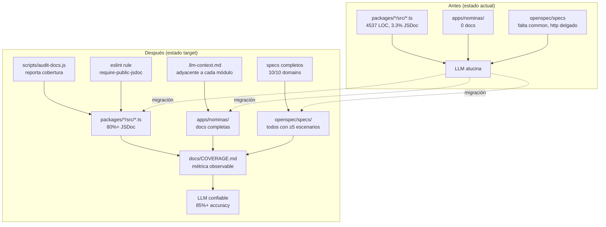
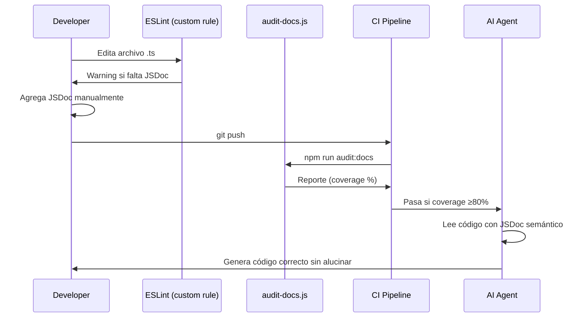
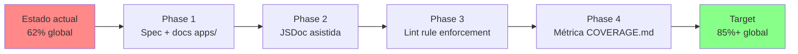

# Design: Documentation LLM-Readiness Audit

## Architecture Overview



## Decisiones Técnicas

### D1 — Generación de JSDoc: Asistida, no automática

**Decisión:** El script `audit-docs.js` **reporta qué falta** pero **NO genera JSDoc automáticamente**.

**Rationale:** JSDoc generado automáticamente (vía IA o AST manipulation) tiende a ser genérico ("Envía un email") y pierde el contexto semántico del dominio. Un humano+Itera asistido es más eficiente y produce mejor resultado que generación 100% IA.

**Alternativa descartada:** Usar IA para generar JSDoc en bulk → baja calidad, alto costo de tokens.

### D2 — `.llm-context.md` adyacente al módulo (no centralizado)

**Decisión:** Crear un archivo de contexto **al lado** del código, no en `/docs/central`.

**Rationale:** Los LLMs con tooling moderno (Claude Code, Cursor, Cline) leen más rápido un archivo adyacente porque:
1. Mantiene proximidad cognitiva (código ↔ contexto en mismo directorio)
2. Evita "context rot" (archivos lejanos se olvidan en contexto largo)
3. Permite generar/refrescar con un script simple

**Template del archivo:**
```markdown
<!-- .llm-context.md — Auto-mantenido. No editar manualmente si regenerable. -->

# <nombre>.ts — Contexto para IA

## Propósito
<1-2 líneas>

## Dependencias inyectadas
- ServicioX (de @common/x) — <para qué>

## Patrones aplicados
- Repository pattern
- Soft delete via deletedAt

## Errores típicos
- HttpError(404) cuando <condición>

## Convenciones del módulo
- Métodos retornan Promise<Entity>
- IDs son ObjectId de MongoDB
```

### D3 — ESLint rule custom, no plugin externo

**Decisión:** Implementar regla custom en `eslint.config.mjs` inline, no instalar `eslint-plugin-jsdoc`.

**Rationale:**
- `eslint-plugin-jsdoc` valida formato, no presencia → no resuelve el problema real
- Regla custom permite warn-only en transición
- Menos dependencias = menos superficie de mantenimiento

```javascript
// eslint.config.mjs (fragmento)
{
  files: ['packages/*/src/**/*.ts', 'apps/*/src/**/*.ts'],
  plugins: {
    'ai-readiness': {
      rules: {
        'require-public-jsdoc': {
          create(context) {
            return {
              MethodDefinition(node) {
                if (node.accessibility !== ''public'') return;
                const comments = context.getSourceCode().getCommentsBefore(node);
                const hasJSDoc = comments.some(c => c.type === ''Block'' && c.value.startsWith(''*''));
                if (!hasJSDoc) {
                  context.report({
                    node,
                    messageId: ''missingJsdoc'',
                    data: { name: node.key.name || ''anonymous'' }
                  });
                }
              }
            };
          }
        }
      }
    }
  },
  rules: {
    ''ai-readiness/require-public-jsdoc'': ''warn'' // cambiar a ''error'' post-rollout
  }
}
```

### D4 — Métrica de cobertura: archivos con JSDoc, no densidad de líneas

**Decisión:** El reporte mide **% de archivos exportados con JSDoc**, no densidad.

**Rationale:** Un método bien documentado vale más que 10 métodos con una línea. Contar por archivo refleja mejor "comprensibilidad" para el LLM.

**Fórmula:**
```
coverage = (archivos .ts con al menos 1 export público JSDoc''d) /
           (archivos .ts con al menos 1 export público) × 100
```

**Por qué no densidad:** JSDoc de 1 línea sobre un método obvio infla artificialmente la métrica sin agregar valor.

### D5 — Eliminación vs. archivado de archivos redundantes

**Decisión:** Eliminar `BOILERPLATE.md` con `git rm`, migrar contenido único a `AGENTS.md`.

**Rationale:**
- `BOILERPLATE.md` (481 líneas) y `AGENTS.md` (788 líneas) comparten ~60% del contenido
- Consolidar reduce carga cognitiva del LLM (lee 1 archivo en vez de 2)
- `git log BOILERPLATE.md` preserva historial

**Migración específica:**
| Sección de BOILERPLATE.md | Destino |
|---------------------------|---------|
| §1 Descripción General | §2 Stack y Arquitectura (ya existe) |
| §2 Stack Tecnológico | §2 Stack (consolidar tabla) |
| §3 Estructura del Proyecto | §4 Paquetes — Índice (ya existe) |
| §4 Packages Compartidos | §4 Paquetes (consolidar) |
| §5 Módulo de Ejemplo: Usuarios | `apps/nominas/src/modules/usuarios/README.md` |
| §6 Cómo Crear un Nuevo Módulo | `apps/nominas/CONTRIBUTING.md` |
| §7 Patrones de Diseño | `apps/nominas/PATTERNS.md` |
| §8 Configuración | §6 Configuración (consolidar) |
| §9 Scripts y Comandos | §1 Comandos (consolidar) |
| §10 Extracción de Packages | `docs/EXTRACTING-PACKAGES.md` |

### D6 — Specs delgados: expandir vs. dividir

**Decisión:** Expandir en sitio, no dividir.

**Rationale:**
- `http/spec.md` (126 palabras) tiene solo 2 escenarios → expandir a 5+
- `playwright/spec.md` (185 palabras) tiene 3 escenarios → expandir a 5+
- Dividir crearía specs fragmentados sin cohesión temática

### D7 — Nuevos specs sin implementar: ok

**Decisión:** `openspec/specs/common/spec.md` documenta capacidades YA implementadas.

**Rationale:**
- `BaseAdapter<T>`, `HttpError`, `DatabaseExceptionFilter` ya existen en código
- El spec captura el contrato **deseado** (Given/When/Then) que ya se cumple
- Futuros cambios deben pasar por delta spec → archive

## Diagrama de Secuencia — Generación de JSDoc



## Migration Path



## Referencias Externas

- [TypeScript JSDoc Reference](https://www.typescriptlang.org/docs/handbook/jsdoc-supported-types.html)
- [ESLint Custom Rules](https://eslint.org/docs/latest/extend/custom-rules)
- [OpenSpec Schema](https://github.com/Fission-AI/OpenSpec)
- [Anthropic: Claude Code Best Practices](https://docs.anthropic.com/claude-code)