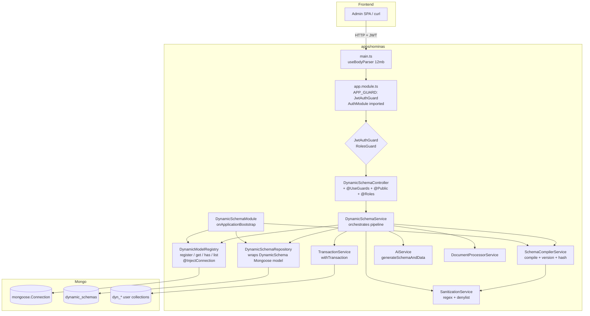
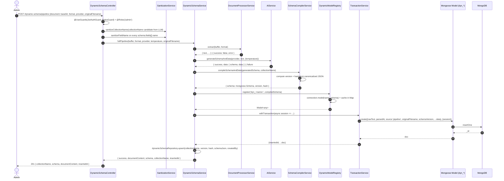
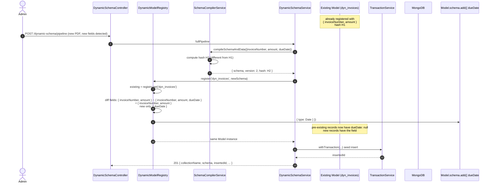
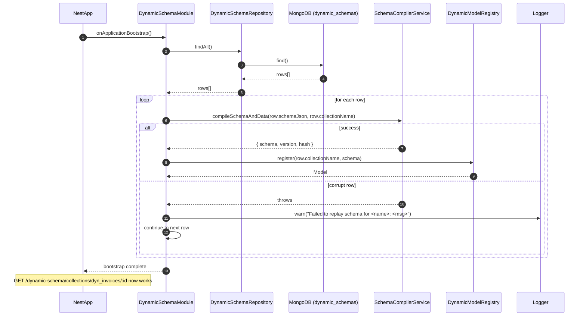
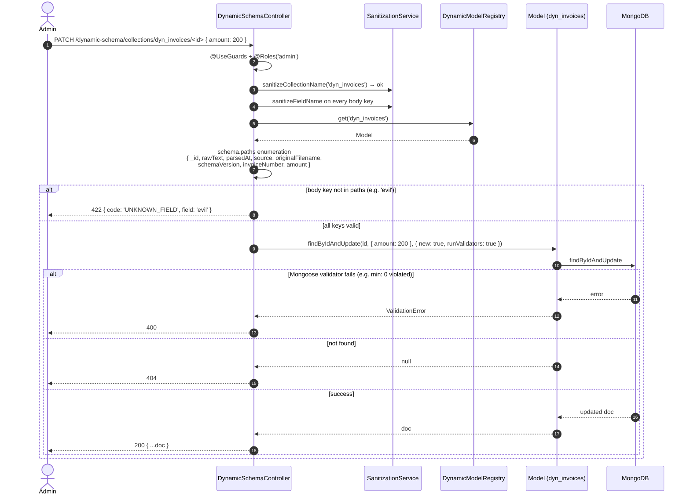
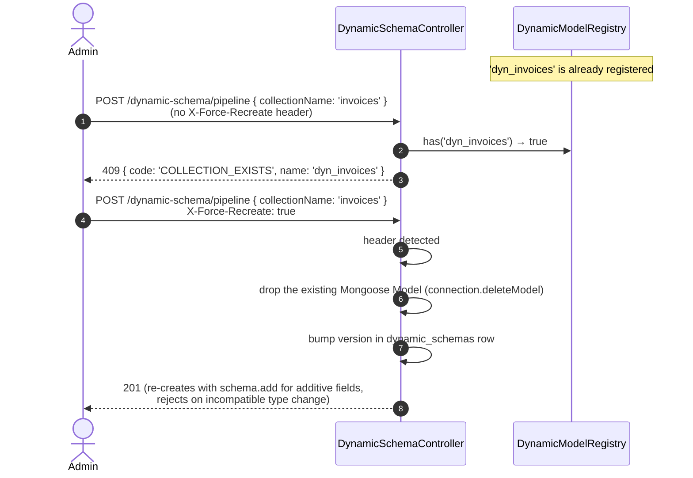
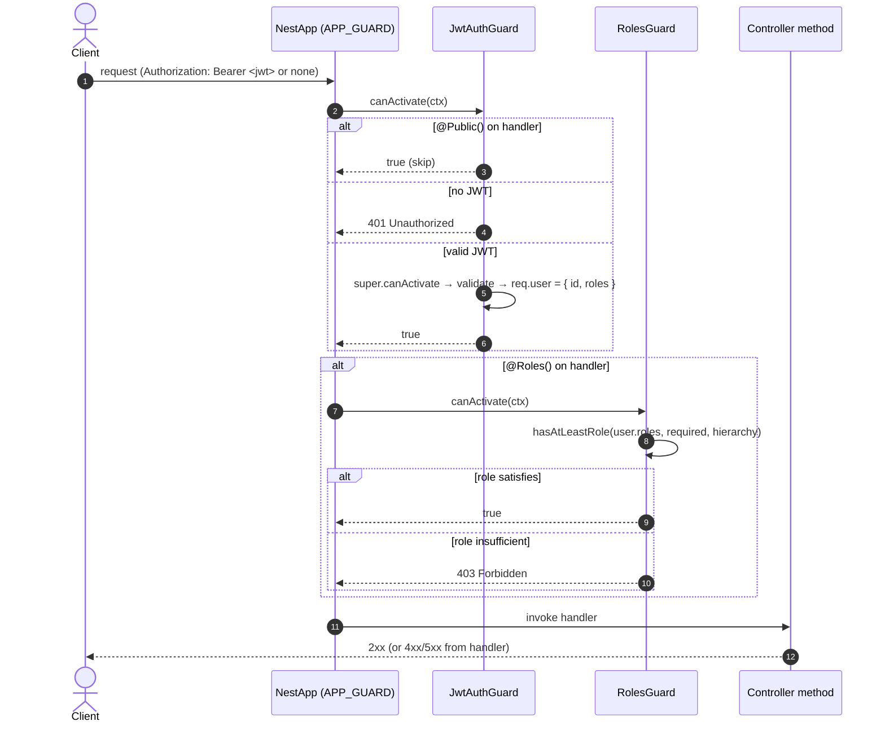

# Design: dynamic-schema-complete-pipeline

> Closes the 5 P0 blockers in the existing `dynamic-schema` module (orphan `Schema` in a process-local `Map`, unwired `DynamicSchemaSchema` Mongoose model, no data insertion, public OpenAI proxy, no input sanitization) and adds the minimum supporting surface (runtime registry, persistence + boot replay, seed ingestion, GET/PATCH corrections, `ui` field metadata, global `APP_GUARD`, 409 on duplicate, 12 MB body limit).

## 1. Architecture Overview

The current `dynamic-schema` module compiles a Mongoose `Schema` and stashes it in a process-local `Map` that no other service can see (`schema-compiler.service.ts:8, 45`); the `DynamicSchemaSchema` is defined but never registered with `MongooseModule.forFeature`; the `DynamicSchemaRepository` is a stub; and the controller is public with no sanitization. This change restructures the module into a layered architecture that matches the rest of the boilerplate (controller → service → repository) with **one** cross-cutting service — `DynamicModelRegistry` — that owns the only `connection.model(name, schema)` call in the codebase.

`DynamicModelRegistry` is the runtime answer to the user's "disponible inmediatamente" promise: it injects the live `@InjectConnection()` from `@nestjs/mongoose`, calls `connection.model(name, schema)` on register, and caches the returned `Model<any>` in a `Map` keyed by collection name. `DynamicSchemaService.fullPipeline` registers a new `Model` immediately after compiling the `GeneratedSchema`; `DynamicSchemaController` resolves the `Model` for PATCH/GET; and `DynamicSchemaModule.onApplicationBootstrap` replays all persisted schemas on boot so the registry survives a restart. The seed insert is wrapped in `TransactionService.withTransaction`, but model registration is intentionally **outside** the transaction because `connection.model()` is a Node-side, in-process operation that cannot participate in a Mongo transaction (this is a documented Mongoose limitation, called out inline).

Cross-cutting concerns are introduced at three boundaries: (1) a global `APP_GUARD: JwtAuthGuard` in `app.module.ts` makes every route authenticated by default, with `@Public()` opt-outs on the low-cost triage endpoints (`extract`, `generate-from-text`); (2) `SanitizationService` validates `collectionName` and every `field.name` against a regex + denylist at both the controller boundary AND the compiler boundary (defense-in-depth); (3) a 12 MB global body limit in `main.ts` bounds the base64 PDF payload.

## 2. Component Diagram



**Component responsibilities**

| Component | Role | Public? |
|---|---|---|
| `DynamicSchemaController` | HTTP layer; auth decorators; sanitization; status codes | yes (HTTP) |
| `DynamicSchemaService` | Pipeline orchestration; seed document assembly; `fullPipeline` | yes (module export) |
| `SchemaCompilerService` | `GeneratedSchema` → `mongoose.Schema`; computes `version` + `hash`; field-type validation | internal |
| `DynamicModelRegistry` | The single `connection.model(name, schema)` call site; in-process `Map` cache | internal |
| `SanitizationService` | Regex + denylist for `collectionName` and `field.name` | internal |
| `DynamicSchemaRepository` | Persists `DynamicSchema` rows; reads them on boot | internal |
| `TransactionService` | Atomic seed insert via `withTransaction` | external (`@common/database`) |
| `DynamicSchemaModule` | Wires providers; implements `onApplicationBootstrap` for boot replay | — |

## 3. Sequence Diagrams

### 3.1 Pipeline flow (happy path)



### 3.2 Schema evolution — additive growth (new fields)



### 3.3 Schema evolution rejected — incompatible type change

```mermaid
sequenceDiagram
    autonumber
    actor Admin
    participant C as DynamicSchemaController
    participant DMR as DynamicModelRegistry
    participant DSS as DynamicSchemaService
    participant SC as SchemaCompilerService

    Note over DMR: dyn_invoices.amount is Number
    Admin->>C: POST /dynamic-schema/pipeline (LLM returns amount:String)
    C->>DSS: fullPipeline
    DSS->>SC: compileSchemaAndData
    SC-->>DSS: { schema, version: 2, hash: H2 }
    DSS->>DMR: register('dyn_invoices', newSchema)
    DMR->>DMR: existing has amount:Number; new has amount:String
    DMR-->>DSS: throw UnprocessableEntityException({ code: 'INCOMPATIBLE_SCHEMA_CHANGE', field: 'amount' })
    Note over DSS: Mongoose schema.add is NOT called<br/>Existing Model is NOT mutated<br/>Persisted dynamic_schemas row is NOT updated
    DSS-->>C: 422 INCOMPATIBLE_SCHEMA_CHANGE
    C-->>Admin: 422 { code: 'INCOMPATIBLE_SCHEMA_CHANGE', field: 'amount' }
```

### 3.4 App boot replay



### 3.5 PATCH correction (validation against active schema)



### 3.6 409 Conflict on duplicate



### 3.7 Auth flow (global `APP_GUARD`)



## 4. Architecture Decisions

### AD-1: One LLM call (`{ schema, data }`) instead of two sequential calls

**Context**: The current `fullPipeline` calls `generateSchemaFromText` first and would, in the naive design, call the LLM a second time to extract data values for the seed. Two calls = two OpenAI invocations, two parses, two failure surfaces, two latency budgets. The user explicitly said "no waste tokens on a second call."

**Decision**: Add `AiService.generateSchemaAndData(provider, text, options?)` that requests `{ schema, data }` in one LLM call using `response_format: { type: 'json_object' }` (OpenAI-compatible providers). The pipeline calls it once.

**Rationale**:
- Halves LLM token cost and wall-clock latency for the pipeline.
- Eliminates the failure mode where `schema` succeeded but `data` failed (would leave a registered model with no seed).
- LLM is good at producing both in one pass when explicitly prompted with a JSON object — the prompt is straightforward ("respond with a JSON object with two top-level keys, `schema` and `data`; data keys MUST match schema.fields[].name").
- Existing `generateSchemaFromText` / `generateSchemaFromImage` stay untouched for backward compatibility (per spec: `ai-schema-and-data` REQ "Existing methods are not regressed").

**Consequences**:
- The new method is a new API surface to test and document.
- The `data` type validation is best-effort warning-only (per spec REQ "Data Type Validation Against Schema"). The schema is the source of truth; the compiler rejects bad types. Caller decides whether to drop or coerce mismatched values.
- Zod schema for the LLM response becomes `{ schema: GeneratedSchemaZ, data: Z.record(Z.unknown()) }`; existing `generateSchemaFromText` Zod schema can be reused for the `schema` portion.

**Alternatives considered**:
- Two separate calls: rejected — explicit user requirement, doubles cost.
- Generate `data` deterministically from the LLM's `schema` by re-parsing the text: rejected — fragile, the LLM is the only thing that knows which values it inferred.
- Embeddings + nearest-neighbor lookup: rejected — over-engineering, doesn't help with extraction.

### AD-2: `dyn_` prefix on Mongo collection names + regex `^[a-z][a-z0-9_]{2,63}$`

**Context**: User-supplied collection names today are unconstrained. A user can submit `__proto__`, `usuarios`, `system.indexes`, or `password` and we happily create or pollute internal collections. The user said "no romper registros viejos" — meaning we cannot accidentally write to existing system collections.

**Decision**: All user-supplied collection names are validated against `^[a-z][a-z0-9_]{2,63}$` (3–64 chars, starts with a lowercase letter, only `[a-z0-9_]`). The registered Mongo collection name is `dyn_<sanitizedName>`.

**Rationale**:
- The `dyn_` prefix is a namespace: ops can `db.getCollectionInfos({ name: /^dyn_/ })` to find every user-created collection, and we cannot collide with `usuarios`, `dynamic_schemas`, `system.indexes`, etc.
- The regex is a NoSQL-injection guard: `$where`, `.`, `__proto__`, mixed case, leading digit, hyphen, space are all rejected.
- `SanitizationService.sanitizeCollectionName` throws `UnprocessableEntityException({ code: 'INVALID_NAME' })` on failure. The `dyn_` prefix is appended AFTER sanitization, never before — so the user never types `dyn_`.
- Length 3–64 matches MongoDB's 64-byte namespace limit minus the `dyn_` (4 bytes) and underscore separator (already included in `dyn_`).

**Consequences**:
- `MongoServerError: Invalid collection name` is impossible by construction.
- Existing internal collections (`usuarios`, `dynamic_schemas`) are guaranteed safe from collision.
- `db.collection.name` is always a 4-character prefix followed by a valid identifier.

**Alternatives considered**:
- Allow user to choose any name and rely on Mongoose to reject: rejected — Mongoose does NOT reject `__proto__`; the user-facing surface is the trust boundary.
- Random UUID prefix: rejected — ops can't grep, debugging is painful.
- Allow uppercase: rejected — Mongo is case-sensitive, mixed case is a footgun; lowercase only is the convention.
- Hash prefix: rejected — same debugging problem as UUIDs.

### AD-3: 409 Conflict on duplicate + `X-Force-Recreate: true` opt-in

**Context**: The user said "no romper registros viejos" (do not break old records). Re-running the pipeline on the same collection name today silently overwrites the in-memory `Map` entry and would, with the new registry, register a 2nd `Model` and throw at Mongoose level. Neither outcome is acceptable: the first loses data on the in-memory `Map` reset, the second throws at runtime.

**Decision**: `POST /dynamic-schema/pipeline` with a `collectionName` that is already registered returns `409 { code: 'COLLECTION_EXISTS', name: 'dyn_<name>' }` UNLESS the request sends the header `X-Force-Recreate: true`. With the header, the controller drops the existing Mongoose model (`connection.deleteModel(name)`), bumps the `version` field, and re-registers.

**Rationale**:
- **Default = safe**: 409 protects against accidental data loss. The user has to opt-in to recreation.
- **Opt-in is explicit**: `X-Force-Recreate: true` is a single header; easy to add to curl, easy to add to a frontend "Re-run pipeline" button.
- **Re-registration is monotonic**: `X-Force-Recreate` is the only way to bump the version; nothing in normal operation does. Bumping requires an admin click.
- **Backwards compatible with the spec's seed document**: when `X-Force-Recreate` is used, the existing `dyn_*` collection's documents are NOT dropped (per the user's "no romper registros viejos"); only the schema is updated. `schema.add()` is the additive path; incompatible type changes still 422 even with the header (per spec).

**Consequences**:
- The registry needs a `delete(name)` method to support `X-Force-Recreate` (or `connection.deleteModel` + clear the `Map` entry).
- The persisted `dynamic_schemas` row is bumped to the new version on force-recreate.
- 409 must be tested for both header-present and header-absent paths.

**Alternatives considered**:
- Always overwrite, return 200: rejected — violates the user's "no romper registros viejos" requirement.
- 409 with no opt-in: rejected — blocks legitimate "I want to evolve this schema" workflows.
- 409 + `?force=true` query param: rejected — query params are not as visible as headers; the spec explicitly chose the header.
- Soft-delete the old row + create a new collection: rejected — over-engineering; the user said "agregar campos" not "version everything".

### AD-4: Schema versioning + `schema.add()` for additive growth, no full migration

**Context**: The user said "agregar campos, no romper registros viejos" (add fields, do not break old records). A full migration system (renames, type changes, computed defaults) is out of scope. The Mongoose native way to add fields without breaking existing documents is `Schema.add(newFieldDef)` — the new field is `null` for old records, and new records get the field.

**Decision**:
- Every persisted `DynamicSchema` row carries `version: number` (monotonically increasing) and `hash: string` (canonicalized JSON of the `GeneratedSchema`).
- `DynamicModelRegistry.register(name, newSchema)`:
  - If `name` not yet registered: `connection.model(name, newSchema)` + cache.
  - If registered with same `hash`: no-op (idempotent).
  - If registered with different `hash`:
    - For every field present in both with the same `name` but a different `type` → throw `UnprocessableEntityException({ code: 'INCOMPATIBLE_SCHEMA_CHANGE', field })`.
    - For every field present only in `newSchema` → `existingSchema.add(newFieldDef)`.
    - Return the same `Model` instance.
- A "rename" in the LLM's output (e.g., `invoiceNumber` → `invoiceCode`) is treated as additive: both fields end up in the schema. The old data still has `invoiceNumber`; new data can populate both. This is intentionally lossy for the renamed field but never corrupts the old data.

**Rationale**:
- `Schema.add()` is the Mongoose-native API and works at runtime (no model re-instantiation needed).
- The hash is computed from `JSON.stringify(canonicalize(generatedSchema))` where canonicalize sorts field names. This makes the hash deterministic and order-independent.
- Incompatible type changes are rejected at the boundary, not at write time — Mongoose's `strict: throw` (or `runValidators: true`) would catch them eventually, but failing early is better UX.
- Version is monotonic (auto-incremented) so the persisted history is recoverable.

**Consequences**:
- The `DynamicSchema` Mongoose collection grows with every version (a row per `version`). Acceptable for P0; archival is a future change.
- The hash must be recomputed only on the canonicalized JSON, not on the raw LLM output. Any field with a `Date` default would need `toJSON()`-aware canonicalization.
- `Schema.add()` is append-only — field ordering in the rendered document changes. Documented as acceptable per the proposal's risk table.

**Alternatives considered**:
- Full migration system (rename, type coercion, defaulting): rejected — out of scope, the user explicitly limited to additive growth.
- Drop and recreate on every mismatch: rejected — loses data.
- Schema diff stored as a separate `Migrations` collection: rejected — over-engineering for P0.
- Use Mongoose's `SchemaVersion` plugin: rejected — not installed in this repo; adding a plugin is heavier than the in-house `version` + `hash` pair.

### AD-5: Mongoose model registration via `connection.model(name, schema)` + in-process `Map` cache

**Context**: Mongoose models are registered on a `Connection` via `connection.model(name, schema)`. A 2nd call with the same `name` re-uses the cached model (if the schema is structurally identical) or throws (if different). The "in-process `Map`" is a thin wrapper that exposes the model by name and lets the rest of the app resolve it without re-injecting the connection everywhere.

**Decision**: `DynamicModelRegistry` is the SINGLE call site for `connection.model(name, schema)`. It exposes:
- `register(name, schema): Model<any>` — calls `connection.model(name, schema)`, caches the result in a `Map`, returns the model.
- `get(name): Model<any> | undefined` — `Map.get`.
- `has(name): boolean` — `Map.has`.
- `list(): string[]` — `Array.from(map.keys())`.
- `delete(name): void` — `connection.deleteModel(name)` + `Map.delete(name)` (for `X-Force-Recreate`).

**Rationale**:
- Mongoose already caches models by name on the connection. Wrapping it in a `Map` is a one-line `get` and a one-line `has` — trivial complexity, huge readability win for callers (no need to inject the connection into every consumer).
- A `Map` is also useful for `list()` (no Mongoose equivalent without introspecting `connection.models`).
- The `Map` is per-process. Multi-instance deployments see different maps. The `dynamic_schemas` collection is the shared source of truth; `onApplicationBootstrap` synchronizes each instance.

**Consequences**:
- Process-local: a horizontally-scaled deployment needs a different sync mechanism. Documented as a known follow-up.
- The `Map` is created on service instantiation (NestJS singleton). No lifecycle hook to clear it; `delete()` is explicit.
- `get()` returns `undefined` for unknown names; callers must handle that (controller maps to 404).

**Alternatives considered**:
- Use `connection.models` directly: works but couples every consumer to the connection injection. The `Map` wrapper isolates the coupling.
- Redis-backed cross-process registry: rejected — adds a runtime dependency for P0; deferred.
- MongoDB `db.watch()` change stream to invalidate cache: rejected — adds complexity for a known multi-instance gap.

### AD-6: Model registration OUTSIDE the transaction (Mongoose limitation)

**Context**: The seed insert should be atomic — partial writes must not be observable. The natural approach is to wrap the insert in `TransactionService.withTransaction`. But `connection.model(name, schema)` is a Node-side, in-process operation that does NOT touch MongoDB and cannot participate in a session. Wrapping it inside `withTransaction` would be a no-op for the registration step.

**Decision**:
- Step 1 (outside txn): compile the schema, `registry.register(name, compiledSchema)`. If this throws, abort the pipeline and return the error.
- Step 2 (inside txn): `Model.create({ ...seed })` with `{ session }`. The transaction commits the write or rolls back.
- Step 3 (outside txn): `dynamicSchemaRepository.upsert(collectionName, version, hash, schemaJson, createdBy)`. This is a separate write to a different collection; it is intentionally NOT in the same transaction as the seed because if the registry row write fails, the seed is still there (the user can retry and re-link the row).

**Rationale**:
- Mongoose model registration is a `connection.model()` call — it touches the in-process model cache, not MongoDB. No transaction, no session, no rollback.
- The seed insert is the only write that needs atomicity (per spec REQ "Transaction-Wrapped Seed Insert").
- If the transaction aborts, the registered `Model` stays in the registry (it's process-local and unrelated to the Mongo write). The caller gets 5xx and can retry — the retry re-uses the same `Model` and the `Model.create` step alone is retried.
- The order is documented inline in `fullPipeline` with a comment linking to the Mongoose docs on `connection.model()`.

**Consequences**:
- The registered `Model` can exist without any data (if the txn aborts). This is by design — a future POST/PATCH can populate the collection.
- A crash between the model registration and the repo `upsert` leaves an orphan `Model` (in memory) + no row in `dynamic_schemas` (no replay on next boot). Mitigated by retry: the pipeline is idempotent on `collectionName` (returns 409 unless `X-Force-Recreate`).

**Alternatives considered**:
- Use `connection.transaction()` (a fake transaction that wraps the model registration): rejected — adds complexity, doesn't actually give atomicity (the registration is in-memory; a crash on the other side of the txn loses nothing).
- Run the model registration after the seed insert: rejected — the seed needs the `Model` to call `Model.create`.
- Two-phase commit: rejected — Mongo doesn't have 2PC with in-process caches; overkill.

### AD-7: Global `APP_GUARD` + `@Public()` opt-out vs. per-controller `@UseGuards`

**Context**: Today, every controller in this codebase opts in to auth with `@UseGuards(JwtAuthGuard, RolesGuard)` at the class level. Adding new controllers requires remembering to add the decorators. The user said "el admin debe poder revisar y corregir" — auth is mandatory, but the triage endpoints (`extract`, `generate-from-text`) should remain public for cost reasons (they don't write data).

**Decision**: Register `{ provide: APP_GUARD, useClass: JwtAuthGuard }` in `app.module.ts` providers. Every controller is now authenticated by default. Routes opt out with `@Public()`. Role checks remain per-route via `@Roles()` + `RolesGuard` (registered as a class-level guard on the controller OR as a second `APP_GUARD`).

**Rationale**:
- Default-deny is the right security posture. New controllers are secure by default; adding a route forgets the decorator → 401, which is fail-loud.
- `@Public()` is the explicit exception, easy to grep for in code review.
- NestJS dedupes guard execution: a controller with `@UseGuards(JwtAuthGuard)` and a global `JwtAuthGuard` does NOT cause double-execution. The `usuarios` controller's existing class-level `@UseGuards(JwtAuthGuard, RolesGuard)` is unchanged and still works.
- The `JwtAuthGuard` already supports `@Public()` via the `IS_PUBLIC_KEY` reflector metadata. No changes to the guard.
- The `auth-global-app-guard` spec confirms backward compatibility.

**Consequences**:
- Every existing controller in the app that was previously authenticated by class-level guards continues to work.
- Any controller that was previously PUBLIC without `@Public()` (none in the current codebase per the proposal's audit) becomes 401. The proposal's risk #7 notes this was audited and no such controller exists.
- The `AGENTS.md` §8 must be updated to document the pattern as the recommended default.

**Alternatives considered**:
- Per-controller `@UseGuards` everywhere: rejected — requires the new `dynamic-schema` controller to remember the decorator; not future-proof.
- Custom `AppAuthGuard` with more nuanced defaults: rejected — over-engineering; the existing `JwtAuthGuard` already does the right thing with `@Public()`.
- Two global guards (JwtAuthGuard + RolesGuard) with the same provider key: rejected — the `roles` metadata is per-route; RolesGuard's `canActivate` is cheap, but adding it globally means every authenticated request also runs the role check (which is a no-op when no `@Roles` is set, but adds a reflector lookup).

### AD-8: Sanitization regex + denylist at TWO boundaries (controller AND compiler)

**Context**: `field.name` is the attack surface. An LLM (or a malicious `compile` payload) can return `$where`, `__proto__`, `$ne`, etc. Mongoose DOES validate some of this — `$`-prefixed paths are rejected at write time — but we want fail-fast at the boundary, not on the first write.

**Decision**: `SanitizationService` is called at TWO boundaries:
1. **Controller** (`DynamicSchemaController.pipeline`, `compile`, `patch`): every body key and the `collectionName` are sanitized BEFORE the controller calls the service.
2. **Compiler** (`SchemaCompilerService.compileSchemaAndData`): every `field.name` in the `GeneratedSchema` is sanitized BEFORE the Mongoose `Schema` is constructed.

Both throw `UnprocessableEntityException({ code: 'INVALID_NAME', field? })` on failure.

**Rationale**:
- **Defense-in-depth**: a controller bug (e.g., a new endpoint that forgets to sanitize) cannot let a bad name reach the compiler. The compiler is the last line of defense.
- **Consistent error shape**: both boundaries throw the same exception with the same code. Frontend can map `INVALID_NAME` → "the field 'X' is not allowed" without knowing which layer caught it.
- **The denylist is a module-level constant**, not configurable per environment: `[password, token, secret, __proto__, __v, _id]`. The list is small and explicit; the cost of misconfiguration is high.
- **Field regex is `^[a-zA-Z_][a-zA-Z0-9_]{0,63}$`**: allows leading underscore (Mongoose internal fields like `_internal` are fine), disallows leading digit, hyphen, space, dot, dollar sign.
- **Collection regex is `^[a-z][a-z0-9_]{2,63}$`**: stricter — no uppercase, no leading underscore, 3-char minimum. The `dyn_` prefix is added after sanitization.

**Consequences**:
- A bad name costs an extra `RegExp.test` call per field. Negligible.
- The denylist is hard-coded. A future change can move it to a config; for P0, hard-coding is correct (lower surprise).
- The compiler sanitization is not optional. A test must verify the compiler rejects a bad name even if the controller is mocked to skip sanitization.

**Alternatives considered**:
- Sanitize only at the controller: rejected — one missed decorator = bypass.
- Sanitize only at the compiler: rejected — wastes an LLM call for a bad payload. Better to fail before paying the token cost.
- Use `class-validator` decorators on a DTO: rejected — DTOs don't know the LLM-generated `field.name`s (they're dynamic). Sanitization has to happen AFTER parsing the LLM response.

### AD-9: PATCH validation against active schema.paths (rejects unknown fields with 422)

**Context**: PATCH is for "admin corrections" — fixing what the LLM got wrong. The user said "no romper registros viejos" + "PATCH is for corrections, not invention." A PATCH that adds a new field is the WRONG endpoint for that; the user should re-run the pipeline.

**Decision**: `PATCH /dynamic-schema/collections/:name/:id` validates EVERY body key against `model.schema.paths`. Any key not in `paths` returns `422 { code: 'UNKNOWN_FIELD', field: '<key>' }` BEFORE the database is touched.

**Rationale**:
- `model.schema.paths` is the Mongoose-built list of all fields (including inherited `_id`, `__v`, `rawText`, `parsedAt`, `source`, `originalFilename`, `schemaVersion`, plus every dynamic field). Any key in the body that is NOT in this list is unknown.
- This is a "type-safe corrections" contract: the admin can ONLY change values that already exist. To add a field, they re-run the pipeline.
- The check is O(body size), no DB roundtrip needed.
- An empty body `{}` is a valid PATCH (no-op, returns the unchanged document) — per spec REQ "PATCH with an empty body".

**Consequences**:
- The controller must resolve the `Model` via `DynamicModelRegistry.get(name)` BEFORE validating. If the model is not registered, return 404 (NOT 422 — the collection doesn't exist).
- The body is validated as a plain object (class-validator doesn't know dynamic fields). The controller does the field-by-field check after class-validator's standard pipe.
- The reserved-key check (see AD-11) runs before this unknown-field check; a body with `_id`, `__v`, or any seed-metadata key is rejected with `RESERVED_KEY` before the per-path check runs.

**Alternatives considered**:
- Validate against the persisted `dynamic_schemas.schemaDefinition` (the `GeneratedSchema` JSON): rejected — requires reading the registry row on every PATCH, slower. The live `Model` already has the merged schema in `paths`.
- Allow PATCH to add fields, validate the new field type against the active schema: rejected — explicitly out of scope per the user's "PATCH is for corrections" requirement.
- Use `findByIdAndUpdate` with a custom validator: rejected — Mongoose already validates against `schema.paths`; we just need to reject unknown keys earlier.

### AD-10: `ui` field on `SchemaFieldDefinition` is optional + LLM-inferred + frontend type-based fallback

**Context**: The user wants the frontend to "renderizar el formulario sin configuración manual." The LLM is the natural source of widget hints (e.g., "this is a date — use a datepicker"; "this is a number with min 0 — use a number input with min=0"). But the LLM is not always right, and the user should be able to override.

**Decision**: `SchemaFieldDefinition.ui` is `optional`. The LLM prompt tells the model that `ui` is optional. The README documents a frontend fallback table:

| Field type | Default widget |
|------------|----------------|
| `string`   | `text` input   |
| `number`   | `number` input |
| `boolean`  | `checkbox`     |
| `date`     | `datepicker`   |
| `array`    | `repeater`     |
| `object`   | `fieldset`     |

The frontend MAY override the type-fallback by reading `ui.widget` when present.

**Rationale**:
- The `ui` field is a hint, not a contract. Missing `ui` MUST work (per spec REQ "LLM May Include or Omit").
- The LLM prompt is explicit: "`ui` is optional; describe each property with one-line examples." The model is told that omitting `ui` is a valid signal.
- The Zod schema for the LLM response accepts both `ui: undefined` and `ui: { ... }`. The TypeScript type uses `?` for every property.
- Existing `generateSchemaFromText` / `generateSchemaFromImage` MUST continue to parse LLM responses that may or may not include `ui` (per spec REQ "TypeScript Shape"). The Zod schema in those methods is extended with `.optional()` on the `ui` field; the existing tests continue to pass.

**Consequences**:
- The Zod schema for `SchemaFieldDefinition` is extended with `ui: z.object({...}).optional()`. Every LLM-parsing code path runs through this schema.
- The frontend's fallback table is documented in `packages/ai/README.md` and `AGENTS.md` §8.
- The `ui` is stored on the `GeneratedSchema` JSON in the `dynamic_schemas` collection; PATCH on a document does NOT touch `ui` (per spec REQ "Cross-Reference to Pipeline and Corrections"). To change `ui`, re-run the pipeline.

**Alternatives considered**:
- Make `ui` required with a default: rejected — adds a required field to the existing `SchemaFieldDefinition`; existing tests would break.
- Compute `ui` deterministically from the field type in the frontend: rejected — loses the LLM's contextual hint ("this is a birthdate, not a transaction date" — both are `date` but want different widgets).
- Add a separate `/metadata` endpoint for the admin to override `ui`: rejected — over-engineering; the user can re-run the pipeline.

### AD-11: PATCH validation rejects reserved keys (`_id`, `__v`, `__proto__`, seed metadata)

**Context**: The PATCH endpoint validates the request body against `schema.paths` to enforce "PATCH is for corrections, not invention". But Mongoose's `schema.paths` includes `_id` and `__v` (added automatically by Mongoose when the schema is compiled), and the seed document writes system metadata fields (`parsedAt`, `source`, `originalFilename`, `schemaVersion`) that are NOT in the user-defined `GeneratedSchema` but ARE present in the actual stored document. A PATCH attempt like `{ _id: 'hijack' }` or `{ parsedAt: null }` would either be silently ignored by Mongoose (noisy) or could mask bugs in the corrections flow. The denylist in the Sanitization spec covers `_id` as a **generated field name** (LLM output) but NOT as a **PATCH body key** (admin input).

**Decision**: The PATCH endpoint MUST reject any body key in the `RESERVED_PATCH_KEYS` list — `['_id', '__v', '__proto__', 'parsedAt', 'source', 'originalFilename', 'schemaVersion']` — with HTTP 422 + `{ code: 'RESERVED_KEY', field: '<key>' }`. The reserved-key check runs BEFORE the unknown-field check; the first violation wins, and a single response reports a single field. PATCH on a user-defined field is unchanged.

**Rationale**:
- `_id`, `__v`, `__proto__` are Mongoose internals; allowing PATCH on them is a no-op or undefined behavior.
- `parsedAt`, `source`, `originalFilename`, `schemaVersion` are pipeline-write-only fields. An admin that wants to change `source` from `'pipeline'` to `'manual'` should use a dedicated endpoint (out of scope for P0), not a generic PATCH.
- Short-circuiting on the first violation gives a deterministic, debuggable response (vs. a list of all violations).
- `strict: throw` on the schema does NOT help here because these keys are either not in the schema (`parsedAt`, etc.) or are in `schema.paths` but Mongoose treats them specially (`_id`, `__v`).

**Consequences**:
- One new constant exported from `apps/nominas/dynamic-schema/constants/patch.constants.ts`.
- One new check in the PATCH handler, before the existing `unknownFields` check.
- Three new spec scenarios in `dynamic-schema-corrections` (overwrite `_id`, overwrite seed metadata, mixed reserved+unknown).
- One new error code (`RESERVED_KEY`) mapped to HTTP 422 in the design's error table.

**Alternatives considered**:
- Rely on Mongoose's `strict: throw`: rejected — Mongoose treats `_id` and `__v` as reserved and silently strips them even with `strict: throw`, so the protection is partial.
- Reject all body keys not in the user-defined schema (not `schema.paths`): rejected — would over-restrict; the user-defined schema does not contain seed metadata, but the user CAN see those fields in the GET response. Rejecting PATCH on them at the data level is fine; rejecting reads is not.
- Allow reserved keys but ignore them: rejected — the spec is "no silent failures". A 422 with an explicit code is better than a 200 with a no-op.

## 5. Data Model

### 5.1 `DynamicSchema` collection (registry)

```ts
@Schema({ timestamps: true, collection: 'dynamic_schemas' })
@Index({ collectionName: 1, version: 1 }, { unique: true })  // unique compound
export class DynamicSchema extends Document {
  @Prop({ required: true, index: true })
  collectionName: string;   // e.g. 'dyn_invoices' — already prefixed

  @Prop({ type: Number, required: true, default: 1 })
  version: number;          // monotonic per collectionName

  @Prop({ type: String, required: true })
  hash: string;             // canonicalized JSON of the GeneratedSchema

  @Prop({ type: String, required: true })
  schemaDefinition: string; // JSON.stringify(GeneratedSchema)

  @Prop({ type: String, required: true })
  createdBy: string;        // admin user id

  @Prop({ type: Date })
  createdAt?: Date;

  @Prop({ type: Date })
  updatedAt?: Date;
}
export const DynamicSchemaSchema = SchemaFactory.createForClass(DynamicSchema);
```

The unique compound index `(collectionName, version)` prevents two rows from claiming the same version of the same collection. This is what makes the upsert + boot replay deterministic.

### 5.2 User-defined dynamic collection (e.g., `dyn_invoices`)

```ts
// Constructed at runtime by SchemaCompilerService
const compiled = new Schema(
  {
    // LLM-extracted fields, after sanitization:
    invoiceNumber: { type: String, required: true },
    amount:        { type: Number, required: true },
    dueDate:       { type: Date },  // added later via schema.add()
    // Plus the seed metadata fields (added by the seed assembler):
    rawText:           { type: String, required: true },
    parsedAt:          { type: Date,   required: true },
    source:            { type: String, required: true, default: 'pipeline' },
    originalFilename:  { type: String },
    schemaVersion:     { type: Number, required: true },
  },
  { timestamps: true, strict: 'throw' }
);
```

`strict: 'throw'` is the safety net: any field in a write that is NOT in the schema throws at write time. Combined with the controller-level PATCH check (which catches unknown fields before the write), this is defense-in-depth.

### 5.3 Seed document shape

The seed inserted during `fullPipeline`:

```ts
{
  // LLM-extracted data spread at the top level (after sanitization)
  invoiceNumber: 'INV-001',
  amount: 100,
  // ... other generated fields

  // Pipeline metadata
  rawText:           '...extracted text from PDF...',
  parsedAt:          new Date(),
  source:            'pipeline',           // literal string
  originalFilename:  'invoice-2024-01.pdf',
  schemaVersion:     1,
}
```

If a key in `data` collides with a reserved key (`rawText`, `parsedAt`, `source`, `originalFilename`, `schemaVersion`, `_id`, `__v`), the LLM key is dropped and a warning is logged (per spec REQ "Seed Document Shape" — collision warning scenario). The reserved keys win because they are pipeline-managed; the LLM's hallucinated `data._id` cannot override Mongo's auto-generated `_id`.

## 6. API Surface

All endpoints are mounted under the global prefix `api` (set in `main.ts`). All endpoints require JWT auth by default (global `APP_GUARD`); `@Public()` and `@Roles('admin')` are explicit opt-outs.

| # | Method | Path | Auth | Request DTO | Response DTO | Status codes | Notes |
|---|--------|------|------|-------------|--------------|--------------|-------|
| 1 | `POST` | `/api/dynamic-schema/extract` | `@Public()` | `ExtractDocumentDto` (`document: base64, format: 'pdf'\|'docx'\|'doc'`) | `{ success, documentContent }` | 200, 400, 401(n/a), 422 | `@MaxLength(10*1024*1024)` on `document`; `@IsIn(['pdf','docx','doc'])` on `format` |
| 2 | `POST` | `/api/dynamic-schema/generate-from-text` | `@Public()` | `GenerateSchemaFromTextDto` (`text, provider?, temperature?`) | `{ schema, collectionName }` | 200, 400, 401(n/a), 422 | LLM call; may return 422 if `collectionName` fails sanitization (added in PR4) |
| 3 | `POST` | `/api/dynamic-schema/generate-from-image` | `@Roles('admin')` | `GenerateSchemaFromImageDto` | `{ schema, collectionName }` | 200, 400, 401, 403, 422 | Changed from public to admin in the auth phase |
| 4 | `POST` | `/api/dynamic-schema/compile` | `@Roles('admin')` | `CompileSchemaDto` (`schema, collectionName`) | `{ collectionName, success }` | 200, 400, 401, 403, 422 | Sanitizes `collectionName` and every `field.name` |
| 5 | `POST` | `/api/dynamic-schema/pipeline` | `@Roles('admin')` | `ExtractDocumentDto & { provider?, temperature?, originalFilename }` | `{ collectionName, schema, documentContent, insertedId }` | 201, 400, 401, 403, **409**, 422 | **409** when `dyn_<name>` already exists and `X-Force-Recreate` header is absent |
| 6 | `GET`  | `/api/dynamic-schema/collections/:name?limit=N` | `@Roles('admin')` | — (path + query) | `lean()` array of documents | 200, 400, 401, 403, 404 | Default `limit=50`, clamped to 200; 404 if `name` not in registry |
| 7 | `GET`  | `/api/dynamic-schema/collections/:name/:id` | `@Roles('admin')` | — (path) | single document | 200, 400 (bad ObjectId), 401, 403, 404 | 400 for malformed `ObjectId`; 404 for valid-but-missing |
| 8 | `PATCH`| `/api/dynamic-schema/collections/:name/:id` | `@Roles('admin')` | `PatchDocumentDto` (any object, validated against `schema.paths`) | updated document | 200, 400 (validator), 401, 403, 404, 422 | **422** `{ code: 'UNKNOWN_FIELD', field }` for keys not in `schema.paths`; 400 for Mongoose validator failure; 200 + unchanged doc for empty `{}` |
| 9 | `POST` | `/api/dynamic-schema/pipeline` (with `X-Force-Recreate: true`) | `@Roles('admin')` | same as #5 + header | same as #5 | 201, 400, 401, 403, 422 | 422 (not 409) on `INCOMPATIBLE_SCHEMA_CHANGE` even with the header |

5 modified + 3 new (collection GET list, GET one, PATCH) + the duplicate-with-header is a 9th behavior on endpoint #5.

## 7. Error Mapping

| Internal code | HTTP status | When |
|---------------|-------------|------|
| `INVALID_NAME` | 422 | `SanitizationService` rejects `collectionName` or `field.name` (regex fail or denylist hit) |
| `UNKNOWN_FIELD` | 422 | PATCH body key is not in `schema.paths` |
| `RESERVED_KEY` | 422 | PATCH body key is in `RESERVED_PATCH_KEYS` (`_id`, `__v`, `__proto__`, `parsedAt`, `source`, `originalFilename`, `schemaVersion`); check runs BEFORE the unknown-field check |
| `COLLECTION_EXISTS` | 409 | Pipeline with existing `dyn_<name>` and no `X-Force-Recreate` |
| `INCOMPATIBLE_SCHEMA_CHANGE` | 422 | Schema evolution detects type change on existing field (even with `X-Force-Recreate`) |
| `SCHEMA_GENERATION_ERROR` | 422 | `AiService` returns failure (unknown provider, malformed JSON, invalid format) |
| `SCHEMA_COMPILATION_ERROR` | 422 | `SchemaCompilerService` throws (invalid field type, etc.) |
| `DOCUMENT_PARSE_ERROR` | 422 | `DocumentProcessorService` fails to extract text (e.g., corrupt PDF) |
| Mongoose `ValidationError` | 400 | PATCH value fails the schema's `min`, `required`, etc. validators |
| `CastError` on ObjectId | 400 | GET/PATCH with malformed `:id` |
| Any unhandled exception | 500 | Caught by `DatabaseExceptionFilter` + `HttpException` filter chain |
| No JWT + non-`@Public()` | 401 | Global `JwtAuthGuard` |
| JWT + insufficient role | 403 | `RolesGuard` (uses `hasAtLeastRole` if hierarchy registered) |

All 4xx error responses are JSON with a `code` field (string) and optional `field`, `name`, `message` for context. The shape is: `{ statusCode, code, message, field?, name? }`.

## 8. Test Strategy

Per the strict-TDD contract (`openspec/config.yaml`: `strict_tdd: true`):

| Layer | What | Where | Approach |
|-------|------|-------|----------|
| Unit | `SanitizationService` (exhaustive table: 13 collection cases + 14 field cases + 6 denylist cases + 1 case-sensitivity test) | `__tests__/sanitization.service.spec.ts` | Pure function table-driven; no NestJS Test module needed |
| Unit | `SchemaCompilerService.compileSchemaAndData` (happy path, invalid types, 60+ fields, `ui` field round-trip, hash determinism) | `__tests__/schema-compiler.service.spec.ts` | Mocks no providers; pure transform on `GeneratedSchema` |
| Unit | `DynamicModelRegistry` (register/get/has/list, idempotent re-register, additive `schema.add`, `INCOMPATIBLE_SCHEMA_CHANGE`, delete) | `__tests__/dynamic-model-registry.service.spec.ts` | Mocks `Connection`; `connection.model` and `connection.deleteModel` are jest.fn() |
| Unit | `DynamicSchemaRepository` (upsert idempotency, findAll ordering, findByCollection, unique-index conflict) | `__tests__/dynamic-schema.repository.spec.ts` | Mocks the Mongoose model with `mongodb-memory-server` for the unique-index test (others can use jest mock) |
| Unit | `DynamicSchemaService.fullPipeline` (one LLM call asserted, AI failure short-circuits, model registered before transaction, seed shape, collision warning) | `__tests__/dynamic-schema.service.spec.ts` | Mocks `AiService`, `DocumentProcessorService`, `DynamicModelRegistry`, `TransactionService`, `DynamicSchemaRepository`; uses `jest.spyOn` order check `expect(registry.register).toHaveBeenCalledBefore(transaction.withTransaction)` |
| Unit | `AiService.generateSchemaAndData` (one provider call, prompt contains `{ schema, data }`, 4 failure modes, type-mismatch warning) | `packages/ai/src/ai.service.spec.ts` (extended) | Mocks `OpenAICompatibleProvider` |
| Integration | `DynamicSchemaController` (status code matrix: 200/201/400/401/403/404/409/422 for every route, `X-Force-Recreate` behavior, empty PATCH body) | `__tests__/dynamic-schema.controller.spec.ts` | Uses `@nestjs/testing` with supertest; overrides guards + providers |
| E2E | Full HTTP round-trip with real Mongo (`mongodb-memory-server`) | `apps/nominas/test/dynamic-schema.e2e-spec.ts` | admin login → POST /pipeline → GET /collections/:name/:id → PATCH a field → PATCH unknown field (422) |

**Coverage target**: all new production code MUST have a corresponding test that fails BEFORE the implementation. Existing tests MUST NOT regress (3 `usuarios/__tests__/*.spec.ts` are already broken from `usuarios-rbac` and are a known follow-up — out of scope for this change).

**`mongodb-memory-server` risk**: the dependency is NOT in `devDependencies` (verified in `package.json` lines 58-89). It MUST be added before the e2e test can run. The `apply` phase verifies and adds it; if it cannot be installed in CI, the e2e is skipped with a clear warning, NOT a hard failure.

## 9. PR / Work-Unit Split (for `sdd-tasks`)

Total estimated: 1400-1800 LOC. Over the 400-line PR budget. Split into **5 chained PRs** along the natural architectural seams:

### PR1 — Foundation (registry + persistence + boot replay)

**Scope**:
- `services/dynamic-model-registry.service.ts` (NEW, ~80 LOC)
- `schemas/dynamic-schema.schema.ts` (extend with `version`, `hash`, `createdBy`, unique compound index)
- `dynamic-schema.repository.ts` (replace stub with real impl, ~90 LOC)
- `dynamic-schema.module.ts` (register `MongooseModule.forFeature`, add `DynamicModelRegistry` to providers, wire `onApplicationBootstrap`, ~50 LOC)

**Tests**:
- `__tests__/dynamic-model-registry.service.spec.ts` (NEW, ~150 LOC)
- `__tests__/dynamic-schema.repository.spec.ts` (NEW, ~120 LOC)

**Estimated LOC**: ~400-500. **Independent**: yes — registry + repo are pure infrastructure, no controller changes.

### PR2 — AI extension

**Scope**:
- `packages/ai/src/types/ai.types.ts` (extend `SchemaFieldDefinition` with `ui?: {...}`, extend Zod schema)
- `packages/ai/src/ai.service.ts` (add `generateSchemaAndData` method, ~80 LOC)
- `packages/ai/README.md` (document new method + `ui` field + frontend fallback table)

**Tests**:
- `packages/ai/src/ai.service.spec.ts` (extend with `generateSchemaAndData` cases, ~150 LOC)

**Estimated LOC**: ~150-200. **Independent**: yes — no consumer changes yet; the new method is unused.

### PR3 — Pipeline + corrections (ingestion + GET/PATCH + sanitization at compiler)

**Scope**:
- `services/schema-compiler.service.ts` (add `compileSchemaAndData`, compute `version` + `hash`, sanitize field names via `SanitizationService`, ~60 LOC of changes)
- `services/sanitization.service.ts` (NEW, ~80 LOC)
- `services/dynamic-schema.service.ts` (rewrite `fullPipeline` to use `generateSchemaAndData` + ingest seed + transaction, ~80 LOC of changes)
- `dynamic-schema.controller.ts` (3 new endpoints: GET list, GET one, PATCH, ~100 LOC)
- `dto/generate-schema.dto.ts` (new `PatchDocumentDto`, `CollectionPathParamsDto`, ~40 LOC)

**Tests**:
- `__tests__/sanitization.service.spec.ts` (NEW, ~180 LOC)
- `__tests__/schema-compiler.service.spec.ts` (NEW, ~150 LOC)
- `__tests__/dynamic-schema.service.spec.ts` (NEW, ~200 LOC)
- `__tests__/dynamic-schema.controller.spec.ts` (NEW for the 3 new endpoints, ~120 LOC)

**Estimated LOC**: ~500-600. **Independent**: yes — `SanitizationService` is internal; the controller endpoints are added but the auth wiring lands in PR4.

### PR4 — Cross-cutting (auth + sanitization at controller + 409 + main.ts + app.module.ts)

**Scope**:
- `app.module.ts` (import `AuthModule`, add `APP_GUARD: JwtAuthGuard` provider, ~10 LOC of changes)
- `main.ts` (add `useBodyParser('json', { limit: '12mb' })`, ~1 LOC)
- `dynamic-schema.controller.ts` (add `@UseGuards`, `@Public()`, `@Roles()` decorators, 409-on-duplicate logic with `X-Force-Recreate`, ~30 LOC of changes on top of PR3's controller)
- `dto/generate-schema.dto.ts` (add `@MaxLength` + `@IsIn` on `ExtractDocumentDto`)

**Tests**:
- `__tests__/dynamic-schema.controller.spec.ts` (extend with status code matrix including 401/403/409, ~80 LOC of additions)

**Estimated LOC**: ~200-300. **Dependent on PR3** (the controller exists).

### PR5 — E2E + AGENTS.md docs

**Scope**:
- `apps/nominas/test/dynamic-schema.e2e-spec.ts` (NEW, full HTTP round-trip with `mongodb-memory-server`, ~150 LOC)
- `AGENTS.md` §8 (document: 3 new endpoints, `dyn_` prefix, `X-Force-Recreate` header, `generateSchemaAndData` method, `ui` field, global `APP_GUARD` pattern, ~50 lines of doc)
- Add `mongodb-memory-server` to `devDependencies` if not present (small `package.json` change)

**Tests**: e2e test file is the deliverable.

**Estimated LOC**: ~150-200. **Dependent on PR1-PR4**.

**Total: ~1400-1800 LOC, 5 PRs, each ≤600 LOC, each independently reviewable and mergeable.**

`Decision needed before apply: No` (split is mechanical, follows architecture seams).
`Chained PRs recommended: Yes`.
`400-line budget risk: Low` (per-PR).

## 10. Open Questions

None. All 13 decisions in the proposal + all 10 ADs in this design resolve every branching point. The user-confirmed constraints (`dyn_` prefix, `X-Force-Recreate`, 12mb body, one LLM call) are committed.

## 11. Dependencies

| Dependency | Version | Where imported | Purpose |
|------------|---------|----------------|---------|
| `mongoose` | `^9.4.1` (already installed) | `apps/.../dynamic-model-registry.service.ts`, `dynamic-schema.service.ts` | `connection.model(name, schema)`, `Schema.add()`, `Model.create`, `model.schema.paths` |
| `@nestjs/mongoose` | `^11.0.4` (already installed) | Same | `@InjectConnection()`, `MongooseModule.forFeature` |
| `@nestjs/common` | `^11.0.1` (already installed) | All new files | `Injectable`, `Module`, `UnprocessableEntityException`, `OnApplicationBootstrap` |
| `@nestjs/core` | `^11.0.1` (already installed) | `app.module.ts` | `APP_GUARD` token |
| `@common/auth` | workspace (already exported) | `app.module.ts`, `dynamic-schema.controller.ts` | `AuthModule`, `JwtAuthGuard`, `RolesGuard`, `Public`, `Roles` |
| `@common/database` | workspace (already exported) | `dynamic-schema.service.ts` | `TransactionService.withTransaction` |
| `@common/ai` | workspace (already exported) | `dynamic-schema.service.ts` | `AiService.generateSchemaAndData` (NEW), `GeneratedSchema`, `SchemaFieldDefinition` |
| `@common/documents` | workspace (already exported) | `dynamic-schema.service.ts` | `DocumentProcessorService.extract` |
| `class-validator` | `^0.15.1` (already installed) | `dto/generate-schema.dto.ts` | `@IsString`, `@IsIn`, `@MaxLength`, `@IsOptional` |
| `class-transformer` | `^0.5.1` (already installed) | `dto/generate-schema.dto.ts` | `@Transform` (used by `PatchDocumentDto` if needed) |
| `mongodb-memory-server` | **NOT installed** — must be added as devDep in PR5 | `apps/nominas/test/dynamic-schema.e2e-spec.ts` | In-memory Mongo for e2e test |
| `@nestjs/testing` | `^11.0.1` (already installed) | `__tests__/*.spec.ts` | `Test.createTestingModule` |
| `supertest` | `^7.0.0` (already installed) | `apps/nominas/test/*.e2e-spec.ts` | HTTP assertions |
| `jest`, `ts-jest` | `^30.0.0`, `^29.2.5` (already installed) | All test files | Test runner + TS transform |
