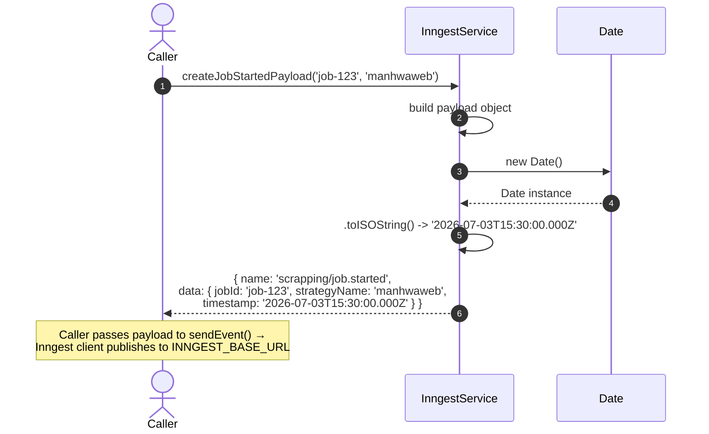

# Design: Fix Pre-Existing Issues (Inngest Tests + Lint/Format Scripts)

## Context

Two classes of pre-existing hygiene debt that the prior `usuarios-add-rbac-tests` change deliberately deferred: (1) **5 dormant inngest test failures** in `packages/inngest/src/inngest.service.spec.ts` — the spec and `packages/inngest/src/README.md` document 4 public-API methods (`createJobStartedPayload`, `createJobCompletedPayload`, `createJobFailedPayload`, `createChapterProcessedPayload`) that the service does not implement, and (2) **broken `lint` and `format` scripts** in `package.json` whose globs reference directories (`src/`, `libs/`) that do not exist — so `npm run lint` matches zero files (ESLint 9 "all files ignored") and `npm run format` silently formats only `apps/`, never `packages/`. Specs: `specs/inngest-payload-methods/spec.md` (4 requirements, 6 scenarios) + `specs/npm-scripts/spec.md` (2 requirements, 2 scenarios).

The design decision is settled by `proposal.md`: the spec is correct, the service is incomplete. Fix is mechanical: copy the `createHolaInngestPayload` pattern 4 times and correct 2 glob patterns.

## Architecture (high level)

```
packages/inngest/src/inngest.service.ts           (MODIFIED — +4 methods, ~32 LOC)
├── createJobStartedPayload     (NEW) ── returns InngestEventPayload<'scrapping/job.started'>
├── createJobCompletedPayload   (NEW) ── returns InngestEventPayload<'scrapping/job.completed'>
├── createJobFailedPayload      (NEW) ── returns InngestEventPayload<'scrapping/job.failed'>
├── createChapterProcessedPayload (NEW) ── returns InngestEventPayload<'scrapping/chapter.processed'>
└── createHolaInngestPayload    (EXISTING — template pattern, lines 82-92)

package.json                                      (MODIFIED — 2 script lines)
├── format: prettier --write "apps/**/*.ts" "packages/**/*.ts"   (was: … "libs/**/*.ts")
└── lint:   eslint "apps/**/*.ts" "packages/**/*.ts" --fix        (was: "{src,apps,libs,test}/**/*.ts")

No new files. No new modules. No interface changes.
```

## Component design

### 1. `packages/inngest/src/inngest.service.ts` — ADD 4 methods

**Template** (existing `createHolaInngestPayload`, lines 82-92):

```ts
createHolaInngestPayload(
  message: string = 'HOLA INNGEST',
): InngestEventPayload<'scrapping/hola-inngest'> {
  return {
    name: 'scrapping/hola-inngest',
    data: {
      message,
      timestamp: new Date().toISOString(),
    },
  };
}
```

**Pattern for all 4 new methods** — sync, returns `InngestEventPayload<SpecificEventName>`, embeds `timestamp: new Date().toISOString()` in `data`.

| New method | Signature | `name` | `data` keys |
|---|---|---|---|
| `createJobStartedPayload` | `(jobId: string, strategyName: string) => InngestEventPayload<'scrapping/job.started'>` | `'scrapping/job.started'` | `jobId`, `strategyName`, `timestamp` |
| `createJobCompletedPayload` | `(jobId: string, strategyName: string, resultCount?: number) => InngestEventPayload<'scrapping/job.completed'>` | `'scrapping/job.completed'` | `jobId`, `strategyName`, `success: true`, `resultCount?`, `timestamp` |
| `createJobFailedPayload` | `(jobId: string, strategyName: string, error: string) => InngestEventPayload<'scrapping/job.failed'>` | `'scrapping/job.failed'` | `jobId`, `strategyName`, `error`, `timestamp` |
| `createChapterProcessedPayload` | `(jobId: string, chapterId: string, chapterTitle: string, pagesScraped: number) => InngestEventPayload<'scrapping/chapter.processed'>` | `'scrapping/chapter.processed'` | `jobId`, `chapterId`, `chapterTitle`, `pagesScraped`, `timestamp` |

Data shapes are taken **verbatim** from `ScrappingEvents` in `serve/interfaces/inngest.interfaces.ts` (lines 1-31). All event names are string literals — no enums, no unions. `resultCount` in `createJobCompletedPayload` is conditionally spread: include in `data` only when the argument is defined (spec scenario "without resultCount" requires `resultCount === undefined`). `error` is the message string, not the `Error` object.

**Placement**: append after `createHolaInngestPayload` (line 92), before `sendHolaInngest` (line 94). Mirrors the current "payload-constructor then send-helper" grouping.

### 2. `package.json` — FIX 2 script lines

| Line | Field | Before | After |
|---|---|---|---|
| 11 | `format` | `prettier --write "apps/**/*.ts" "libs/**/*.ts"` | `prettier --write "apps/**/*.ts" "packages/**/*.ts"` |
| 16 | `lint` | `eslint "{src,apps,libs,test}/**/*.ts" --fix` | `eslint "apps/**/*.ts" "packages/**/*.ts" --fix` |

`eslint.config.mjs` `ignores` list (`dist/`, `node_modules/`, `coverage/`) is still honored. `test/**/*.ts` and `*.spec.ts` are excluded from `lint` (Jest handles them). Root-level TS (`eslint.config.mjs`, `nest-cli.json`) is JS, not in scope.

## Architecture decisions (with rationale)

### ADR-1: Follow the `createHolaInngestPayload` pattern verbatim

**Decision**: New methods mirror the existing `createHolaInngestPayload` exactly (sync, returns `{ name, data: { ..., timestamp } }`).

**Rationale**: Consistency with the established pattern. The spec already tests against this exact shape (`expect(payload.data.timestamp).toBeDefined()`, `expect(payload.data.success).toBe(true)`, etc.). Following the pattern verbatim means a reviewer can verify the diff by side-by-side comparison with `createHolaInngestPayload` — no new design vocabulary introduced.

| Alternative | Tradeoff |
|---|---|
| Class-based builders (e.g., `JobStartedEvent.builder()`) | Over-engineering for 4 one-shot methods. Breaks the established `create*` naming. |
| Single `createPayload(name, data)` dispatch | Loses type safety on `name`/`data` pairing; defeats the type-safe API the README advertises. |
| Push payload construction to call sites | Re-declares event-name literals and data shapes in every consumer. Defeats the type system. |

**Consequences**: Reviewer can verify by diff against `createHolaInngestPayload`. Adding a 5th event in the future is a copy-paste job. No new patterns introduced.

### ADR-2: 2 script fixes in 1 change

**Decision**: Both `lint` AND `format` script fixes in the same change.

**Rationale**: Same root cause (stale `libs/` glob), same file (`package.json`), one-line edits each. Combining is cheaper than splitting — one PR, one review, one revert unit. The `format` script's `libs/` bug is a latent companion to the `lint` script's `libs/` bug; leaving one half-fixed would be misleading.

| Alternative | Tradeoff |
|---|---|
| Two separate changes | Two review cycles, two PRs, two merge-conflict surfaces for the same `package.json`. No real separation of concerns — both are the same fix class. |
| Include `test/**/*.ts` in the lint glob | Spec scenario only requires the script to match real source files. Test specs are Jest's domain. |

**Consequences**: One commit, one PR, easy to revert. Reviewer reads 2 lines.

### ADR-3: Do NOT run `npm run format` in this change

**Decision**: Don't run `npm run format` as part of apply. Defer the actual reformatting run to a separate change.

**Rationale**: Once the script is fixed, the next `npm run format` would touch the entire `packages/` tree (10 packages, hundreds of files). That diff is unrelated to the core fix and would dominate the PR. The user explicitly deferred. The `format` script's job is to be **correct**, not to be **run** in this change.

| Alternative | Tradeoff |
|---|---|
| Run `format` and commit the result | 100+ files of whitespace churn in the same PR as 32 LOC of method additions. Loses the focus of the change. |
| Add a `format:check` script | Scope creep — `format:check` is a CI concern, not a hygiene fix. |

**Consequences**: This change's diff is clean (~34 LOC). A follow-up `chore(format)` change can reformat `packages/` without conflict with the service / script work.

## Sequence diagrams

### Flow: `createJobStartedPayload('job-123', 'manhwaweb')`



The 3 other methods (`createJobCompletedPayload`, `createJobFailedPayload`, `createChapterProcessedPayload`) follow the same pattern: synchronous construction, ISO 8601 timestamp stamped at call time, returned to caller for `sendEvent` / `sendEvents` dispatch.

## Migration / Compatibility

- **The 4 new inngest methods are additive.** No existing code uses them yet. The `inngest.service.spec.ts` tests (the ones currently failing) reference them, and the inngest functions in `functions/index.ts` listen for these 4 events but have no producer — this change closes that functional gap.
- **The script fixes change developer-tooling behavior.** `npm run lint` and `npm run format` now actually run on the project. No existing workflow is broken (both scripts were previously no-ops). Existing CI (none — out of scope) would now have a working lint to enforce.
- **No DB migration, no config change, no new env var.**

## Out of scope (per proposal)

1. Auth/JWT desync (separate change).
2. Global `APP_GUARD` in `main.ts` (orthogonal).
3. `RoleManagementService` abstract class extraction (premature, 1 consumer).
4. Rate limiting on auth endpoints (specced elsewhere, not implemented).
5. E2E test maintenance (current 1/1 E2E test passes).
6. `overrideProvider(RBAC_HIERARCHY)` pattern (not a bug — established convention).
7. CI workflow (separate infrastructure concern).
8. Reformatting `packages/` (deferred to a separate `chore(format)` change).
