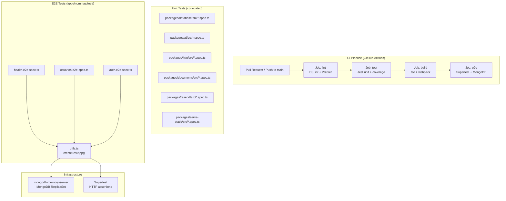

# Design: Testing Coverage & CI/CD Pipeline

## Architecture Overview



## Unit Test Strategy

### Patrón de mocking

Todos los tests unitarios usan el patrón NestJS `Test.createTestingModule()`
con providers mockeados. Referencia: `packages/auth/src/services/auth.service.spec.ts`.

```typescript
describe('ServiceName', () => {
  let service: ServiceName;
  let mockDep: jest.Mocked<Dependency>;

  beforeEach(async () => {
    mockDep = { method: jest.fn() } as any;
    const module = await Test.createTestingModule({
      providers: [
        ServiceName,
        { provide: Dependency, useValue: mockDep },
      ],
    }).compile();
    service = module.get(ServiceName);
  });

  it('should do X when Y', async () => {
    mockDep.method.mockResolvedValue(expected);
    const result = await service.methodUnderTest();
    expect(result).toEqual(expected);
  });
});
```

### Cobertura por paquete

| Package | Clases a testear | Mocks necesarios | Tests est. |
|---------|-----------------|-----------------|------------|
| `@common/database` | `DatabaseService`, `TransactionManager` | `mongoose.Connection`, `ConfigService` | ~15 |
| `@common/ai` | `AiService`, providers | `openai`, `anthropic`, `generative-ai` | ~20 |
| `@common/http` | `HttpClient`, `DownloadService` | `axios`, `sharp` | ~12 |
| `@common/documents` | `DocumentProcessor` | `pdf-parse`, `mammoth` | ~10 |
| `@common/resend` | `ResendService`, `NewsletterService` | `Resend` SDK | ~12 |
| `@common/serve-static` | `ServeStaticService` | `ejs`, filesystem | ~10 |

### Reglas de testing

1. **Sin I/O real**: todos los tests unitarios mockean red, filesystem y DB.
2. **`jest.useFakeTimers()`** para tests de retry/timeout.
3. **Un `describe` por clase**, un `it` por comportamiento.
4. **Nombres descriptivos**: `it('returns null when user not found')`.
5. **`.llm-context.md`** co-located explicando qué se testea.

## E2E Test Infrastructure

### `createTestApp()` helper

```typescript
// apps/nominas/test/utils.ts
import { Test } from '@nestjs/testing';
import { INestApplication } from '@nestjs/common';
import { MongoMemoryReplSet } from 'mongodb-memory-server';
import { AppModule } from '../src/app.module';

let replSet: MongoMemoryReplSet;

export async function createTestApp(): Promise<INestApplication> {
  replSet = await MongoMemoryReplSet.create({
    replSet: { count: 1, storageEngine: 'wiredTiger' },
  });
  const uri = replSet.getUri('boilerplate_test');
  process.env.MONGODB_URI = uri;
  process.env.JWT_SECRET = 'test-secret-min-32-chars-for-testing';
  process.env.AUTH_DEMO_MODE = 'true';

  const moduleRef = await Test.createTestingModule({
    imports: [AppModule],
  }).compile();

  const app = moduleRef.createNestApplication();
  app.setGlobalPrefix('api');
  await app.init();
  return app;
}

export async function teardownTestApp(app: INestApplication): Promise<void> {
  await app.close();
  if (replSet) await replSet.stop();
}
```

### Decisión: `mongodb-memory-server` vs Testcontainers

| Criterio | `mongodb-memory-server` | Testcontainers |
|----------|------------------------|----------------|
| Velocidad de arranque | ~3s | ~10s |
| Requiere Docker | No | Sí |
| ReplicaSet support | ✅ `MongoMemoryReplSet` | ✅ |
| CI compatibility | ✅ (binario cacheado) | ✅ (Docker required) |

**Decisión**: `mongodb-memory-server` con `MongoMemoryReplSet`.
**Rationale**: no requiere Docker, más rápido, binario se cachea.

## CI/CD Pipeline

### GitHub Actions workflow

```yaml
# .github/workflows/ci.yml
name: CI
on:
  push:
    branches: [main]
  pull_request:
    branches: [main]

jobs:
  lint:
    runs-on: ubuntu-latest
    steps:
      - uses: actions/checkout@v4
      - uses: actions/setup-node@v4
        with: { node-version: '22', cache: 'npm' }
      - run: npm ci
      - run: npm run lint

  test:
    needs: lint
    runs-on: ubuntu-latest
    steps:
      - uses: actions/checkout@v4
      - uses: actions/setup-node@v4
        with: { node-version: '22', cache: 'npm' }
      - run: npm ci
      - run: npm run test:cov

  build:
    needs: test
    runs-on: ubuntu-latest
    steps:
      - uses: actions/checkout@v4
      - uses: actions/setup-node@v4
        with: { node-version: '22', cache: 'npm' }
      - run: npm ci
      - run: npm run build

  e2e:
    needs: build
    runs-on: ubuntu-latest
    steps:
      - uses: actions/checkout@v4
      - uses: actions/setup-node@v4
        with: { node-version: '22', cache: 'npm' }
      - run: npm ci
      - run: npm run test:e2e
```

**Decisión**: jobs secuenciales (`lint → test → build → e2e`).
**Rationale**: fail-fast. Si lint falla, no gastamos CI en tests.

## Documentation Updates

### AGENTS.md changes

1. **§4 Matriz**: Tests ❌ → ✅ para 6 paquetes.
2. **§12 Dashboard**: fila `testing-coverage-cicd` como cambio activo.
3. **§14 Cognitive Ranking**: `test_coverage = 2` para los 6 paquetes
   (+2.0 pts raw, +8.9% cada uno).

### Package READMEs

Cada paquete afectado recibe sección "Testing":

```markdown
## Testing
```bash
npm run test -- packages/<name>
```
| Test file | Covers |
|-----------|--------|
| `src/foo.service.spec.ts` | FooService methods |
```
