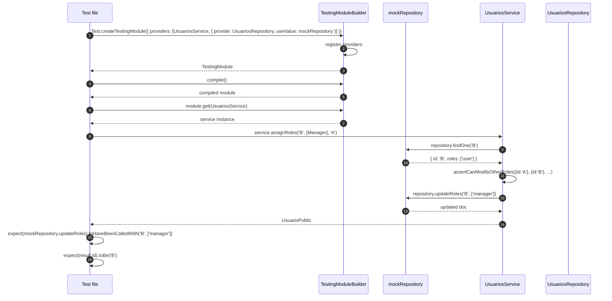
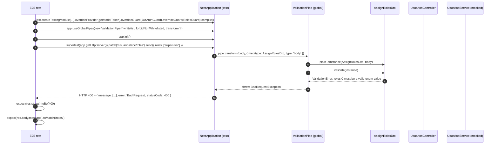

# Design: Add Tests for Usuarios Module with RBAC

## Context

This is the **test follow-up** to the just-archived `usuarios-rbac` change (16 commits, 814 LOC of production code). The RBAC implementation is in place at `packages/auth/src/rbac/` + `apps/nominas/src/modules/usuarios/`, but **no spec file covers any of the 4 new framework files** and **2 of 3 stale spec files in `usuarios/__tests__/` fail to load** because Jest cannot resolve `@common/*`. This change fixes the Jest infrastructure, updates the 3 stale spec files, and adds coverage for the new RBAC framework + domain code. Per `proposal.md`: 6 new test files + 3 updated + 1 jest config change; ~30-34 test cases; ~600-800 LOC; single branch, no PR. Specs: `specs/testing-infrastructure/spec.md` (1 req, 3 scenarios), `specs/rbac-framework-tests/spec.md` (3 req, 14 scenarios), `specs/usuarios-tests/spec.md` (8 req, 27 scenarios).

The boundary rule inherited from the previous change: tests MUST NOT introduce behavior changes. Production code (`usuarios.service.ts`, `rbac/`, schema, controller) is untouched. Only `package.json` (jest config) + test files change.

## Architecture (high level)

```
TEST LAYERS — what runs where

  Framework unit (pure functions, no NestJS)
    packages/auth/src/rbac/__tests__/
      role-hierarchy.spec.ts
      cannot-self-modify.spec.ts
      roles.guard.spec.ts  (uses Test.createTestingModule)
             │
             │ (no @common/* import)
             ▼
  Domain unit (NestJS TestingModule, mocked deps)
    apps/nominas/src/modules/usuarios/__tests__/
      assign-roles.dto.spec.ts
      usuarios.controller.spec.ts  (UPDATED + overrideGuard)
      usuarios.service.spec.ts  (UPDATED)
      usuarios.repository.spec.ts  (UPDATED)
      usuarios.module.spec.ts  (NEW, OnApplicationBootstrap)
             │
             │ (needs @common/auth to load)
             ▼
  E2E (supertest against NestApplication)
    apps/nominas/test/
      usuarios.e2e-spec.ts  (ValidationPipe 400)

  Infrastructure (gates all of the above)
    package.json  ─► moduleNameMapper + roots + moduleDirectories
```

The 3 stale spec files are **updated in place** (not rewritten). The skeleton is correct; the missing pieces are 4 model methods in the mock + 4 new methods in `mockService` + the new test scenarios. The `@common/*` resolution problem is a single jest config change that affects every layer.

## Test pyramid for this change

| Layer | Tests | Files | LOC | Run time |
|---|---|---|---|---|
| Framework unit | 14 | 3 | ~200 | <1s |
| Domain unit (updates + new) | 16 | 5 | ~400 | <2s |
| E2E | 1-2 | 1 | ~80 | ~3s |
| **Total** | **~31** | **9** | **~680** | **<6s** |

Framework-first: the 3 framework specs are pure functions (no NestJS DI), the fastest to write and run. Domain specs depend on the framework files being testable but don't import the framework specs.

## Component design

### 1. Jest config fix (`package.json`)

**Why this is the blocker.** Lines 85-104 of `package.json` declare `roots: ["<rootDir>/apps/"]` and no `moduleNameMapper`. Result: `apps/nominas/src/modules/usuarios/usuarios.controller.ts` imports from `@common/auth` (a workspace path alias declared in `tsconfig.json` lines 24-33), and jest cannot resolve it. The 2 stale specs that import `usuarios.controller` / `usuarios.service` fail at module load.

**Before** (current state, lines 85-104):

```json
"jest": {
  "moduleFileExtensions": ["js", "json", "ts"],
  "rootDir": ".",
  "testRegex": ".*\\.spec\\.ts$",
  "transform": { "^.+\\.(t|j)s$": "ts-jest" },
  "collectCoverageFrom": ["**/*.(t|j)s"],
  "coverageDirectory": "./coverage",
  "testEnvironment": "node",
  "roots": ["<rootDir>/apps/"]
}
```

**After** (3 additions only — no removals, no behavioral changes for existing tests):

```json
"jest": {
  "moduleFileExtensions": ["js", "json", "ts"],
  "rootDir": ".",
  "testRegex": ".*\\.spec\\.ts$",
  "transform": { "^.+\\.(t|j)s$": "ts-jest" },
  "collectCoverageFrom": ["**/*.(t|j)s"],
  "coverageDirectory": "./coverage",
  "testEnvironment": "node",
  "roots": ["<rootDir>/apps/", "<rootDir>/packages/"],
  "moduleDirectories": ["node_modules", "<rootDir>"],
  "moduleNameMapper": {
    "^@common/(.*)$": "<rootDir>/packages/$1/src/index.ts"
  }
}
```

The `moduleNameMapper` pattern is a single regex covering all 8 `@common/*` aliases from `tsconfig.json`. Resolves to the `index.ts` barrel of each package, matching the `paths` declaration exactly.

### 2. Framework unit tests (new)

#### `packages/auth/src/rbac/__tests__/role-hierarchy.spec.ts`

No NestJS. No mocks. Pure function tests.

```ts
describe('hasAtLeastRole', () => {
  const hierarchy: RoleHierarchy<UsuarioRole> = Object.freeze({
    [UsuarioRole.Admin]: 3, [UsuarioRole.Manager]: 2, [UsuarioRole.User]: 1,
  });

  describe('when user holds a higher-ranked role', () => {
    it('returns true for a lower-required role');              // R1.1
  });
  describe('when user holds a lower-ranked role', () => {
    it('returns false for a higher-required role');            // R1.2
  });
  describe('when user holds multiple roles', () => {
    it('returns true if any one satisfies');                    // R1.3
  });
  describe('when userRoles is empty', () => {
    it('returns false');                                        // R1.4
  });
  describe('when user role is not in the hierarchy', () => {
    it('treats the unknown role as rank 0 and returns false');  // edge case
  });
  describe('when requiredRole is not in the hierarchy', () => {
    it('throws an Error with a configuration-bug message');     // config guard
  });
});
```

Each test imports `hasAtLeastRole` and `RoleHierarchy` from `../role-hierarchy` (or from the package barrel), uses a frozen hierarchy constant declared at the `describe` scope (avoids recreating per test), and asserts the boolean return value. No fixtures, no `beforeEach` setup beyond the constant.

#### `packages/auth/src/rbac/__tests__/cannot-self-modify.spec.ts`

No NestJS DI. Pure function tests, throws checked via `try/catch` or `.toThrow()`.

```ts
describe('assertCanModifyOtherRoles', () => {
  describe('when requester.id equals target.id', () => {
    it('throws ForbiddenException');
    it('throws with a message containing "Cannot modify your own roles"');
  });
  describe('when requester.id differs from target.id', () => {
    it('returns void (undefined) without throwing');
  });
  describe('domain-agnostic contract', () => {
    it('accepts plain {id: string} literals (no Mongoose dependency)');  // R2.3
  });
});
```

The "plain object" test (R2.3) constructs two `{ readonly id: string }` literals at the call site. If the helper secretly required a Mongoose `Document` type, the TypeScript compiler would reject the call — the test acts as both a runtime and a compile-time check.

#### `packages/auth/src/rbac/__tests__/roles.guard.spec.ts`

Uses `Test.createTestingModule` to construct the guard with a mocked `Reflector` + a hierarchy override. Each test builds a minimal `ExecutionContext` stub with `switchToHttp().getRequest()`.

```ts
describe('RolesGuard', () => {
  // helper: buildGuard({ hierarchy?: RoleHierarchy<string> }) -> RolesGuard
  // helper: makeContext({ user?, roles? }) -> ExecutionContext

  describe('when no @Roles() metadata is set', () => {
    it('returns true regardless of req.user');                 // baseline
  });
  describe('with a hierarchy registered', () => {
    it('@Roles("user") admits admin (rank 3 >= rank 1)');     // R5.1
    it('@Roles("admin") rejects user (rank 1 < rank 3)');     // R5.2 / R1.1
    it('@Roles("manager") rejects admin-only when admin is absent'); // edge
  });
  describe('without a hierarchy (backward compat)', () => {
    it('@Roles("admin") admits user with roles:["admin"]');    // string eq
    it('@Roles("admin") rejects user with roles:["user"]');    // string eq
  });
  describe('with missing user data', () => {
    it('returns false when req.user is undefined');           // R1.x
    it('returns false when req.user.roles is undefined');      // R1.x
  });
});
```

The `Reflector` mock is `{ getAllAndOverride: jest.fn().mockReturnValue(roles) }` — the test controls the return value per case. The hierarchy is registered via `Test.createTestingModule({ providers: [{ provide: RBAC_HIERARCHY, useValue: ... }] })` to exercise the real DI injection in the constructor.

### 3. Domain unit tests (updates + new)

#### `apps/nominas/src/modules/usuarios/__tests__/usuarios.controller.spec.ts` (UPDATE)

The existing 5-method skeleton stays. Additions:

- `mockService` gains `assignRoles` and `grantAdminByEmail`.
- New `describe('assignRoles')` (1 test): `controller.assignRoles('B', dto, req)` calls `mockService.assignRoles('B', dto.roles, req.user.id)`.
- New `describe('controller-integration (guard chain)')` block using `.overrideGuard(JwtAuthGuard).useValue({ canActivate: () => true }).overrideGuard(RolesGuard).useValue({ canActivate: () => true })` and calling `controller.findAll()` — proves the controller wires the guards (R1.1, R1.2 path).

#### `apps/nominas/src/modules/usuarios/__tests__/usuarios.service.spec.ts` (UPDATE)

`mockRepository` gains `findRawByEmail`, `updateRoles`, `addRole`. Additions:

- `describe('assignRoles')` (4 tests): happy path returns `repository.updateRoles` result; self-mod throws `ForbiddenException` and `updateRoles` is NOT called; `findOne` rejects with `NotFoundException` propagated; correct args passed.
- `describe('grantAdminByEmail')` (4 tests): `undefined` email no-op; user not found no-op; user without admin → `addRole(id, Admin)`; user already admin → `addRole` NOT called.
- `describe('create default role')` (3 tests): no `roles` field → `['user']`; empty array → `['user']`; explicit `roles` → pass-through.

#### `apps/nominas/src/modules/usuarios/__tests__/usuarios.repository.spec.ts` (UPDATE)

Additions across 4 new describe blocks:

- `updateRoles` (2 tests): `findByIdAndUpdate('id', { roles: [...] }, { new: true })`; not-found throws `NotFoundException`.
- `toPublic legacy normalization` (2 tests): raw doc with NO `roles` field → `toPublic` returns `roles: ['user']`; doc with `roles: ['manager']` returns as-is.
- `findRawByEmail` (2 tests): found returns the raw doc (with `_id`); not-found returns `null`. Key assertion: shape is raw, NOT `toPublic`-transformed.
- `addRole` (2 tests): `findByIdAndUpdate('id', { $addToSet: { roles: 'admin' } }, { new: true })`; not-found throws.

### 4. New domain unit tests

#### `apps/nominas/src/modules/usuarios/__tests__/assign-roles.dto.spec.ts`

Pure DTO validation. Uses `plainToInstance` from `class-transformer` + `validateOrReject` from `class-validator`. No NestJS, no Mongoose.

```ts
describe('AssignRolesDto', () => {
  describe('valid input', () => {
    it('accepts roles: [UsuarioRole.Manager]');
  });
  describe('invalid input', () => {
    it('rejects roles: [] (ArrayMinSize)');                  // R2.3
    it('rejects roles: ["superuser"] (IsEnum)');             // R2.3
    it('rejects roles: "admin" string (IsArray)');            // R2.3
  });
});
```

Each test wraps in `await expect(validateOrReject(instance)).resolves.not.toThrow()` or `.rejects.toMatchObject({ constraints: ... })`. The IsArray/IsEnum/ArrayMinSize constraint names are asserted in the rejection shape to prove the right validator fired.

#### `apps/nominas/src/modules/usuarios/__tests__/usuarios.module.spec.ts`

Tests the `OnApplicationBootstrap` lifecycle hook. Uses `Test.createTestingModule({ providers: [UsuariosModule, mocked UsuariosService, mocked ConfigService] })` to instantiate the module and call `onApplicationBootstrap()` directly.

```ts
describe('UsuariosModule', () => {
  describe('onApplicationBootstrap', () => {
    it('skips when ADMIN_EMAIL is unset (does not call service)');   // R4.x
    it('calls service.grantAdminByEmail(email) when ADMIN_EMAIL is set');  // R4.x
    it('resolves when grantAdminByEmail resolves to undefined (no-op path)');  // R4.x
  });
  describe('providers', () => {
    it('registers RBAC_HIERARCHY with UsuarioRoleHierarchy');        // R4.x
    it('the registered value has admin: 3, manager: 2, user: 1');    // shape
  });
});
```

The `ConfigService` mock is `{ get: jest.fn() }` — controlled per test. The `UsuariosService` mock is `useValue: { grantAdminByEmail: jest.fn() }` — no real DI of the repository. The `RBAC_HIERARCHY` provider test resolves the token from `module.get(RBAC_HIERARCHY)` and compares to `UsuarioRoleHierarchy` (imported from the enum file).

### 5. E2E test

#### `apps/nominas/test/usuarios.e2e-spec.ts`

Uses `Test.createTestingModule` with the real `UsuariosModule` + `overrideProvider(getModelToken(Usuario.name))` + `overrideGuard(JwtAuthGuard).useValue({ canActivate: () => true })` + `overrideGuard(RolesGuard).useValue({ canActivate: () => true })`. The E2E wires the **real `ValidationPipe`** matching `main.ts` (lines 18-24): `whitelist: true, forbidNonWhitelisted: true, transform: true`. The pipe is registered via `app.useGlobalPipes(new ValidationPipe(...))` after `createNestApplication`.

```ts
describe('UsuariosController (e2e)', () => {
  it('PATCH /usuarios/:id/roles with invalid role returns 400');   // R2.3
  // 2nd optional: PATCH with valid role returns 200 (proves the pipe allows it)
});
```

The invalid-body test posts `{ "roles": ["superuser"] }` to a fake id, expects 400, and inspects the response body for a validation error message mentioning `roles`. This is the **only place in the test suite that exercises the global pipe** — the unit DTO test covers the DTO in isolation; the E2E test covers the pipe + DTO + controller wiring.

## Architecture decisions (with rationale)

### ADR-1: Mock at Mongoose model level (no `mongodb-memory-server`)

**Choice**: Plain jest mocks for the Mongoose model in `usuarios.repository.spec.ts`. No new dependency.
**Alternatives considered**: `mongodb-memory-server` (rejected: adds 50+ MB dep, complex binary download, overkill for 30 tests); real MongoDB test instance (rejected: requires running infra in CI and locally).
**Rationale**: The existing `usuarios.repository.spec.ts` (6 passing tests) uses this pattern. The repository layer abstracts the Mongoose model; the service layer is the right granularity for behavioral tests. Mongoose-specific quirks (e.g., `$addToSet` semantics) are best validated in a separate integration suite, which is **out of scope** for this change.
**Consequences**: Tests are fast (no I/O, in-memory jest) and deterministic. Trade-off: we don't catch real MongoDB behavior. Acceptable for unit tests; the 1 E2E test catches the global pipe boundary, which is the highest-value integration risk.

### ADR-2: `Test.createTestingModule` for service / repo / module / controller

**Choice**: `Test.createTestingModule()` from `@nestjs/testing` for service, repository, module, and controller tests. Override providers via `useValue: { ...jest.fn() }`.
**Alternatives considered**: Plain `new UsuariosService(mockRepo)` (rejected: doesn't test DI wiring); pure unit tests with no NestJS (rejected: doesn't test guards, pipes, or module lifecycle).
**Rationale**: NestJS 11 standard pattern. Lets us test real DI wiring while replacing external dependencies with mocks. Works with `overrideGuard` for controller-integration scenarios and `module.get(RBAC_HIERARCHY)` for module-provider tests. Cost is small (each test module compiles in <50ms).
**Consequences**: Tests are slightly slower than pure unit tests but still fast (total suite <6s). The module bootstrap test uses the real `OnApplicationBootstrap` interface by calling the method directly on the resolved instance.

### ADR-3: Controller-integration with `overrideGuard`, not full E2E for guard chain

**Choice**: For controller tests that prove the guard chain (R1.1, R1.2 path), use `Test.createTestingModule({ controllers, providers: [mocked service, JwtAuthGuard = mock, RolesGuard = real with hierarchy] }).overrideGuard(JwtAuthGuard).useValue({ canActivate: () => true }).overrideGuard(RolesGuard).useValue({ canActivate: () => true })`. NOT a full e2e test with supertest.
**Alternatives considered**: Full e2e (rejected: slow, requires infrastructure); mock the guard inline in the spec (rejected: doesn't test the wiring).
**Rationale**: Fast (no HTTP layer), proves the guard chain is wired at the controller level, doesn't require a running app. The 1 E2E test covers the ValidationPipe integration at the HTTP boundary, which is the one thing controller-integration cannot prove.
**Consequences**: We prove the controller works **WITH** the guards. We don't prove the guards themselves work end-to-end — that's covered in `roles.guard.spec.ts` (the guard's `canActivate` is tested in isolation with 6 scenarios).

### ADR-4: Single E2E test for the 400 from `ValidationPipe`

**Choice**: Only 1 E2E test: `PATCH /usuarios/:id/roles` with `{"roles": ["superuser"]}` returns 400. (Optionally a 2nd: same endpoint with a valid role returns 200.)
**Alternatives considered**: E2E for every endpoint (rejected: too slow, too brittle); no E2E (rejected: would miss the global `ValidationPipe` integration that lives outside any unit's testable boundary).
**Rationale**: The global `ValidationPipe` is configured in `main.ts` (lines 18-24) with `whitelist: true, forbidNonWhitelisted: true, transform: true`. The 400 path is the most critical security boundary (rejects unknown roles before they reach the service). Other endpoints are covered by unit tests; the pipe is the integration risk worth one E2E.
**Consequences**: The E2E test re-creates the `ValidationPipe` instance inside the test (the same constructor args as `main.ts`). If the pipe config changes in `main.ts`, the test must be updated in lockstep. This is documented as a maintenance risk in the verify phase.

### ADR-5: Jest `moduleNameMapper` pattern

**Choice**: `"^@common/(.*)$": "<rootDir>/packages/$1/src/index.ts"` in `moduleNameMapper`. Single regex for all 8 `@common/*` aliases from `tsconfig.json`.
**Alternatives considered**: Map each alias explicitly (rejected: 8 lines for the same result); resolve to `src/` directly without the `index.ts` suffix (rejected: skips the barrel, can import internals); use `moduleDirectories` only (rejected: doesn't fix `@common/*` resolution).
**Rationale**: The regex captures the package name and resolves to the barrel. Mirrors the `tsconfig.json` `paths` declaration (lines 24-33) exactly. One line covers all current and future `@common/*` packages.
**Consequences**: All spec files in any folder can `import { ... } from '@common/auth'` and jest resolves to the same `packages/auth/src/index.ts` that the TypeScript compiler uses. Behavior parity between build and test.

## Sequence diagrams

### Test flow: Service unit test with `Test.createTestingModule`



### Test flow: E2E for the 400 from `ValidationPipe`



## File changes

| File | Action | Description |
|------|--------|-------------|
| `package.json` | Modify | ADD `moduleNameMapper` + extend `roots` with `packages/` + add `moduleDirectories`. 3 lines, additive. |
| `packages/auth/src/rbac/__tests__/role-hierarchy.spec.ts` | New | 6 unit tests (5 spec + 1 edge) for `hasAtLeastRole`. |
| `packages/auth/src/rbac/__tests__/cannot-self-modify.spec.ts` | New | 4 unit tests (3 spec + 1 message-shape) for `assertCanModifyOtherRoles`. |
| `packages/auth/src/rbac/__tests__/roles.guard.spec.ts` | New | 7 unit tests (6 spec + 1 edge) for `RolesGuard.canActivate`. |
| `apps/nominas/src/modules/usuarios/__tests__/assign-roles.dto.spec.ts` | New | 4 unit tests for `AssignRolesDto` validation. |
| `apps/nominas/src/modules/usuarios/__tests__/usuarios.module.spec.ts` | New | 5 unit tests (4 bootstrap + 1 provider) for `UsuariosModule`. |
| `apps/nominas/src/modules/usuarios/__tests__/usuarios.controller.spec.ts` | Modify | Add `assignRoles` mock + 1 delegation test + 1 controller-integration block. |
| `apps/nominas/src/modules/usuarios/__tests__/usuarios.service.spec.ts` | Modify | Add 3 missing repo methods to mock + 11 new tests (4 assignRoles + 4 grantAdminByEmail + 3 default-roles). |
| `apps/nominas/src/modules/usuarios/__tests__/usuarios.repository.spec.ts` | Modify | Add 7 new tests across 4 describe blocks (`updateRoles`, `toPublic` legacy, `findRawByEmail`, `addRole`). |
| `apps/nominas/test/usuarios.e2e-spec.ts` | New | 1-2 E2E tests for the 400 from `ValidationPipe`. |

## Migration / Compatibility

- **Jest config change is additive.** `roots` is extended (not replaced); `moduleNameMapper` and `moduleDirectories` are new keys. Old specs that don't import `@common/*` are unaffected. The 1 currently-passing `usuarios.repository.spec.ts` continues to pass.
- **New test files don't change runtime behavior.** Production code is unchanged. The change only adds tests.
- **No DB migration, no schema change, no env var changes.**
- **Activation side effect:** the 2 dormant `packages/inngest/src/*.spec.ts` files will now be discovered (excluded previously by `roots: ["<rootDir>/apps/"]`). This is intentional: tests that exist should run. If those inngest specs fail, that's a separate bug to fix in a follow-up — but they were already broken, just hidden.

## Open questions for the design phase

None. The 5 decisions in the proposal cover all branching points. The 5 ADRs above resolve any remaining ambiguity. The `ValidationPipe` constructor args in the E2E test will mirror `main.ts` lines 18-24 verbatim.

## Out of scope (per proposal)

The proposal lists 7 future-work items: **CI workflow** at `.github/workflows/`; **`mongodb-memory-server`** for real-DB integration; **coverage threshold** in jest config; **E2E for every endpoint** (only the critical 400 today); **refactor stale spec files** to a different pattern; **remove dead `interfaces/usuario.interface.ts`** (flagged in the previous verify report); **wire `AuthService` to read roles from `usuarios`** (closes the JWT/identity gap noted in `usuarios-rbac/proposal.md`).
