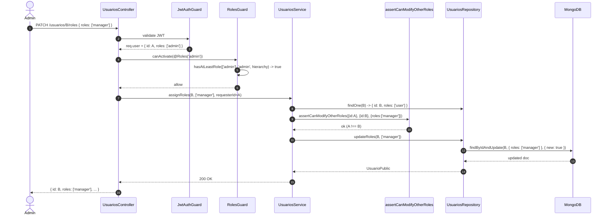
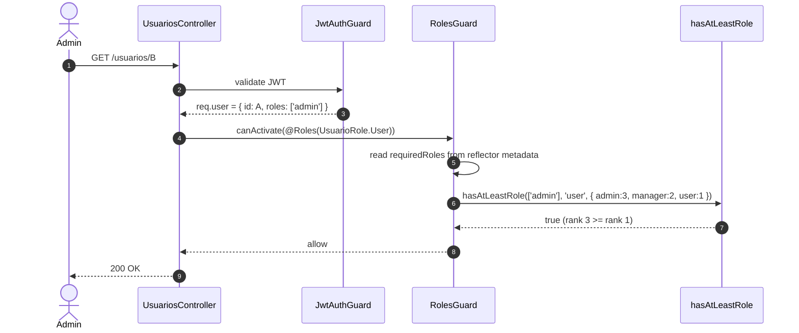
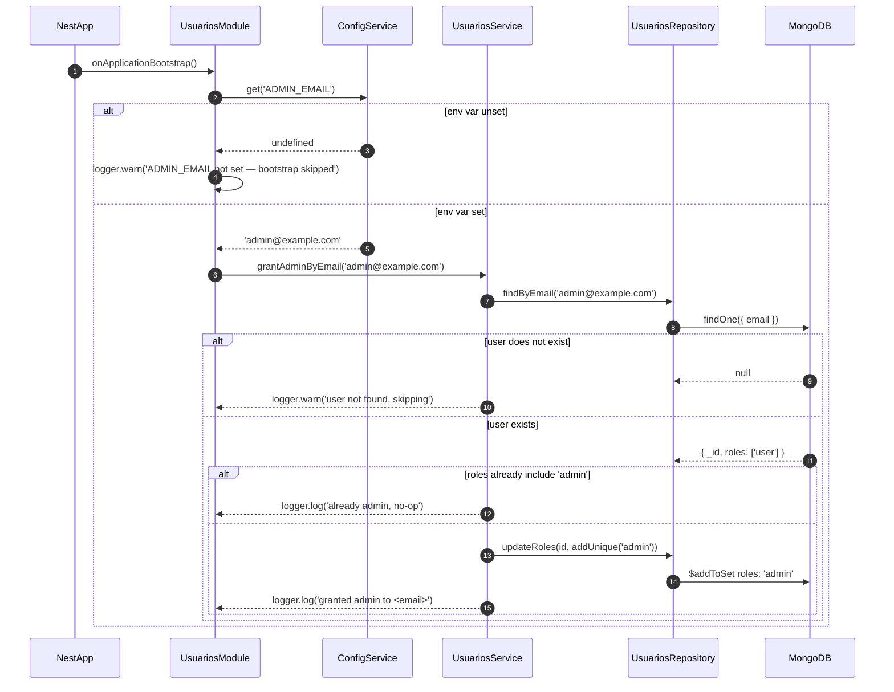

# Design: RBAC for Usuarios Module

## Context

This change applies RBAC to the `usuarios` module (currently unprotected) and consolidates generic RBAC primitives into `packages/auth/src/rbac/`. Per `proposal.md`, two layers: (1) framework primitives in `packages/auth/` (no domain knowledge), (2) domain application in `apps/nominas/src/modules/usuarios/`. Specs: `specs/usuarios/spec.md` (5 requirements, 12 scenarios) and `specs/auth/spec.md` (2 new framework requirements for `hasAtLeastRole` and `assertCanModifyOtherRoles`).

The boundary rule: `rbac/` MUST NOT import from `apps/nominas/` or reference `UsuarioRole`. It works with generic `string` types and `{id: string}` shapes. The `UsuarioRole` enum, `AssignRolesDto`, schema, and endpoints stay in `usuarios/`.

## Architecture (high level)

```
DOMAIN — apps/nominas/src/modules/usuarios/
  UsuarioRole + UsuarioRoleHierarchy  AssignRolesDto  Usuario schema
  Controller / Service / Module ──► assertCanModifyOtherRoles
                          │
                          │ imports
                          ▼
FRAMEWORK — packages/auth/src/rbac/
  roles.guard.ts ──► hasAtLeastRole
  role-hierarchy.ts   cannot-self-modify.ts
  (re-exported via packages/auth/src/index.ts)
```

`RolesGuard` reads the hierarchy from a `RBAC_HIERARCHY` injection token; `usuarios` registers `UsuarioRoleHierarchy` as that value.

## Sequence diagrams

### Flow 1: PATCH /usuarios/:id/roles (admin assigns roles to another user)



### Flow 2: RolesGuard check with hierarchy (admin accesses @Roles('user'))



### Flow 3: ADMIN_EMAIL bootstrap at onApplicationBootstrap



## Component design

### packages/auth/src/rbac/role-hierarchy.ts (NEW)

```ts
// Generic role rank map. Higher number = stronger role.
export type RoleHierarchy<T extends string> = Readonly<Record<T, number>>;

export function hasAtLeastRole<T extends string>(
  userRoles: readonly T[],
  requiredRole: T,
  hierarchy: RoleHierarchy<T>,
): boolean;
```

**Behavior contract:** pure function, no I/O. Returns `true` iff at least one role in `userRoles` has rank >= `requiredRole`'s rank in `hierarchy`. Empty `userRoles` -> `false`. Unknown role -> rank 0. Required role not in hierarchy -> throws `Error`. Generic over the role string type.

### packages/auth/src/rbac/cannot-self-modify.ts (NEW)

```ts
import { ForbiddenException } from '@nestjs/common';

export interface HasId {
  readonly id: string;
}

export interface RoleChanges {
  readonly roles: readonly string[];
}

export function assertCanModifyOtherRoles<
  R extends HasId,
  T extends HasId,
>(requester: R, target: T, roleChanges: RoleChanges): void;
```

**Behavior contract:** throws `ForbiddenException('Cannot modify your own roles')` when `requester.id === target.id`; returns `void` when ids differ. Generic over requester/target — only requires `{ id: string }`. No Mongoose, no DTO, no schema imports. Pure: no DB, no logger (logging is the caller's job).

### packages/auth/src/rbac/roles.guard.ts (MOVED + MODIFIED)

Was `packages/auth/src/guards/roles.guard.ts` (44 lines). New location: `packages/auth/src/rbac/roles.guard.ts`. Content diff: the check changes from `user.roles.includes(role)` to `hasAtLeastRole(user.roles, role, this.hierarchy)`. The `hierarchy` is injected via constructor (DI token `RBAC_HIERARCHY`).

```ts
@Injectable()
export class RolesGuard implements CanActivate {
  constructor(
    private readonly reflector: Reflector,
    @Inject(RBAC_HIERARCHY) private readonly hierarchy: RoleHierarchy<string>,
  ) {}

  canActivate(ctx: ExecutionContext): boolean {
    const required = this.reflector.getAllAndOverride<string[]>(ROLES_KEY, [
      ctx.getHandler(),
      ctx.getClass(),
    ]);
    if (!required?.length) return true;
    const { user } = ctx.switchToHttp().getRequest();
    if (!user?.roles) return false;
    return required.some((role) =>
      hasAtLeastRole(
        user.roles as string[],
        role,
        this.hierarchy as RoleHierarchy<string>,
      ),
    );
  }
}
```

The guard types its hierarchy as `RoleHierarchy<string>` (the guard does not know the domain's role enum). The usuarios module registers `RBAC_HIERARCHY` with the `UsuarioRoleHierarchy` value cast to `RoleHierarchy<string>` — a safe widening since `UsuarioRole` is a `string` subset.

### apps/nominas/src/modules/usuarios/enums/usuario-role.enum.ts (NEW)

```ts
import { RoleHierarchy } from '@common/auth';

export enum UsuarioRole {
  Admin = 'admin',
  Manager = 'manager',
  User = 'user',
}

export const UsuarioRoleHierarchy: RoleHierarchy<UsuarioRole> = Object.freeze({
  [UsuarioRole.Admin]: 3,
  [UsuarioRole.Manager]: 2,
  [UsuarioRole.User]: 1,
});
```

**Why string enum**: Mongoose stores `string[]`, JWT payload carries `string[]`. String enums serialize without numeric coercion. Numeric enums would force a value-mapping layer in the schema (MongoDB stores `0/1/2`, JWT too — fragile across migrations).

### apps/nominas/src/modules/usuarios/dto/assign-roles.dto.ts (NEW)

```ts
import { ArrayMinSize, IsArray, IsEnum } from 'class-validator';
import { ApiProperty } from '@nestjs/swagger';
import { UsuarioRole } from '../enums/usuario-role.enum';

export class AssignRolesDto {
  @ApiProperty({ enum: UsuarioRole, isArray: true, example: ['manager'] })
  @IsArray()
  @ArrayMinSize(1)
  @IsEnum(UsuarioRole, { each: true })
  roles: UsuarioRole[];
}
```

`IsEnum(UsuarioRole, { each: true })` natively throws `BadRequestException` (400) on `['superuser']` — matches the spec's "Invalid role is rejected" scenario. Integrates with whichever `ValidationPipe` is in scope (controller-local `@UsePipes(new ValidationPipe(...))` if global is absent).

### apps/nominas/src/modules/usuarios/schemas/usuario.schema.ts (MODIFIED)

```ts
@Prop({ type: [String], default: ['user'], index: true })
@ApiProperty({ type: [String], example: ['user'], description: 'User roles' })
roles: string[];
```

**Indexing strategy**: single-key index `roles_1` (Mongoose auto-name) supports `find({ roles: 'admin' })`. Multikey index (one entry per array element) is the default for `type: [String]`. No compound index needed — single query path uses this field.

### apps/nominas/src/modules/usuarios/usuarios.service.ts (MODIFIED)

New `assignRoles` method + default-role-on-create logic:

```ts
async assignRoles(
  id: string,
  roles: UsuarioRole[],
  requesterId: string,
): Promise<UsuarioPublic> {
  const target = await this.repository.findOne(id); // throws NotFoundException
  assertCanModifyOtherRoles(
    { id: requesterId },
    { id: target.id },
    { roles },
  );
  this.logger.log(`roles updated for ${id}: ${roles.join(',')}`);
  return this.repository.updateRoles(id, roles);
}
```

`create()` gains a default-roles fallback: if `createDto.roles` is missing or empty, persist `['user']`. `repository.toPublic()` also normalizes `undefined` -> `['user']` on read for legacy documents (no `roles` field).

### apps/nominas/src/modules/usuarios/usuarios.controller.ts (MODIFIED)

Per-endpoint guard pattern. `POST /usuarios` is `@Public()`; everything else is authenticated. `RolesGuard` reads `@Roles()` metadata and admits higher roles via `hasAtLeastRole`.

```ts
@ApiTags('usuarios')
@UseGuards(JwtAuthGuard, RolesGuard)
@Controller('usuarios')
export class UsuariosController { /* ... */ }

@Post()                                  // @Public() — self-service registration
@Public()
create(@Body() dto: CreateUsuarioDto) { return this.service.create(dto); }

@Get() findAll()                          // @Roles(Admin, Manager)
@Get(':id') findOne(@Param('id') id)      // @Roles(User) — hierarchy: any role
@Patch(':id') update(@Param('id') id, @Body() dto)  // @Roles(User) — hierarchy: any role
@Delete(':id') remove(@Param('id') id)    // @Roles(Admin)

@Patch(':id/roles')                       // NEW
@Roles(UsuarioRole.Admin)
assignRoles(
  @Param('id') id: string,
  @Body() dto: AssignRolesDto,
  @Request() req: AuthenticatedRequest,
) {
  return this.service.assignRoles(id, dto.roles, req.user.id);
}
```

### apps/nominas/src/modules/usuarios/usuarios.module.ts (MODIFIED)

```ts
@Module({
  imports: [
    MongooseModule.forFeature([{ name: Usuario.name, schema: UsuarioSchema }]),
  ],
  controllers: [UsuariosController],
  providers: [
    UsuariosRepository,
    UsuariosService,
    { provide: RBAC_HIERARCHY, useValue: UsuarioRoleHierarchy }, // NEW
  ],
  exports: [UsuariosService],
})
export class UsuariosModule implements OnApplicationBootstrap {
  private readonly logger = new Logger(UsuariosModule.name);
  constructor(
    private readonly service: UsuariosService,
    private readonly config: ConfigService,
  ) {}

  async onApplicationBootstrap(): Promise<void> {
    const email = this.config.get<string>('ADMIN_EMAIL');
    if (!email) {
      this.logger.warn('ADMIN_EMAIL not set — admin bootstrap skipped');
      return;
    }
    await this.service.grantAdminByEmail(email); // idempotent
  }
}
```

## Architecture decisions (with rationale)

### ADR-1: `roleHierarchy` map location — co-located with the enum, not in `rbac/`

**Decision**: `UsuarioRoleHierarchy` lives in `apps/nominas/src/modules/usuarios/enums/usuario-role.enum.ts` alongside `UsuarioRole`. `rbac/` exports a `RBAC_HIERARCHY` injection token; the consuming module provides the value.

**Rationale**: A role enum is **domain knowledge**. `rbac/` is a **framework primitive** that knows nothing about `UsuarioRole`. Putting the hierarchy in the auth package would force it to import from `usuarios/`, breaking the boundary ("framework stays in framework, domain stays in domain"). DI token pattern keeps the framework decoupled — `RolesGuard` reads a generic `RoleHierarchy<string>`; the domain plugs in a typed value at the module level.

| Alternative | Tradeoff |
|---|---|
| Default in `rbac/` as `RoleHierarchy<string>` | Couples the framework to a specific role set. New modules either reuse it (false coupling) or override (defeats purpose). |
| `ConfigService` lookup | Over-engineering for 3 hardcoded roles. Fixed at compile time, not runtime-configurable. |
| Per-user dynamic on `AuthenticatedUser` | Not what the spec says — hierarchy is system-wide. |

**Consequences**: Adding a 4th role (`supervisor`) edits ONE enum file. `rbac/` never changes. Any module that registers `RBAC_HIERARCHY` gets hierarchy-aware guards for free.

### ADR-2: Self-modify check lives in the SERVICE, not in `RolesGuard`

**Decision**: `assertCanModifyOtherRoles` is called from `UsuariosService.assignRoles()`, not from `RolesGuard`. The helper itself lives in `rbac/` so any future role-management endpoint can use it.

**Rationale**: A `CanActivate` guard does not access the request body cleanly — `@Body() dto` is not in `ExecutionContext` without fragile `request.body` parsing (content-type dependent, ordering issues). Guards answer "is this user allowed to call this route at all?" The service answers "is this operation legal given the data?" Self-modification is a data concern (the role-change payload), so the service is the right home. Defense-in-depth: even if `@Roles('admin')` is removed by mistake, the service still rejects self-modification.

| Alternative | Tradeoff |
|---|---|
| Custom guard with body parsing | Fragile, content-type dependent, breaks for `multipart/form-data`. |
| Pipe injecting `__selfModify: boolean` | Implicit, hard to discover, leaks pipeline state. |
| Both guard AND service check | Redundant; one source of truth is the goal. |

**Consequences**: A unit test on `UsuariosService.assignRoles` covers the rule without HTTP setup. Colocated with the only operation that mutates roles. A 2nd endpoint needing the same check imports the helper — no new guard needed.

### ADR-3: Bootstrap method — `onApplicationBootstrap` (NOT a CLI, NOT a migration)

**Decision**: Admin seeding lives in `UsuariosModule.onApplicationBootstrap()`. No CLI command, no DB migration.

**Rationale**: `onApplicationBootstrap` fires once after all modules initialize — `MongooseModule` connection is up, `Usuario` model is registered, `UsuariosService` is injectable. The standard NestJS lifecycle hook for "after everything is wired, do this once." Runs on every deploy (idempotent); a missed deploy auto-heals on the next boot. A CLI requires human action and breaks the "first deploy just works" promise. A migration script would require a separate runner and complicate the build pipeline.

| Alternative | Tradeoff |
|---|---|
| `seed:admin` npm script | Must be re-run manually for every new admin. Easy to forget. |
| Database migration runner | Adds a framework dependency. Couples seed logic to migration versioning. |
| `onModuleInit` | Fires before `MongooseModule` connection is guaranteed in some edge cases. |
| `OnApplicationShutdown` | Wrong direction — fires on shutdown. |

**Consequences**: Bootstrap is invisible until a log line appears — intentional. Devs see "admin granted to admin@example.com" in production logs. Env var checked once at boot. Idempotency enforced by the `roles: ['admin']` check inside `grantAdminByEmail`.

### ADR-4: Roles stored as `string[]`, not `Set<string>` or a single string

**Decision**: Schema field is `roles: string[]` with default `['user']`. Domain uses `UsuarioRole[]` which serializes to `string[]` at the Mongoose boundary.

**Rationale**:

| Alternative | Tradeoff |
|---|---|
| `Set<string>` | Mongoose does not natively serialize `Set`. Custom transform needed. Weaker BSON mapping. |
| Single string (`role: 'admin'`) | Forces 1-role-per-user. Cannot express `['admin', 'manager']` (admin who is also a manager). |
| JSON object (`{ admin: true, manager: true }`) | Adds wrapper, breaks `find({ roles: 'admin' })` (needs `roles.admin: true`), forces unwrapping. |
| Numeric `number[]` | Enum-to-number mapping layers everywhere. Breaks BSON-readable documents. |

**Consequences**: Multikey index on `roles` makes `find({ roles: 'admin' })` a single index scan. `roles: []` forbidden by `AssignRolesDto` (`@ArrayMinSize(1)`). `repository.toPublic()` normalizes `undefined` to `['user']` for legacy documents.

### ADR-5: File move strategy — `git mv` (atomic, preserves history)

**Decision**: Move `packages/auth/src/guards/roles.guard.ts` -> `rbac/roles.guard.ts` and `packages/auth/src/decorators/roles.decorator.ts` -> `rbac/roles.decorator.ts` using `git mv` in the same commit. Update 3 import sites + 2 export lines in the same commit. Delete the now-empty old files in the same commit.

**Rationale**: `git mv` is treated by Git as a rename (similarity detection). Old path removed, new path added in one operation. Blame history follows the file (with `git log --follow`). A single commit means no broken intermediate state — between "delete old" and "create new", `npm run build` would fail.

| Alternative | Tradeoff |
|---|---|
| Copy + delete in two commits | Leaves the repo broken between commits. CI on intermediate commit fails. |
| Symlink from old path to new path | Platform-specific (Windows vs POSIX). Complicates deploy. Not idiomatic in TS projects. |
| Keep old files, add `rbac/` alongside | `rbac/` is dead code from a prior refactor (per proposal). Defeats the user's centralization intent. |

**Consequences**: `git log --follow packages/auth/src/rbac/roles.guard.ts` shows the original 44-line history (with the new hierarchy-aware body as latest). CI on this commit: `npm run build` must pass (verified in tasks). Rollback via `git revert` restores the old layout in one operation.

## Migration / Compatibility

- **`roles` field is additive.** Existing documents read with `roles: undefined`; `toPublic()` normalizes to `['user']`. No DB migration script.
- **File moves are atomic.** Old `guards/roles.guard.ts` and `decorators/roles.decorator.ts` are deleted in the same commit that creates `rbac/`. Consumers update imports in the same commit. No broken state at any commit boundary.
- **`packages/auth/src/index.ts` re-exports from `./rbac`.** Public API unchanged: `import { RolesGuard, Roles, Public } from '@common/auth'` still works. No consumer update needed.
- **Role hierarchy is opt-in.** Modules that don't register `RBAC_HIERARCHY` get the original `some()` (string-equality) check — backward compatible.
- **Existing tests will break.** Per user override, tests not updated. 3 spec files in `usuarios/__tests__/` reference old signatures. Follow-up change updates them.

## Open questions for the design phase

None. The 6 decisions in the proposal cover all branching points. The 5 ADRs above resolve any remaining ambiguity. The bootstrap env var name (`ADMIN_EMAIL`) is taken from the spec verbatim.

## Out of scope (per proposal)

The proposal lists 6 future-work items. Recapped for downstream phases:

1. **Wire `AuthService` to read `roles` from `usuarios`** — closes the auth/identity gap. Role change in `usuarios` does NOT reflect in JWT until next login. Follow-up change.
2. **Attribute-based access control (CASL, AccessControl, OpenFGA)** — finer-grained policies ("manager can edit users in their department"). Out of scope for medium RBAC.
3. **Global `APP_GUARD` in `main.ts`** — controllers would opt out via `@Public()` instead of opting in via `@UseGuards`. Orthogonal improvement.
4. **Extract `RoleManagementService` abstract class in `packages/auth/`** — premature for 1 consumer. Wait for a 2nd use case.
5. **Update `__tests__/`** — controller/service/repository test files. Per user override, deferred.
6. **Rate-limit auth endpoints** — already specced in auth spec; not implemented; not part of this change.
