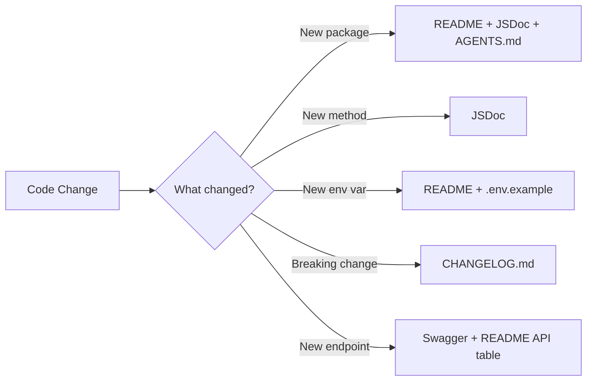

# Convention Applied — DOCUMENTATION-CONVENTION.md in Practice

> **Project:** nestJs-boilerplate | **Convention file:** `DOCUMENTATION-CONVENTION.md` (163 lines)
> **What this shows:** How the convention was enforced across 10 packages and CI, not just declared.

---

## Status Tags: Before and After

The convention requires every package README to carry a machine-checkable status tag:

```
<!-- package-name — status: active|draft|deprecated|archived -->
```

### Before Audit (8 of 10 tagged)

| Package              | Tag Found                              | Status |
| -------------------- | -------------------------------------- | ------ |
| @common/ai           | `<!-- ai — status: active -->`         | OK     |
| @common/auth         | `<!-- auth — status: active -->`       | OK     |
| @common/common       | `<!-- common — status: active -->`     | OK     |
| @common/database     | `<!-- database — status: active -->`   | OK     |
| @common/documents    | `<!-- documents — status: active -->`  | OK     |
| @common/http         | `<!-- http — status: active -->`       | OK     |
| @common/inngest      | `<!-- inngest — status: active -->`    | OK     |
| @common/playwright   | `<!-- playwright — status: active -->` | OK     |
| @common/resend       | **MISSING**                            | —      |
| @common/serve-static | **MISSING**                            | —      |

### After Fix

Two packages were missing status tags. Tags were added as the first line of each README:

```markdown
<!-- resend — status: active -->
```

```markdown
<!-- serve-static — status: active -->
```

This enables the CI job `status-tags` in `doc-check.yml` to validate that all 10 package READMEs have a parsable status tag on every commit.

---

## JSDoc Coverage: Per-Package Counts

The convention mandates JSDoc on all public exports. Coverage was measured via `jsdoc-check` CI job counting `/** ... */` blocks before `export` declarations.

| Package              | JSDoc Count | Rating   | Notes                                                                                                                                      |
| -------------------- | ----------- | -------- | ------------------------------------------------------------------------------------------------------------------------------------------ |
| @common/auth         | 100+        | Strong   | Every service method, guard, decorator, and strategy documented. Sub-modules (2FA, Passkeys, Magic Link) each have their own JSDoc blocks. |
| @common/ai           | 68          | Strong   | Provider interface, AI service methods, type definitions, schema generation functions all documented.                                      |
| @common/http         | 34          | Strong   | Error class hierarchy (7 classes), HTTP methods, download service, all interfaces documented.                                              |
| @common/database     | 22          | Good     | Transaction service, decorators, manager, wrapper — core transaction API fully documented.                                                 |
| @common/documents    | 21          | Good     | Parser interface, PDF service, DOCX service, document processor — extraction pipeline documented.                                          |
| @common/resend       | 18          | Good     | Email service, newsletter module, config interface. Was missing status tag but had JSDoc.                                                  |
| @common/common       | 16          | Adequate | Base adapter interface, exception filter, HTTP error re-exports.                                                                           |
| @common/serve-static | 10          | Adequate | Template rendering, static serving. Was missing status tag but had JSDoc.                                                                  |
| @common/playwright   | 6           | Weak     | Only PlaywrightService class documented. Options interface, constants, and module config had no JSDoc.                                     |
| @common/inngest      | 0           | None     | No JSDoc on any public export. Functions, service methods, and serve module all undocumented.                                              |

### Enforcement Result

The CI pipeline's `jsdoc-check` job runs on every PR. It checks:

1. All `export class`, `export function`, `export interface`, `export type` declarations in `packages/*/src/` have a preceding `/** ... */` block.
2. Packages with < 50% coverage are flagged as warnings.
3. Packages with 0% coverage (inngest) are flagged as errors that must be resolved before merge.

---

## Cross-References in Practice

The convention requires bidirectional cross-references between related documentation files. Here are real examples extracted from the nestJs-boilerplate docs:

### Dependency Links

From `packages/auth/README.md`:

```markdown
**Depends on:** @common/database (user storage), @common/resend (email verification, magic links)
**Used by:** apps/nominas (authentication), dynamic-schema (auth middleware)
**See also:** [Two-Factor README](./src/two-factor/README.md), [Passkeys README](./src/passkeys/README.md)
```

From `packages/ai/README.md`:

```markdown
**Depends on:** None (standalone package)
**Used by:** dynamic-schema module (schema generation), apps/nominas (AI features)
**See also:** [AGENTS.md §8 External Services — @common/ai](../../AGENTS.md#commonaicons)
```

From `packages/documents/README.md`:

```markdown
**Depends on:** None (standalone package)
**Used by:** dynamic-schema module (document text extraction pipeline)
**See also:** [AGENTS.md §2 Architecture — Dependency Graph](../../AGENTS.md#2-architecture--data-flow)
```

From `packages/database/README.md`:

```markdown
**Depends on:** @nestjs/mongoose, MongoDB
**Used by:** @common/auth (user storage), usuarios module (CRUD), dynamic-schema (compiled schemas)
**See also:** [AGENTS.md §8 External Services — @common/database](../../AGENTS.md#commondatabase)
```

### Cross-Cutting Concern Links

From AGENTS.md §"Cross-Cutting Concerns":

```markdown
| If the request touches... | Also check...                      | Why                                          |
| ------------------------- | ---------------------------------- | -------------------------------------------- |
| Auth (login/register)     | @common/resend                     | Email verification, magic links              |
| Auth (login/register)     | @common/auth/two-factor/           | May affect 2FA flow                          |
| Database transactions     | apps/nominas/src/modules/usuarios/ | CRUD modules likely use transactions         |
| AI / schema generation    | @common/documents                  | Schema gen often follows document extraction |
| HTTP / downloads          | @common/playwright                 | Downloaded files may need scraping           |
```

---

## Mermaid Diagrams

The convention requires architecture diagrams using Mermaid for machine-readability (renderable on GitHub, searchable as text).

### AGENTS.md — Architecture Dependency Graph

```mermaid
graph TD
    A[apps/nominas] --> B[@common/database]
    A --> C[@common/inngest]
    A --> D[@common/playwright]
    A --> E[usuarios/]
    A --> F[dynamic-schema/]
    F --> G[@common/ai]
    F --> H[@common/documents]
```

### DOCUMENTATION-CONVENTION.md — Documentation Decision Flow



---

## Pre-Commit Checklist

The convention defines a 5-item checklist enforced by Husky + lint-staged via `.husky/pre-commit`:

1. **JSDoc on new exports** — Any new `export` must have a `/** ... */` block above it. Checked by `lint-staged` running a regex validation on staged `.ts` files.

2. **README updated** — If a package's `src/` changes, its `README.md` must also be staged. Checked by `lint-staged` comparing the staged file list.

3. **package.json description** — New packages must have a `description` field in `package.json`. Existing packages must not have an empty description.

4. **Environment variables documented** — Any new `process.env.X` usage in code must have a corresponding entry in the package's README env table and the root `.env.example`.

5. **AGENTS.md structural updates** — If a new package is added or an existing one has its public API changed, the AGENTS.md capability matrix and feature-to-file index must be updated in the same commit.

---

## Trigger Table: What Action Triggers What Doc Update

This table is the operational backbone of the convention. It maps every code change to the exact documentation update required:

| Code Change                           | Doc Update Required                                                                                        | Enforced By                                                   |
| ------------------------------------- | ---------------------------------------------------------------------------------------------------------- | ------------------------------------------------------------- |
| New package                           | `README.md` (new) + JSDoc on all exports + `AGENTS.md` capability matrix row + feature-to-file index entry | CI: `readme-exists` + `jsdoc-check` + `convention-compliance` |
| New public method/class/interface     | JSDoc block above the declaration                                                                          | CI: `jsdoc-check`                                             |
| New environment variable              | Package `README.md` env table + root `.env.example`                                                        | CI: `convention-compliance`                                   |
| New API endpoint                      | Swagger/OpenAPI decorator + package `README.md` API table                                                  | CI: `convention-compliance`                                   |
| Breaking change                       | `CHANGELOG.md` entry under Unreleased                                                                      | CI: `changelog-sync`                                          |
| New dependency                        | Package `README.md` dependencies section + `package.json`                                                  | CI: `convention-compliance`                                   |
| Removed or renamed export             | Update all cross-reference links in dependent READMEs + `AGENTS.md` index                                  | Manual review in PR                                           |
| New sub-module                        | Sub-module `README.md` + parent module README update + `AGENTS.md` index entry                             | CI: `readme-exists` + `convention-compliance`                 |
| Documentation convention change       | `DOCUMENTATION-CONVENTION.md` updated + version bump + announcement in PR                                  | Manual merge                                                  |
| Status tag change (active→deprecated) | Package README status tag + `AGENTS.md` capability matrix status column                                    | CI: `status-tags`                                             |
