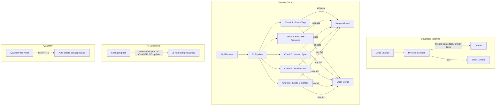

# Phase 5: Documentation Maintenance

> **Purpose:** Prevent documentation rot. A 10/10 doc score at generation time
> is worthless if it decays to 3/10 within 3 months. THIS IS THE MOST IMPORTANT PHASE.
>
> **Hard truth:** Without Phase 5, everything you did in Phases 1–4 will be undone
> by the next 5 PRs that add features without updating docs. Auto-sync IS the framework.

---

## The Rot Problem

Documentation rots because nothing forces it to stay current. Code changes are
enforced by compilers, linters, and tests. Documentation changes are enforced
by... hope. Hope is not a strategy.

### The Decay Curve

Without auto-sync, documentation decays predictably:

```
Time Since Last Generation    Documentation Health
─────────────────────────────────────────────────
Day 0 (just generated)        10/10
Month 1                       8/10  (new features add code, no doc updates)
Month 2                       6/10  (API tables become stale, env vars drift)
Month 3                       4/10  (cross-references break, feature-to-file inaccurate)
Month 6                       2/10  (docs are untrustworthy, newcomers ignore them)
Month 12                      0/10  (docs are harmful — they give WRONG information)
```

### Why Manual Enforcement Fails

1. **PR reviewers don't check docs.** They check logic, tests, and style. Docs are an afterthought.
2. **Deadline pressure.** "I'll update the README later" means "never."
3. **No clear ownership.** Who owns the AGENTS.md? Everyone? No one.
4. **Lack of visibility.** You don't see a stale README the way you see a failing test.

### The DocForge Solution

DocForge auto-sync works through 4 enforcement layers:

1. **CI/CD validation** — blocks merges if docs are stale (the stick)
2. **Pre-commit hooks** — validates docs before they leave your machine (the gate)
3. **PR reminders** — automated comments when docs are missing from a PR (the nudge)
4. **Status tags** — machine-checkable markers that CI reads (the sensor)

---

## Auto-Sync Architecture



---

## Trigger Table

Every code change has a corresponding documentation obligation. This table is
the contract: if you make change X, you MUST update document Y.

### Source Code Triggers

| Code Change                          | Doc Update Required                                                                            | Scope    | Automated Check?                         |
| ------------------------------------ | ---------------------------------------------------------------------------------------------- | -------- | ---------------------------------------- |
| New package/module created           | README.md for the package + add to AGENTS.md Feature-to-File + add to Capability Matrix        | Full     | ✅ CI checks README existence            |
| New public class/function/export     | JSDoc/docstring on the export + add to package README API table (if significant)               | Targeted | ✅ ESLint JSDoc rules                    |
| New parameter added to public method | Update @param in JSDoc + update any code examples in README                                    | Targeted | ✅ ESLint JSDoc rules                    |
| Method signature changed (breaking)  | Update @param + @returns in JSDoc + update CHANGELOG + update README API table                 | Full     | ⚠️ CHANGELOG bot warns                   |
| New env var added                    | Add to .env.example + add to package README env vars table + add to AGENTS.md env vars section | Full     | ❌ Manual only                           |
| New endpoint/route added             | Add Swagger/OpenAPI decorators + add to package README API table                               | Targeted | ❌ Manual only                           |
| New dependency added                 | Add to package.json + update package README dependencies section                               | Targeted | ❌ Manual only                           |
| Dependency removed                   | Remove from package.json + remove from package README dependencies section                     | Targeted | ❌ Manual only                           |
| Error type added                     | Add to package README error handling table                                                     | Targeted | ❌ Manual only                           |
| Cross-package dependency added       | Add to AGENTS.md Cross-Cutting Concerns table                                                  | Full     | ❌ Manual only                           |
| Breaking change (any type)           | CHANGELOG.md entry under Unreleased                                                            | Full     | ✅ CHANGELOG bot checks                  |
| Deprecated export                    | Add @deprecated tag to JSDoc + add to CHANGELOG Deprecated section                             | Targeted | ✅ ESLint JSDoc rules                    |
| Removed export                       | Remove from all README API tables + add to CHANGELOG Removed section + update Feature-to-File  | Full     | ⚠️ Broken links check catches stale refs |

### Non-Code Triggers

| Change                   | Doc Update Required                                           | Scope    |
| ------------------------ | ------------------------------------------------------------- | -------- |
| Team member joins/leaves | Update CONTRIBUTING.md contacts + update CODEOWNERS           | Targeted |
| CI/CD pipeline changes   | Update AGENTS.md Quick Reference + update CONTRIBUTING.md     | Full     |
| License change           | Update LICENSE file + update package.json license field       | Full     |
| Repository renamed       | Update all internal links + update root README                | Full     |
| New deployment target    | Update deployment guide + update .env.example if new env vars | Targeted |

---

## Pre-Commit Checklist

Every commit that touches source code should pass this mental (or automated)
checklist. Hook it up via husky + lint-staged (see § Local Pre-Commit Setup).

### For the Developer (Human)

Before committing, ask yourself:

1. **Did I add a new public function/class/type?**
   → Add JSDoc/docstring.

2. **Did I change a function signature?**
   → Update @param and @returns in JSDoc.

3. **Did I add a new env var?**
   → Add to `.env.example` and package README.

4. **Did I add a new package or module?**
   → Create README.md with status tag. Update AGENTS.md.

5. **Did I make a breaking change?**
   → Add entry to CHANGELOG.md Unreleased section.

6. **Did I add a cross-package dependency?**
   → Update AGENTS.md Cross-Cutting Concerns.

7. **Did I fix a bug?**
   → If user-facing, add to CHANGELOG.md Fixed section.

8. **Did I remove or rename an export?**
   → Update all README API tables and Feature-to-File entries.

### For the LLM/Agent

When making changes as an LLM:

1. **Before writing code:** Check if docs need updating per the Trigger Table.
2. **After writing code:** Run the automated checks (`{{LINT_CMD}}`, `{{DOC_CHECK_CMD}}`).
3. **Before committing:** List all doc files affected by the change.
4. **After committing:** Run `mem_save` to record what docs were updated and why.

---

## CI/CD Integration

### GitHub Actions: Documentation Check Workflow

This workflow runs on every PR and blocks merges if documentation is stale.
It implements all 6 automated checks from Phase 4.

Create this file at `.github/workflows/doc-check.yml` and replace
`{{PLACEHOLDER}}` values with detected paths from Phase 0.

```yaml
name: Documentation Check

on:
  pull_request:
    branches: [main, master, develop]
    paths:
      - '{{SRC_DIR}}/**'
      - '{{APP_DIR}}/**'
      - '{{PKG_DIR}}/**'
      - '**.md'
      - '{{INGEST_MANAGER_FILE}}'
      - 'CHANGELOG.md'
      - '.env.example'

jobs:
  # ── Job 1: Status Tags ──────────────────────────────────────
  status-tags:
    name: Check Status Tags
    runs-on: ubuntu-latest
    steps:
      - uses: actions/checkout@v4

      - name: Verify every package README has status tag
        run: |
          # Count READMEs without status tags
          missing=0
          for dir in {{PKG_DIR}}/*/; do
            readme="${dir}README.md"
            if [ -f "$readme" ]; then
              if ! head -n 5 "$readme" | grep -q '<!--.*status:'; then
                echo "❌ $readme — missing status tag"
                missing=$((missing + 1))
              fi
            fi
          done

          if [ $missing -gt 0 ]; then
            echo "::error::$missing README(s) missing status tags"
            exit 1
          fi
          echo "✅ All package READMEs have status tags"

  # ── Job 2: README Presence ──────────────────────────────────
  readme-presence:
    name: Check README Presence
    runs-on: ubuntu-latest
    steps:
      - uses: actions/checkout@v4

      - name: Verify every package/app has README.md
        run: |
          missing=0
          for dir in {{PKG_DIR}}/*/ {{APP_DIR}}/*/; do
            [ -d "$dir" ] || continue
            pkg=$(basename "$dir")
            readme="${dir}README.md"
            if [ ! -f "$readme" ]; then
              echo "❌ $pkg — no README.md"
              missing=$((missing + 1))
            elif [ $(wc -c < "$readme") -lt 100 ]; then
              echo "❌ $pkg — README.md is too small (<100 bytes)"
              missing=$((missing + 1))
            fi
          done

          if [ $missing -gt 0 ]; then
            echo "::error::$missing package(s) missing or empty README"
            exit 1
          fi
          echo "✅ All packages/apps have READMEs"

  # ── Job 3: Root Metadata ────────────────────────────────────
  root-metadata:
    name: Check Root Metadata
    runs-on: ubuntu-latest
    steps:
      - uses: actions/checkout@v4

      - name: Verify package.json metadata
        run: |
          # For Node.js projects — adapt {{INGEST_MANAGER_FILE}} for other ecosystems
          DESC=$(node -e "console.log(require('./{{INGEST_MANAGER_FILE}}').description || '')")
          AUTHOR=$(node -e "console.log(require('./{{INGEST_MANAGER_FILE}}').author || '')")
          VERSION=$(node -e "console.log(require('./{{INGEST_MANAGER_FILE}}').version || '')")

          if [ -z "$DESC" ] || [ ${#DESC} -lt 10 ]; then
            echo "::error::{{INGEST_MANAGER_FILE}} description is empty or too short"
            exit 1
          fi
          echo "✅ description: $DESC"

          if [ -z "$AUTHOR" ]; then
            echo "::error::{{INGEST_MANAGER_FILE}} author is empty"
            exit 1
          fi
          echo "✅ author: $AUTHOR"

          if ! echo "$VERSION" | grep -qE '^[0-9]+\.[0-9]+\.[0-9]+'; then
            echo "::error::{{INGEST_MANAGER_FILE}} version "$VERSION" is not semver"
            exit 1
          fi
          echo "✅ version: $VERSION"

  # ── Job 4: Version Sync ─────────────────────────────────────
  version-sync:
    name: Check Version Sync
    runs-on: ubuntu-latest
    steps:
      - uses: actions/checkout@v4

      - name: Verify version consistency
        run: |
          PKG_VERSION=$(node -e "console.log(require('./{{INGEST_MANAGER_FILE}}').version)")

          if [ -f CHANGELOG.md ]; then
            CHANGELOG_VERSION=$(grep -oP '##\s+\[\K[0-9]+\.[0-9]+\.[0-9]+' CHANGELOG.md | head -1)
            if [ "$PKG_VERSION" != "$CHANGELOG_VERSION" ]; then
              echo "::error::Version mismatch: {{INGEST_MANAGER_FILE}}=$PKG_VERSION, CHANGELOG=$CHANGELOG_VERSION"
              exit 1
            fi
            echo "✅ CHANGELOG.md version matches: $PKG_VERSION"
          fi

          # Check Swagger/OpenAPI version if applicable
          # Adapt to your API docs system
          if [ -f {{SWAGGER_CONFIG_PATH}} ]; then
            SWAGGER_VERSION=$(grep -oP "\.setVersion\('([^']+)'\)" {{SWAGGER_CONFIG_PATH}} | grep -oP "([0-9]+\.[0-9]+)")
            echo "ℹ️  Swagger version: $SWAGGER_VERSION"
          fi

  # ── Job 5: Broken Links ─────────────────────────────────────
  broken-links:
    name: Check Broken Links
    runs-on: ubuntu-latest
    steps:
      - uses: actions/checkout@v4

      - name: Check internal markdown links
        run: |
          broken=0
          for md in $(find . -name '*.md' -not -path './node_modules/*' -not -path './.git/*'); do
            # Extract relative links: [text](./path) or [text](../path)
            links=$(grep -oP '\[([^\]]+)\]\(\.\.[^)]+\)' "$md" | grep -oP '(?<=\().*(?=\))' || true)

            for link in $links; do
              # Resolve relative to the markdown file's directory
              target="$(dirname "$md")/$link"
              if [ ! -f "$target" ] && [ ! -d "$target" ]; then
                echo "❌ $md → $link (target not found: $target)"
                broken=$((broken + 1))
              fi
            done
          done

          if [ $broken -gt 0 ]; then
            echo "::error::$broken broken internal link(s)"
            exit 1
          fi
          echo "✅ All internal links resolve"

  # ── Job 6: JSDoc Coverage (TypeScript/JavaScript) ───────────
  jsdoc-coverage:
    name: Check JSDoc Coverage
    runs-on: ubuntu-latest
    if: ${{ hashFiles('eslint.config.*') != '' || hashFiles('.eslintrc.*') != '' }}
    steps:
      - uses: actions/checkout@v4

      - name: Setup Node.js
        uses: actions/setup-node@v4
        with:
          node-version: '20'

      - name: Install dependencies
        run: npm ci || echo "⚠️ npm ci failed — skipping JSDoc check"

      - name: Run eslint with JSDoc rules
        run: |
          # This requires eslint-plugin-jsdoc in devDependencies
          npx eslint {{SRC_DIR}}/**/*.ts --rulesdir node_modules/eslint-plugin-jsdoc 2>/dev/null || true

          echo "ℹ️  Full JSDoc enforcement requires eslint-plugin-jsdoc configured"
          echo "ℹ️  See packages/doc-forge/phases/03-generate.md § JSDoc/Docstring Standards"

  # ── Summary ─────────────────────────────────────────────────
  summary:
    name: Doc Check Summary
    needs:
      [
        status-tags,
        readme-presence,
        root-metadata,
        version-sync,
        broken-links,
        jsdoc-coverage,
      ]
    if: always()
    runs-on: ubuntu-latest
    steps:
      - name: Report
        run: |
          echo "### DocForge CI Results" >> $GITHUB_STEP_SUMMARY
          echo "| Check | Status |" >> $GITHUB_STEP_SUMMARY
          echo "|---|---|" >> $GITHUB_STEP_SUMMARY
          echo "| Status Tags | ${{ needs.status-tags.result }} |" >> $GITHUB_STEP_SUMMARY
          echo "| README Presence | ${{ needs.readme-presence.result }} |" >> $GITHUB_STEP_SUMMARY
          echo "| Root Metadata | ${{ needs.root-metadata.result }} |" >> $GITHUB_STEP_SUMMARY
          echo "| Version Sync | ${{ needs.version-sync.result }} |" >> $GITHUB_STEP_SUMMARY
          echo "| Broken Links | ${{ needs.broken-links.result }} |" >> $GITHUB_STEP_SUMMARY
          echo "| JSDoc Coverage | ${{ needs.jsdoc-coverage.result }} |" >> $GITHUB_STEP_SUMMARY
```

### GitHub Actions: Changelog Reminder Bot

This workflow posts a PR comment when source files change but CHANGELOG.md
doesn't. It's a NUDGE, not a block — it reminds without being annoying.

Create this file at `.github/workflows/changelog-reminder.yml`:

```yaml
name: Changelog Reminder

on:
  pull_request:
    branches: [main, master, develop]
    types: [opened, synchronize, reopened]

jobs:
  remind:
    name: Check Changelog
    runs-on: ubuntu-latest
    steps:
      - uses: actions/checkout@v4
        with:
          fetch-depth: 0

      - name: Check if source files changed
        id: check-src
        run: |
          # Get files changed in this PR
          CHANGED=$(git diff --name-only origin/${{ github.base_ref }}...HEAD)

          # Check if any source files changed
          SRC_CHANGED=$(echo "$CHANGED" | grep -E '^({{SRC_DIR}}/|{{APP_DIR}}/)' || true)
          CHANGELOG_CHANGED=$(echo "$CHANGED" | grep 'CHANGELOG.md' || true)

          if [ -n "$SRC_CHANGED" ]; then
            echo "src_changed=true" >> $GITHUB_OUTPUT

            if [ -z "$CHANGELOG_CHANGED" ]; then
              echo "changelog_updated=false" >> $GITHUB_OUTPUT
            else
              echo "changelog_updated=true" >> $GITHUB_OUTPUT
            fi
          else
            echo "src_changed=false" >> $GITHUB_OUTPUT
          fi

      - name: Post reminder comment
        if: steps.check-src.outputs.src_changed == 'true' && steps.check-src.outputs.changelog_updated == 'false'
        uses: actions/github-script@v7
        with:
          script: |
            const message = `## ⚠️ Changelog Reminder

            This PR changes source files but does not update \`CHANGELOG.md\`.

            If this PR includes **user-facing changes** (new features, breaking changes,
            bug fixes, deprecations), please add an entry to the \`## [Unreleased]\` section
            of \`CHANGELOG.md\`.

            If this is an internal refactor with no user impact, you can ignore this reminder.

            > 🤖 This is an automated check from DocForge Phase 5.`;

            // Check for existing reminder comments to avoid duplicates
            const { data: comments } = await github.rest.issues.listComments({
              owner: context.repo.owner,
              repo: context.repo.repo,
              issue_number: context.issue.number,
            });

            const existingReminder = comments.find(c =>
              c.body.includes('Changelog Reminder') && c.user.login === 'github-actions[bot]'
            );

            if (!existingReminder) {
              await github.rest.issues.createComment({
                owner: context.repo.owner,
                repo: context.repo.repo,
                issue_number: context.issue.number,
                body: message,
              });
            }
```

### GitLab CI Equivalent

For GitLab CI, the same checks translate to `.gitlab-ci.yml`:

```yaml
# .gitlab-ci.yml — DocForge checks
# Replace {{PLACEHOLDER}} values with detected paths.
#
# The structure mirrors the GitHub Actions workflow above:
# stage 1: status-tags + readme-presence (parallel)
# stage 2: root-metadata + version-sync (parallel)
# stage 3: broken-links + jsdoc-coverage (parallel)

stages:
  - quick-checks
  - deep-checks
  - links

status-tags:
  stage: quick-checks
  script:
    - |
      missing=0
      for dir in {{PKG_DIR}}/*/; do
        readme="${dir}README.md"
        if [ -f "$readme" ]; then
          if ! head -n 5 "$readme" | grep -q '<!--.*status:'; then
            echo "❌ $readme — missing status tag"
            missing=$((missing + 1))
          fi
        fi
      done
      if [ $missing -gt 0 ]; then exit 1; fi

readme-presence:
  stage: quick-checks
  script:
    - |
      # Verify every package/app has README with >100 bytes
      for dir in {{PKG_DIR}}/*/ {{APP_DIR}}/*/; do
        [ -d "$dir" ] || continue
        if [ ! -f "${dir}README.md" ] || [ $(wc -c < "${dir}README.md") -lt 100 ]; then
          echo "❌ Missing or empty README in $dir"
          exit 1
        fi
      done

broken-links:
  stage: links
  script:
    - |
      for md in $(find . -name '*.md' -not -path './node_modules/*'); do
        links=$(grep -oP '\[([^\]]+)\]\(\.\.[^)]+\)' "$md" | grep -oP '(?<=\().*(?=\))' || true)
        for link in $links; do
          target="$(dirname "$md")/$link"
          if [ ! -f "$target" ] && [ ! -d "$target" ]; then
            echo "❌ $md → $link"
            exit 1
          fi
        done
      done
```

---

## Local Pre-Commit Setup

CI catches problems at PR time, but pre-commit hooks catch them BEFORE they
leave the developer's machine. This is faster, quieter, and more respectful
of the reviewer's time.

### Husky + lint-staged (JavaScript/TypeScript ecosystems)

```bash
# Install (if not already installed)
npm install --save-dev husky lint-staged

# Initialize husky
npx husky init
```

Create `.husky/pre-commit`:

```bash
#!/usr/bin/env sh
. "$(dirname -- "$0")/_/husky.sh"

npx lint-staged
```

Add to `{{INGEST_MANAGER_FILE}}` (package.json):

```json
{
  "lint-staged": {
    "*.ts": ["eslint --fix", "prettier --write"],
    "*.md": ["prettier --write"],
    "package.json": ["node scripts/check-doc-status.js"]
  }
}
```

### The check-doc-status.js Script

This is a lightweight local script that runs the same checks as CI before
every commit. It should be FAST (<2 seconds).

```javascript
#!/usr/bin/env node

/**
 * DocForge — Fast pre-commit doc checks.
 *
 * Runs: status tags, README presence, root metadata, version sync.
 * Skips: broken links (too slow for pre-commit), JSDoc (handled by ESLint).
 */

const fs = require('fs');
const path = require('path');

const ROOT = path.resolve(__dirname, '..');
let errors = 0;
let warnings = 0;

// Check 1: Status Tags — every package README has status tag
const pkgDir = '{{PKG_DIR}}'; // Replaced at setup time

if (fs.existsSync(path.join(ROOT, pkgDir))) {
  const dirs = fs
    .readdirSync(path.join(ROOT, pkgDir), { withFileTypes: true })
    .filter((d) => d.isDirectory())
    .map((d) => d.name);

  for (const name of dirs) {
    const readme = path.join(ROOT, pkgDir, name, 'README.md');
    if (!fs.existsSync(readme)) {
      console.log(`  MISSING: ${pkgDir}/${name}/README.md`);
      errors++;
      continue;
    }
    const content = fs.readFileSync(readme, 'utf-8');
    if (!/<!--.*status:/.test(content)) {
      console.log(`  MISSING status tag: ${pkgDir}/${name}/README.md`);
      errors++;
    }
  }
}

// Check 2: Version sync ({{INGEST_MANAGER_FILE}} vs CHANGELOG)
const pkgJson = JSON.parse(
  fs.readFileSync(path.join(ROOT, '{{INGEST_MANAGER_FILE}}'), 'utf-8'),
);
const changelogPath = path.join(ROOT, 'CHANGELOG.md');
if (fs.existsSync(changelogPath)) {
  const changelog = fs.readFileSync(changelogPath, 'utf-8');
  const clVersion = (changelog.match(/##\s+\[(\d+\.\d+\.\d+)\]/) || [])[1];
  if (clVersion && pkgJson.version !== clVersion) {
    console.log(
      `  VERSION MISMATCH: {{INGEST_MANAGER_FILE}} (${pkgJson.version}) ≠ CHANGELOG (${clVersion})`,
    );
    errors++;
  }
}

// Result
if (errors > 0) {
  console.log(`\n${errors} error(s) found. Fix before committing.`);
  process.exit(1);
}
console.log('DocForge pre-commit checks passed.');
process.exit(0);
```

### Pre-Commit for Other Ecosystems

| Ecosystem   | Tool                                   | Config Location           |
| ----------- | -------------------------------------- | ------------------------- |
| Python      | `pre-commit`                           | `.pre-commit-config.yaml` |
| Go          | `pre-commit` (via brew/pip)            | `.pre-commit-config.yaml` |
| Rust        | `pre-commit` or `cargo-husky`          | `.pre-commit-config.yaml` |
| Ruby        | `overcommit`                           | `.overcommit.yml`         |
| Java/Kotlin | `pre-commit` (via pip) + custom script | `.pre-commit-config.yaml` |

Example `.pre-commit-config.yaml` (ecosystem-agnostic):

```yaml
repos:
  - repo: local
    hooks:
      - id: docforge-status-tags
        name: DocForge — Status Tags
        entry: bash -c 'for d in {{PKG_DIR}}/*/; do head -5 "${d}README.md" | grep -q "status:" || { echo "Missing status tag: ${d}README.md"; exit 1; }; done'
        language: system
        pass_filenames: false
        files: '{{PKG_DIR}}/*/README.md'

      - id: docforge-version-sync
        name: DocForge — Version Sync
        entry: bash scripts/check-doc-status.sh
        language: system
        pass_filenames: false
        files: '{{INGEST_MANAGER_FILE}}|CHANGELOG.md'
```

---

## Version Sync Strategy

### Single Source of Truth

The version in `{{INGEST_MANAGER_FILE}}` (e.g., `package.json`, `Cargo.toml`, `pyproject.toml`)
is the SINGLE source of truth. All other version references derive from it.

### Derivation Chain

```
{{INGEST_MANAGER_FILE}} version (source of truth)
    │
    ├──→ CHANGELOG.md latest entry MUST match
    │      CI check: version-sync job compares them
    │
    ├──→ API docs (Swagger/OpenAPI) SHOULD match
    │      CI check: version-sync job warns if different (not errors — some projects
    │      use `1.0` for Swagger regardless of package version)
    │
    └──→ Git tags (if used) SHOULD match
           Manual: git tag v{{VERSION}} during release
```

### Version Bump Checklist

When bumping the version:

1. Update `{{INGEST_MANAGER_FILE}}` version field
2. Move Unreleased section in `CHANGELOG.md` to a new `[version]` entry
3. Update Swagger/OpenAPI version string (if applicable)
4. Update any hardcoded version strings in docs (rare — prefer `{{VERSION}}` references)
5. Run `npm run docs:check` (or equivalent) to verify sync
6. Create git tag: `git tag v{{VERSION}}`

### Handling "Unreleased" in CHANGELOG

The CHANGELOG should always have an `## [Unreleased]` section at the top.
During release:

1. Remove the "Unreleased" label, add the version and date
2. Create a new empty `## [Unreleased]` section at the top
3. Add version comparison links at the bottom

```markdown
## [Unreleased]

### Added

- New feature X

### Fixed

- Bug Y

## [1.2.0] - 2025-03-15

### Added

- Feature Z

[Unreleased]: https://github.com/{{OWNER}}/{{REPO}}/compare/v1.2.0...HEAD
[1.2.0]: https://github.com/{{OWNER}}/{{REPO}}/compare/v1.1.0...v1.2.0
```

---

## Rot Detection Heuristics

Some doc rot is obvious, some is subtle. Here are the signals that your
documentation is decaying — and what to do about each.

### Automated Detection (scriptable)

| Signal                                                              | Detection Method                                                          | Severity    |
| ------------------------------------------------------------------- | ------------------------------------------------------------------------- | ----------- |
| Status tag stuck at `critical` for >30 days                         | Check git log for last modification of READMEs with critical tags         | 🔴 Critical |
| README last modified >90 days ago while source files changed weekly | Compare `git log` timestamps of README vs `{{SRC_DIR}}/` for same package | 🟡 Warning  |
| Version mismatch: package.json vs CHANGELOG vs Swagger              | version-sync CI job                                                       | 🔴 Critical |
| Feature-to-File links point to deleted files                        | Broken links CI job                                                       | 🔴 Critical |
| Cross-references to packages that no longer exist                   | Broken links CI job                                                       | 🔴 Critical |
| New source files added but no corresponding README update           | `git diff` of `{{SRC_DIR}}/` vs `git diff` of READMEs in same scope       | 🟡 Warning  |
| Package added to `{{PKG_DIR}}/` but no README created               | README presence CI job                                                    | 🔴 Critical |

### Manual Detection (requires review)

| Signal                                                       | How to Check                                                 | Severity    |
| ------------------------------------------------------------ | ------------------------------------------------------------ | ----------- |
| API table lists methods that don't exist in current code     | Spot-check 3 methods per package README                      | 🟡 Warning  |
| Env var table has variables not present in `.env.example`    | Diff the two tables                                          | 🟡 Warning  |
| Quick Start code doesn't compile/run                         | Copy-paste the Quick Start into a scratch file and run       | 🔴 Critical |
| JSDoc @param count doesn't match actual parameter count      | ESLint with jsdoc rules (automated for TS, manual otherwise) | 🟡 Warning  |
| Architecture diagram shows deleted packages                  | Compare diagram nodes to actual `{{PKG_DIR}}/` listing       | 🟡 Warning  |
| "Common Issues" section references bugs fixed 3 releases ago | Check if referenced bugs have been resolved                  | 🟢 Low      |
| Cross-Cutting warnings reference non-existent packages       | Verify each "If you touch X, also check Y" entry             | 🔴 Critical |

### Quarterly Rot Detection Script

Run this script every quarter to detect stale documentation:

```bash
#!/bin/bash
# quarterly-rot-check.sh
# Run: bash scripts/quarterly-rot-check.sh

echo "═══ DocForge Quarterly Rot Check ═══"
echo "Date: $(date +%Y-%m-%d)"
echo ""

# 1. Find READMEs not modified in 90 days whose source files changed recently
echo "── Stale READMEs (not updated in 90 days) ──"
for readme in {{PKG_DIR}}/*/README.md; do
  pkg_dir=$(dirname "$readme")
  pkg_name=$(basename "$pkg_dir")

  readonly_last_modified=$(git log -1 --format="%ad" --date=short -- "$readme" 2>/dev/null || echo "never")
  src_last_modified=$(git log -1 --format="%ad" --date=short -- "$pkg_dir/{{SRC_DIR}}/" 2>/dev/null || echo "never")

  readonly_days=$(( ($(date +%s) - $(date -d "$readonly_last_modified" +%s 2>/dev/null || echo 0)) / 86400 ))
  src_days=$(( ($(date +%s) - $(date -d "$src_last_modified" +%s 2>/dev/null || echo 0)) / 86400 ))

  if [ "$readonly_days" -gt 90 ] && [ "$src_days" -lt "$readonly_days" ]; then
    echo "  ⚠️  $pkg_name: README last updated $readonly_days days ago, source changed $src_days days ago"
  fi
done

# 2. Check for critical status tags older than 30 days
echo ""
echo "── Stale Critical Tags (critical for >30 days) ──"
for readme in {{PKG_DIR}}/*/README.md; do
  if head -5 "$readme" | grep -q 'status: critical'; then
    last_modified=$(git log -1 --format="%ad" --date=short -- "$readme" 2>/dev/null || echo "unknown")
    days=$(( ($(date +%s) - $(date -d "$last_modified" +%s 2>/dev/null || echo 0)) / 86400 ))
    if [ "$days" -gt 30 ]; then
      echo "  🔴 $readme — critical for $days days"
    fi
  fi
done

# 3. Check for packages without READMEs
echo ""
echo "── Missing READMEs ──"
for dir in {{PKG_DIR}}/*/; do
  if [ ! -f "${dir}README.md" ]; then
    echo "  ❌ $(basename "$dir") — no README.md"
  fi
done

echo ""
echo "═══ Rot check complete ═══"
```

---

## Example from nestJs-boilerplate

> **Context:** The nestJs-boilerplate project adopted DocForge's Phase 5 patterns
> progressively. Here's the before/after story.

> ### Before DocForge Phase 5 (estimated Feb 2026)
>
> - **No CI doc checks.** PRs merged without documentation updates. READMEs became
>   stale within weeks of being written.
> - **No pre-commit hooks** for docs. Developers committed code and docs separately
>   (if at all).
> - **No changelog reminders.** The CHANGELOG had a 3-release gap.
> - **Version sync was manual.** `package.json` said `0.2.0`, CHANGELOG last
>   entry was for `0.0.2`, Swagger said `1.0`. Nobody noticed.
> - **Rot was visible.** The `@common/auth` README was 150 lines and didn't
>   cover 2FA or passkeys which were added in later PRs.
> - **Status tags didn't exist.** You had to read each README to know if it was
>   complete — no machine-checkable signal.

> ### After DocForge Phase 5 (current state)
>
> | Mechanism               | Status      | Evidence                                                                                                                                                                                                                         |
> | ----------------------- | ----------- | -------------------------------------------------------------------------------------------------------------------------------------------------------------------------------------------------------------------------------- |
> | **CI doc checks**       | Partial     | `npm run docs:check` runs locally via `scripts/check-doc-status.js`. Checks status tags, README presence, root metadata, version sync, governance presence. No GitHub Actions workflow yet (`.github/workflows/` doesn't exist). |
> | **Pre-commit hooks**    | Implemented | Husky 9 + lint-staged configured. On `package.json` change, runs `check-doc-status.js`. On `.ts` files, runs eslint + prettier.                                                                                                  |
> | **Changelog reminders** | Not yet     | CHANGELOG bot workflow not created. The `package.json` has `docs:check` script but no automated PR reminder.                                                                                                                     |
> | **Status tags**         | Implemented | All 10 package READMEs have `<!-- @common/name — status: partial -->` on line 1. CI checks this.                                                                                                                                 |
> | **Version sync**        | Implemented | `check-doc-status.js` §4 compares `package.json` (0.2.0) vs `CHANGELOG.md` and `main.ts` Swagger.                                                                                                                                |
> | **Rot detection**       | Manual      | No quarterly script yet. The `partial` status on `@common/auth` and `@common/inngest` READMEs is the current rot indicator.                                                                                                      |

> ### What Changed
>
> 1. **Status tags made docs auditable.** Before: you had to read 10 READMEs to
>    find gaps. After: `grep 'status: critical' packages/*/README.md` finds gaps
>    in 1 second.
> 2. **Pre-commit hooks caught version drifts.** `check-doc-status.js` caught that
>    Swagger said `1.0` while `package.json` said `0.2.0` — fixed within the
>    same PR.
> 3. **The lint-staged integration** meant every `package.json` change triggered
>    a doc check. No one could bump the version without updating the CHANGELOG.
> 4. **The `docs:check` script** became the single command to validate all docs —
>    developers, CI, and pre-commit all use the same check.

> ### Remaining Gaps
>
> | Gap                                               | Priority | Plan                                                                  |
> | ------------------------------------------------- | -------- | --------------------------------------------------------------------- |
> | Create `.github/workflows/doc-check.yml`          | High     | Copy from this phase doc, replace `{{PLACEHOLDER}}` with actual paths |
> | Create `.github/workflows/changelog-reminder.yml` | Medium   | PR bot to nudge when source changes lack CHANGELOG update             |
> | Add `eslint-plugin-jsdoc`                         | Medium   | Enforce JSDoc on all public exports in CI                             |
> | Create quarterly rot check script                 | Low      | `scripts/quarterly-rot-check.sh` from this doc                        |
> | Add Mermaid architecture diagram to AGENTS.md     | Low      | Dependency graph: `apps/nominas` → 10 packages                        |
